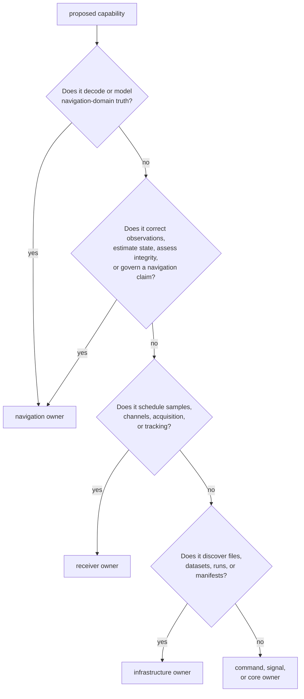
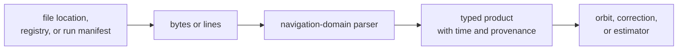
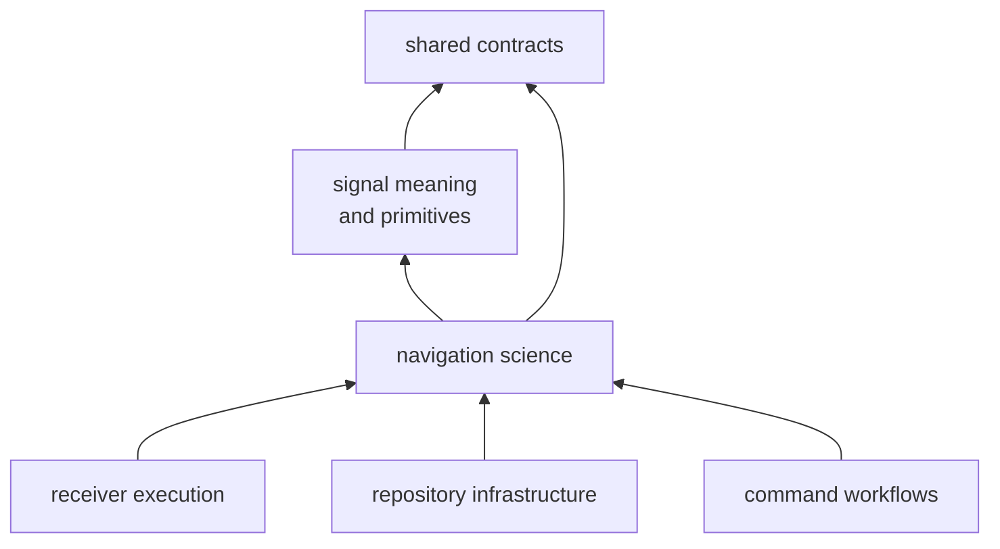

# Navigation Ownership Boundaries

`bijux-gnss-nav` owns the scientific interpretation that turns navigation
messages, external products, observations, models, and corrections into a
position, uncertainty estimate, integrity result, advanced-mode claim, or
explicit refusal.

Navigation breadth is not permission to absorb receiver scheduling,
repository discovery, command policy, or reusable signal processing. Domain
parsing belongs here because encoded navigation formats carry scientific
meaning; generic file location and lifecycle do not.

## Place A Capability

Navigation is the right owner for:

- decoding broadcast navigation words, pages, frames, and parity;
- parsing and formatting navigation-domain exchange products;
- interpreting SP3, clock, bias, and antenna products;
- propagating broadcast or precise orbit and clock state;
- atmosphere, antenna, bias, phase-windup, and signal-combination models;
- position solvers, filters, weighting, integrity, and anomaly evidence;
- PPP and RTK state, ambiguity policy, maturity, provenance, and refusal;
- navigation-specific time rollover and reference-context handling.

## Domain Parsing Versus File Discovery

[Repository infrastructure](../bijux-gnss-infra/index.md) owns the first transition
when repository discovery is involved. Navigation owns the parser and every
scientific interpretation after bytes or records enter the domain boundary.

A parser here must make units, timescales, reference epochs, frames, missing
fields, quality flags, and rejection reasons explicit. It should not search
operator directories, choose repository defaults, or write run manifests.

## Receiver Boundary

Receiver and navigation can both contain state, but they own different state:

| receiver execution | navigation science |
| --- | --- |
| sample ingestion and frame timing | navigation product time interpretation |
| acquisition and tracking channels | satellite orbit and clock state |
| lock, degradation, fade, and reacquisition lifecycle | filter, ambiguity, integrity, and solution lifecycle |
| observation production and runtime handoff | observation correction, weighting, estimation, and refusal |
| stage scheduling and run budgets | scientific convergence and uncertainty |

The [receiver handbook](../bijux-gnss-receiver/index.md) owns when observations are
available and whether channels remain operational. Navigation owns whether
those observations support a defensible solution.

Do not move a filter into receiver because receiver calls it every epoch. Do
not move acquisition or tracking policy into navigation because a solution
depends on their output.

## Signal And Core Boundaries

[Signal processing](../bijux-gnss-signal/index.md) owns code families, component
modulation, sample conversion, carrier relationships, replicas, and reusable
DSP. Navigation may use signal identities and frequencies when forming
corrections or combinations, but it does not own raw-IQ generation or tracking
correlators.

[Shared GNSS contracts](../bijux-gnss-core/index.md) own portable identities,
units, times, observations, diagnostics, artifact envelopes, and generic
solution records. Navigation owns domain-specific algorithms and state that
consume or populate those records.

Dependency direction supports ownership but does not prove it. Infrastructure
may call navigation validation without owning the model; receiver may hold a
navigation engine without owning estimator science.

## Product And Estimator Boundaries

The [navigation public facade](https://github.com/bijux/bijux-gnss/blob/main/crates/bijux-gnss-nav/src/api.rs) exposes
format decoders, precise-product providers, corrections, orbits, models,
position estimation, integrity, PPP, RTK, and explicit advanced-claim
evidence. A new capability belongs in that facade only when callers can use it
without depending on internal module layout.

Scientific state must carry enough context to interpret:

- source product and provider;
- coordinate frame and time system;
- correction order and assumptions;
- measurement support and exclusions;
- uncertainty, residual, and integrity evidence;
- convergence, ambiguity, or maturity state;
- refusal reason when a claim cannot be supported.

Result packaging should preserve those claims without introducing repository
layout or operator wording.

## Command Boundary

[Command workflows](../bijux-gnss/index.md) select a requested navigation operation,
translate operator inputs into typed requests, and render results. Command
defaults may choose among navigation-owned policies, but they must not
duplicate formulas or silently reinterpret refusal.

If an operator flag changes an estimator threshold, the flag belongs to the
command package; the typed threshold, validation, scientific effect, and tests
belong here.

## Reject Boundary Drift

Reject a navigation change that:

- searches repository layouts instead of accepting an explicit product source;
- controls receiver channel scheduling or sample buffering;
- implements raw sample or code-generation behavior;
- moves a generic cross-package identity into a solver module;
- converts missing products or unsafe geometry into plausible success;
- embeds command defaults in an estimator;
- treats a parsed product as scientifically usable without provenance,
  timescale, continuity, and quality checks.

Review format changes with the
[format contracts](https://github.com/bijux/bijux-gnss/blob/main/crates/bijux-gnss-nav/docs/FORMATS.md), model changes
with the [model contracts](https://github.com/bijux/bijux-gnss/blob/main/crates/bijux-gnss-nav/docs/MODELS.md),
estimation changes with the
[estimation contracts](https://github.com/bijux/bijux-gnss/blob/main/crates/bijux-gnss-nav/docs/ESTIMATION.md), and
scientific claims with the
[navigation test guide](https://github.com/bijux/bijux-gnss/blob/main/crates/bijux-gnss-nav/docs/TESTS.md). The owning
proof must exercise the scientific decision, not only the command that exposed
it.
