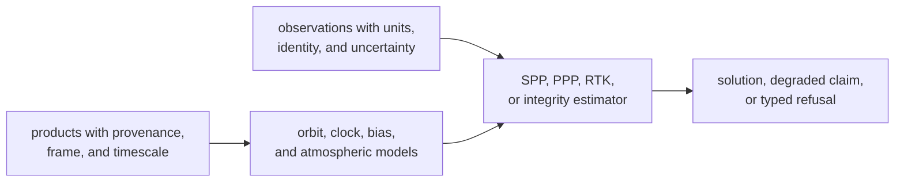
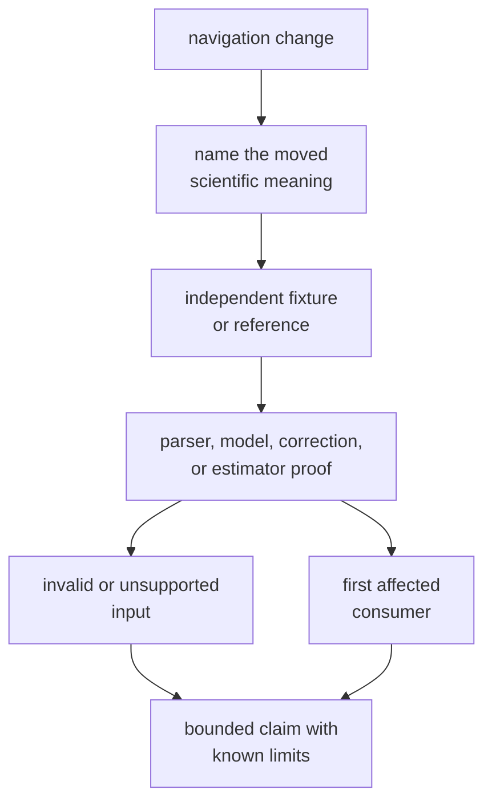

# Navigation Science Invariants

Navigation code turns external products and receiver observations into
satellite states, corrections, solutions, integrity evidence, or explicit
refusal. Its invariants protect the meaning of those results, not merely their
shape.

## Meaning Must Survive the Pipeline

Every arrow is a scientific boundary. A parser that accepts a product has not
yet proved the derived state, and a numerically plausible position has not
proved that its time, frame, corrections, or uncertainty are correct.

## Invariant Catalog

| Invariant | Invalid behavior | Evidence that can expose it |
| --- | --- | --- |
| External data retains source, epoch, timescale, frame, units, signal identity, and validity interval. | A value is interpreted through caller convention or an unstated default. | format, time-conversion, and product-reference tests |
| Orbit and clock states are evaluated only where their products and models are valid. | Extrapolated, stale, mismatched, or unsupported products produce an ordinary state. | broadcast and precise-reference tests plus rejected-range cases |
| Corrections identify the model, inputs, sign, units, and applicability that produced them. | A correction can be applied twice, to the wrong observable, or outside its domain. | correction-specific residual and public-data tests |
| Estimators require sufficient geometry, observations, products, and covariance assumptions. | Missing prerequisites produce a clean-looking position. | accepted and refused position tests |
| Discrete outcomes are deterministic for equivalent ordered inputs. | Satellite selection, ambiguity state, exclusion, downgrade, or refusal changes across replay. | guardrail, checkpoint, and stability tests |
| Numeric outputs remain finite, physically bounded, and paired with their frame and units. | NaN, infinity, impossible covariance, or frame ambiguity reaches a public result. | model, estimator, residual, and fault-injection tests |
| Reported covariance, residuals, DOP, and protection levels describe the same accepted measurement set and model state. | Quality evidence is stale or computed from observations that the solution excluded. | geometry, residual, outlier, protection-level, and RAIM tests |
| Integrity decisions preserve the fault, threshold, exclusion, and resulting claim. | A solution is accepted, downgraded, or refused without reviewable evidence. | fault-detection, fault-exclusion, separation, and underdetermined tests |
| PPP and RTK state transitions expose convergence, ambiguity, fix, downgrade, and prerequisite evidence. | Advanced positioning silently claims support or convergence. | PPP convergence and RTK ambiguity/baseline tests |
| Unsupported constellations, products, combinations, or claim modes return typed rejection or refusal. | A missing capability is treated as success, absence, or a generic numeric failure. | support, compatibility, and refusal tests |

The [navigation contracts](https://github.com/bijux/bijux-gnss/blob/main/crates/bijux-gnss-nav/docs/CONTRACTS.md)
define the scientific families, while the
[boundary guide](https://github.com/bijux/bijux-gnss/blob/main/crates/bijux-gnss-nav/docs/BOUNDARY.md) separates
them from receiver runtime and repository workflow.

## Exact and Toleranced Assertions

Assert these exactly:

- constellation, satellite, signal, product, and station identity
- coordinate frame, timescale, epoch ordering, and correction applicability
- selected and excluded measurements
- accepted, degraded, refused, fixed, float, and integrity states
- diagnostic, prerequisite, downgrade, and fault identity

Use documented tolerances for orbit and clock differences, corrected
observables, residuals, covariance, DOP, protection levels, coordinates,
baselines, and convergence. Every tolerance must state:

- quantity and unit
- reference source and independence from the implementation
- frame and timescale
- fixture, geometry, and estimator configuration
- applicable epoch or stable window

A looser numeric tolerance cannot compensate for changed identity, state,
frame, or measurement selection.

## Preserve Scientific Ownership

- Signal owns canonical signal definitions, modulation, codes, and reusable
  DSP.
- Core owns shared identities, units, records, diagnostics, and envelopes.
- Navigation owns product interpretation, orbit and clock state, corrections,
  positioning, integrity, PPP, and RTK science.
- Receiver owns sample-flow orchestration and navigation-stage handoff.
- Infrastructure owns dataset discovery, repository layout, manifests, and
  persistence.

Parsing a scientific product is part of the navigation domain. Discovering
which repository file to parse is not.

## Prove the Earliest Changed Meaning

Start at the owner of the changed meaning. A final position test is too late to
diagnose a timescale error in a product parser, while a parser round trip is too
early to support an accuracy claim.

## Block the Change When

- frame, timescale, unit, sign, or product provenance is implicit
- expected values are generated by the implementation under test
- an estimator has no insufficient-input or unsupported-mode case
- a correction test proves only that code executes
- covariance or integrity evidence refers to a different accepted set
- PPP or RTK support is inferred from a single converged fixture
- public-data evidence is described as universal certification
- repository paths or receiver scheduling enter navigation-owned APIs

Use the [verification guide](../operations/verification-commands.md) to route
the claim to focused proof and [known limitations](known-limitations.md) to
bound the conclusion.

A navigation invariant is defended only when its inputs, scientific owner,
exact and numeric meaning, independent reference, refusal behavior, consumer,
and remaining limits are all visible.
