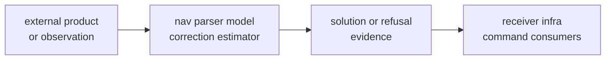

# Risk Register

This page records the main trust risks in `bijux-gnss-nav`.

## Risk Flow

## Risks and Controls

| risk | reader-visible consequence | control |
| --- | --- | --- |
| accidental public export | downstream crates depend on an internal solver detail | review `api.rs` changes as contract changes |
| narrow reference proof | tests stay green while an adjacent scientific family drifts | choose validation by scientific family |
| runtime policy creep | nav starts deciding scheduling, sample flow, or run layout | keep runtime-neutral APIs explicit |
| weak refusal evidence | solver cannot explain why it did not claim a solution | keep refusal and evidence records documented |
| parser repository leakage | file discovery or command assumptions enter format parsers | keep repository paths in infra or CLI |
| tolerance drift | fixture tests pass by accepting weaker science | require rationale for tolerance changes |
| precise-product ambiguity | SP3, CLK, ANTEX, or bias SINEX claims lose source context | preserve product provenance and parser family ownership |

## Review Checks

- Does the change alter a public scientific contract?
- Is the proof close to the parser, model, correction, or estimator family that
  changed?
- Does a refusal still explain unsupported geometry, missing products,
  degraded integrity, or invalid inputs?
- Does the change keep repository file discovery outside nav?
- Do the [navigation ownership boundaries](../ownership-boundaries.md) remain
  accurate?

## Evidence To Inspect

Inspect the [public API guide](https://github.com/bijux/bijux-gnss/blob/main/crates/bijux-gnss-nav/docs/PUBLIC_API.md),
[navigation test guide](https://github.com/bijux/bijux-gnss/blob/main/crates/bijux-gnss-nav/docs/TESTS.md),
[package boundary](https://github.com/bijux/bijux-gnss/blob/main/crates/bijux-gnss-nav/docs/BOUNDARY.md),
[public facade](https://github.com/bijux/bijux-gnss/blob/main/crates/bijux-gnss-nav/src/api.rs), and
[dependency guardrail](https://github.com/bijux/bijux-gnss/blob/main/crates/bijux-gnss-nav/tests/integration_guardrails.rs).
