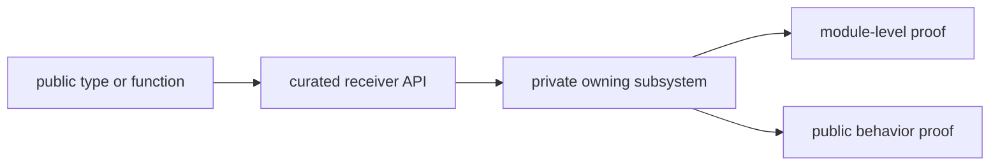

# Code Navigation

Use this page when you have a receiver symptom, public type, or failing test but
do not yet know the owning runtime family.

## Start From A Public Type

1. Find the export in the [curated receiver API](https://github.com/bijux/bijux-gnss/blob/main/crates/bijux-gnss-receiver/src/api.rs).
2. Follow the re-export to its private owner.
3. Confirm whether the name is always available or gated by `nav`.
4. Read the nearest module tests before selecting an integration target.
5. Check downstream callers before changing public shape or semantics.

Do not add a second public route to avoid this trace. One curated API keeps
feature availability and ownership reviewable.

## Start From A Runtime Symptom

| symptom or question | implementation route | first focused proof |
| --- | --- | --- |
| configuration is accepted, rejected, or defaulted unexpectedly | [Receiver configuration](https://github.com/bijux/bijux-gnss/tree/main/crates/bijux-gnss-receiver/src/engine/receiver_config) | configuration module tests, then [basic runtime integration](https://github.com/bijux/bijux-gnss/blob/main/crates/bijux-gnss-receiver/tests/integration_basic.rs) |
| a signal is missed, ambiguously selected, or poorly refined | [Acquisition stage](https://github.com/bijux/bijux-gnss/tree/main/crates/bijux-gnss-receiver/src/pipeline/acquisition) | acquisition module tests, then [acquisition smoke proof](https://github.com/bijux/bijux-gnss/blob/main/crates/bijux-gnss-receiver/tests/integration_acquisition_smoke.rs) or the matching accuracy/refusal target |
| carrier, code, lock, or reacquisition behavior drifts | [Tracking stage](https://github.com/bijux/bijux-gnss/tree/main/crates/bijux-gnss-receiver/src/pipeline/tracking) | the narrow matching tracking target, such as [C/N0 tracking proof](https://github.com/bijux/bijux-gnss/blob/main/crates/bijux-gnss-receiver/tests/integration_tracking_cn0.rs) |
| observations have wrong timing, smoothing, covariance, or status | [Observation stage](https://github.com/bijux/bijux-gnss/tree/main/crates/bijux-gnss-receiver/src/pipeline/observations) | observation module tests, then [measurement-quality proof](https://github.com/bijux/bijux-gnss/blob/main/crates/bijux-gnss-receiver/tests/integration_observations_measurement_quality.rs) |
| optional navigation handoff or report meaning changes | [Navigation adapter](https://github.com/bijux/bijux-gnss/blob/main/crates/bijux-gnss-receiver/src/pipeline/navigation.rs) and [validation reports](https://github.com/bijux/bijux-gnss/blob/main/crates/bijux-gnss-receiver/src/validation_report.rs) | [navigation accuracy budget](https://github.com/bijux/bijux-gnss/blob/main/crates/bijux-gnss-receiver/tests/integration_navigation_pvt_accuracy_budget.rs) plus the closest report or refusal target |
| samples, clocks, or sinks do not behave as expected | [Sample adapters](https://github.com/bijux/bijux-gnss/tree/main/crates/bijux-gnss-receiver/src/io) and [runtime ports](https://github.com/bijux/bijux-gnss/tree/main/crates/bijux-gnss-receiver/src/ports) | source, streaming, clock, or sink integration proof |
| a deterministic scenario no longer matches truth | [Synthetic runtime](https://github.com/bijux/bijux-gnss/tree/main/crates/bijux-gnss-receiver/src/sim/synthetic) | [synthetic integration proof](https://github.com/bijux/bijux-gnss/blob/main/crates/bijux-gnss-receiver/tests/integration_synthetic.rs) plus the affected stage target |
| supported-signal reporting disagrees across surfaces | [Engine support reporting](https://github.com/bijux/bijux-gnss/blob/main/crates/bijux-gnss-receiver/src/engine/support_matrix.rs) | [support inventory proof](https://github.com/bijux/bijux-gnss/blob/main/crates/bijux-gnss-receiver/tests/integration_receiver_support_matrix_inventory.rs) |

## Start From A Failing Test

Test names identify the observed contract, not necessarily the root cause:

- Acquisition failures often require checking signal assumptions, front-end
  rejection, threshold resolution, candidate selection, and uncertainty before
  changing the assertion.
- Tracking failures may originate in acquisition handoff, signal metadata,
  channel lifecycle, loop initialization, or fade/reacquisition policy.
- Observation failures can originate in tracking timing or lock evidence before
  observation construction.
- Navigation and RTK failures may belong to navigation science rather than the
  receiver adapter.
- Synthetic failures can expose either scenario truth drift or a real runtime
  regression.

Use the [receiver test directory](https://github.com/bijux/bijux-gnss/tree/main/crates/bijux-gnss-receiver/tests)
to find the exact target, then trace backward through the stage handoff instead
of editing the first matching assertion.

## Stop At The Right Boundary

Leave receiver when the root cause becomes reusable signal math, navigation
science, repository persistence, command policy, or shared record meaning. Use
the [Module Map](module-map.md) and [Integration Seams](integration-seams.md)
to identify that handoff before widening receiver internals.
