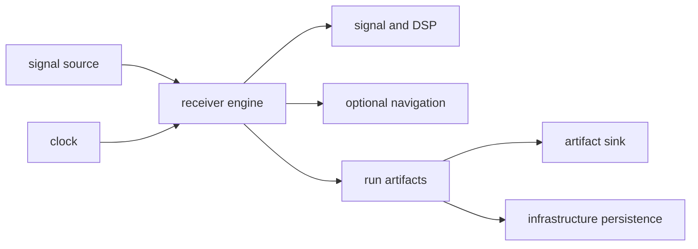

# Integration Seams

Receiver integration seams isolate runtime input, time, side effects,
scientific dependencies, and emitted evidence. They allow the same receiver
pipeline to run against memory, files, synthetic sources, or higher-level
infrastructure without embedding those environments in stage logic.

## Runtime Seams

## Seam Contracts

| seam | contract |
| --- | --- |
| [sample-source adapter interface](https://github.com/bijux/bijux-gnss/blob/main/crates/bijux-gnss-receiver/src/ports/mod.rs) | supplies ordered sample frames and explicit end-of-stream or input failure |
| [file and memory adapters](https://github.com/bijux/bijux-gnss/blob/main/crates/bijux-gnss-receiver/src/io/data.rs) | convert concrete storage into the sample-source contract without changing signal meaning |
| [clock interface](https://github.com/bijux/bijux-gnss/blob/main/crates/bijux-gnss-receiver/src/ports/clock.rs) | provides runtime time without hardwiring the system clock into stage logic |
| [artifact-sink interface](https://github.com/bijux/bijux-gnss/blob/main/crates/bijux-gnss-receiver/src/ports/mod.rs) | accepts versioned observation and navigation records without deciding repository layout |
| [receiver entrypoint](https://github.com/bijux/bijux-gnss/blob/main/crates/bijux-gnss-receiver/src/api.rs) | accepts validated configuration, runtime controls, and a signal source, then returns typed run artifacts or receiver failure |
| [signal boundary](https://github.com/bijux/bijux-gnss/blob/main/crates/bijux-gnss-signal/src/api.rs) | supplies physical signal facts, codes, replicas, timing, DSP, and source traits |
| [navigation adapter](https://github.com/bijux/bijux-gnss/blob/main/crates/bijux-gnss-receiver/src/pipeline/navigation.rs) | converts receiver observations into optional navigation execution without taking ownership of solver science |
| [run artifact contract](https://github.com/bijux/bijux-gnss/blob/main/crates/bijux-gnss-receiver/src/api.rs) | preserves acquisition, tracking, observation, support, and optional navigation evidence in memory |
| [validation boundary](https://github.com/bijux/bijux-gnss/blob/main/crates/bijux-gnss-receiver/src/validation_report.rs) | converts receiver and navigation evidence into typed validation claims when navigation is enabled |

## Channel and Stage Handoff

Acquisition hands tracking an explicit seed with signal identity, Doppler,
code phase, assumptions, and uncertainty. Tracking hands observation
construction channel state, timing, lock, carrier, code, CN0, and uncertainty
evidence. Observation construction hands optional navigation typed measurements
and rejection context. No stage should reconstruct information that the
previous stage could have preserved directly.

## Refusal and Side-Effect Rules

- Input failures identify the source boundary and stop affected processing.
- Unsupported signals and stages remain visible through support and refusal
  evidence.
- Navigation prerequisites and solver refusals remain typed through receiver
  artifacts and validation reports.
- Metrics, tracing, logs, clocks, and artifact writes pass through runtime
  controls or ports.
- Repository paths, manifests, histories, and command report wording remain
  outside receiver.

Downstream crates import the [curated receiver API](https://github.com/bijux/bijux-gnss/blob/main/crates/bijux-gnss-receiver/src/api.rs)
rather than private stage modules. The
[port guide](https://github.com/bijux/bijux-gnss/blob/main/crates/bijux-gnss-receiver/docs/PORTS.md) defines concrete
interface behavior, and the
[artifact guide](https://github.com/bijux/bijux-gnss/blob/main/crates/bijux-gnss-receiver/docs/ARTIFACTS.md) defines
the handoff to persistence.
