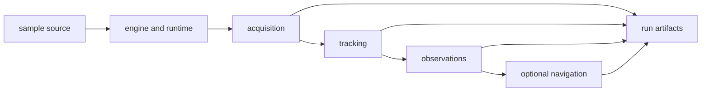

# Module Map

Use this map to enter the receiver through a runtime responsibility. The package
turns a sample source into acquisition, tracking, observation, and optional
navigation evidence; each stage has separate state and refusal rules.

## Choose A Runtime Route

| question | owning subsystem | what belongs there |
| --- | --- | --- |
| How is a receiver configured, validated, and started? | [Receiver engine](https://github.com/bijux/bijux-gnss/tree/main/crates/bijux-gnss-receiver/src/engine) | configuration, defaults, runtime controls, execution entrypoints, metrics, diagnostics, and support selection |
| How do samples enter without coupling stages to storage? | [Sample adapters](https://github.com/bijux/bijux-gnss/tree/main/crates/bijux-gnss-receiver/src/io) and [runtime ports](https://github.com/bijux/bijux-gnss/tree/main/crates/bijux-gnss-receiver/src/ports) | file or memory sources plus clock, sample-source, and artifact-sink traits |
| How are satellites searched and candidates ranked? | [Acquisition stage](https://github.com/bijux/bijux-gnss/tree/main/crates/bijux-gnss-receiver/src/pipeline/acquisition) | request planning, search, calibration, ranking, refinement, uncertainty, and rejection evidence |
| How does a channel preserve or lose lock? | [Tracking stage](https://github.com/bijux/bijux-gnss/tree/main/crates/bijux-gnss-receiver/src/pipeline/tracking) | channel lifecycle, loop state, corrections, reacquisition, navigation-bit annotation, and session evidence |
| How do tracking results become measurements? | [Observation stage](https://github.com/bijux/bijux-gnss/tree/main/crates/bijux-gnss-receiver/src/pipeline/observations) | timing, smoothing, ambiguity, residuals, quality, covariance, and epoch decisions |
| How is navigation invoked from the receiver? | [Navigation adapter](https://github.com/bijux/bijux-gnss/blob/main/crates/bijux-gnss-receiver/src/pipeline/navigation.rs) | feature-gated receiver composition over navigation-owned science |
| How are receiver outcomes assembled for callers? | [Run artifact contract](https://github.com/bijux/bijux-gnss/blob/main/crates/bijux-gnss-receiver/src/artifacts.rs) | in-memory acquisition, tracking, observation, support, and navigation evidence |
| How are runtime outputs compared with references? | [Reference validation](https://github.com/bijux/bijux-gnss/blob/main/crates/bijux-gnss-receiver/src/reference_validation.rs) and [validation reports](https://github.com/bijux/bijux-gnss/blob/main/crates/bijux-gnss-receiver/src/validation_report.rs) | alignment, consistency, budgets, readiness, integrity, and report assembly |
| How are deterministic receiver scenarios exercised? | [Synthetic runtime](https://github.com/bijux/bijux-gnss/tree/main/crates/bijux-gnss-receiver/src/sim/synthetic) | scenario execution, generated signals, stage truth, sensitivity, and validation artifacts |

## Feature Boundaries

Navigation execution, covariance realism, reference validation, validation
reports, and synthetic runtime exports are enabled by the `nav` feature. Core
receiver configuration, acquisition, tracking, observations, ports, and
carrier-smoothed-code validation remain available without it.

The [curated receiver API](https://github.com/bijux/bijux-gnss/blob/main/crates/bijux-gnss-receiver/src/api.rs)
marks that feature boundary explicitly. The
[crate boundary](https://github.com/bijux/bijux-gnss/blob/main/crates/bijux-gnss-receiver/src/lib.rs) keeps
implementation modules private.

## Cross-Stage Helpers

Some logic spans stages without becoming a new stage:

- [Pipeline composition](https://github.com/bijux/bijux-gnss/tree/main/crates/bijux-gnss-receiver/src/pipeline)
  owns Doppler conversion, acquisition assistance, signal capability checks,
  Hatch support, and receiver-side validation adapters.
- [Validation helpers](https://github.com/bijux/bijux-gnss/blob/main/crates/bijux-gnss-receiver/src/validation_helpers.rs)
  support report assembly without owning navigation science.

## Boundary Tests

- Signal generation primitives and code families stay in signal.
- Navigation algorithms, correction law, and estimators stay in navigation.
- Dataset resolution and persisted run layout stay in infra.
- Command selection and report rendering stay in the command package.
- Shared records and artifact-envelope meaning stay in core.

Use [Integration Seams](integration-seams.md) when a change crosses these
owners and [Code Navigation](code-navigation.md) for implementation and proof
routes within the receiver.
