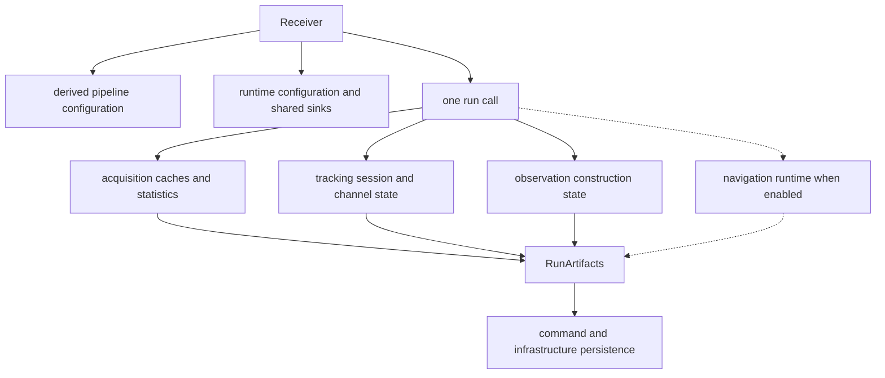
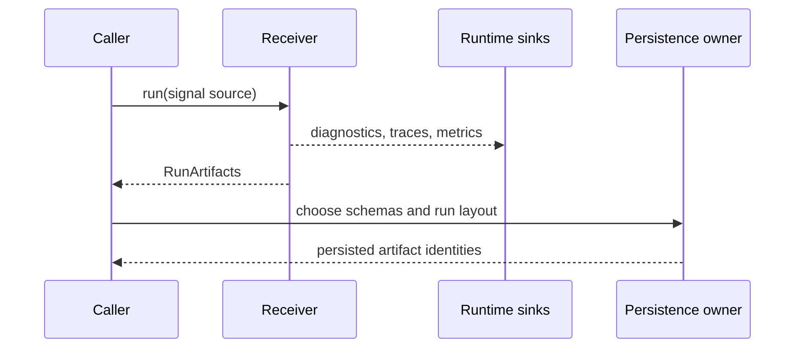

# State And Persistence

The receiver owns live signal-processing state for one execution. It returns a
complete in-memory account of that execution and emits optional telemetry
through caller-provided sinks. It does not turn either form into a durable run
repository.

## State Lifetimes

`Receiver` retains a derived pipeline configuration and a
[`ReceiverRuntime`](../../../crates/bijux-gnss-receiver/src/engine/runtime.rs).
The runtime is cloned into stages and shares logger, trace, and metric sinks
through reference-counted handles. Stage state is otherwise created for an
execution: acquisition maintains run-local caches, tracking uses an explicit
session, and navigation constructs its estimator runtime for the requested
operation.

| state | owner | lifetime | crosses the API boundary as |
| --- | --- | --- | --- |
| pipeline configuration | `Receiver` | receiver instance | borrowed configuration and behavior |
| logger, trace, and metric sinks | `ReceiverRuntime` and caller | shared across runtime clones | side effects, not returned evidence |
| acquisition cache and search statistics | acquisition engine | acquisition execution | candidates and explanation records |
| channel loops, prompt history, lock state, and counters | tracking session | tracking execution | tracking results, transitions, and channel-state reports |
| residual, quality, smoothing, and observation decisions | observation pipeline | observation construction | observation artifacts and reports |
| navigation estimator state | navigation runtime | navigation operation | solution epochs when the feature and inputs permit them |
| run summary | receiver engine | returned to caller | `RunArtifacts` |

The [tracking session type](../../../crates/bijux-gnss-receiver/src/pipeline/tracking/session_artifacts.rs)
makes incremental tracking state explicit. Dropping it ends that session; the
receiver does not provide a stable checkpoint format that can reconstruct its
private loop state later.

## Returned Evidence Is Not Persisted Evidence

[`RunArtifacts`](../../../crates/bijux-gnss-receiver/src/api.rs) is
`Debug + Default + Clone`. It is not a serialized, schema-versioned repository
contract. Its vectors preserve receiver evidence in memory, including
acquisition, tracking, observation, and optional navigation results. The
[`observation artifact projection`](../../../crates/bijux-gnss-receiver/src/artifacts.rs)
reconstructs only observation epochs, residuals, and measurement-quality
reports; it does not include every observation decision carried by the run.

Important consequences:

- a normal run and an empty-input run must be distinguished by processed counts
  and expected evidence, not by successful return alone;
- an empty navigation collection can mean no solution was emitted or that the
  receiver was built without navigation support;
- consumers must not serialize `RunArtifacts` ad hoc and call the result a
  stable artifact contract;
- repository identity, manifests, schema versions, and history begin only when
  the caller uses infrastructure-owned persistence.

Use the [run artifact contract](../interfaces/artifact-contracts.md) for field
meaning and the
[persisted artifact contract](../../bijux-gnss-infra/interfaces/persisted-artifact-contracts.md)
for durable output.

## Telemetry Is Best-Effort

Runtime logger, trace, and metric sink methods return no result. Their default
implementations discard events. The receiver therefore cannot report sink
write failure through its normal `ReceiverError`, and successful execution does
not prove that external telemetry was retained.

If telemetry is required evidence, the caller must provide sinks whose storage
and health are verified outside the receiver result. Do not substitute trace or
metric presence for the typed records returned in `RunArtifacts`.

## Persistence Boundary

The receiver may carry run identifiers and output-related runtime hints so that
diagnostics have context. Those values do not define directory layout,
registration, atomic publication, retention, or replay compatibility. The
[infrastructure state guide](../../bijux-gnss-infra/architecture/state-and-persistence.md)
owns those questions.
