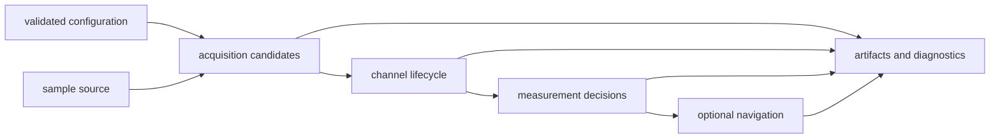
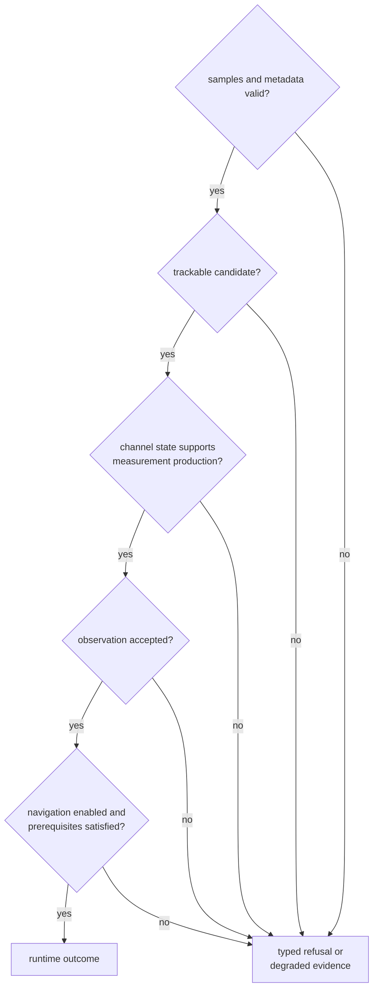

# Receiver Runtime Foundations

`bijux-gnss-receiver` owns the in-memory process that turns sample frames into
acquisition, tracking, observation, optional navigation, diagnostic, and
artifact evidence. It composes signal and navigation contracts, but it does not
redefine their science or decide where a repository stores the resulting
records.

## Follow A Receiver Session

Each stage consumes explicit inputs and emits evidence for the next stage. A
later stage must not erase ambiguity, refusal, uncertainty, or degraded state
reported earlier.

## Start From The Runtime Question

| question | contract |
| --- | --- |
| How are stages ordered and what crosses each handoff? | [Stage contracts](../interfaces/stage-contracts.md) |
| Which defaults, validation rules, and lifecycle behavior apply? | [Runtime contracts](../interfaces/runtime-contracts.md) |
| How do samples, clocks, and artifact effects enter or leave the runtime? | [Port contracts](../interfaces/port-contracts.md) |
| Which in-memory evidence does a run return? | [Artifact contracts](../interfaces/artifact-contracts.md) |
| How should a diagnostic or refused stage be interpreted? | [Diagnostic contracts](../interfaces/diagnostic-contracts.md) |
| What may simulation or reference comparison establish? | [Validation and simulation contracts](../interfaces/validation-and-simulation-contracts.md) |
| Is this behavior really receiver-owned? | [Ownership boundary](ownership-boundary.md) |

## Read Stage Evidence In Order

When a session does not produce the expected result, inspect the earliest stage
whose evidence diverges from its contract:

- Capture or metadata failures belong at the source boundary.
- Rejected or ambiguous search results belong to acquisition evidence.
- Pull-in, lock, continuity, uncertainty, and cycle-slip behavior belong to
  tracking evidence.
- Timing, covariance, residual, support, and measurement rejection belong to
  observation evidence.
- Geometry, products, estimation, integrity, and solution refusal belong to
  optional navigation evidence.

Do not diagnose an upstream failure from the absence of a final position alone.

## Runtime Effects Are Explicit

The runtime receives samples and time through ports and publishes artifacts,
metrics, traces, and logs through owned effect boundaries. Stage algorithms
must not choose repository paths, write command output, or read wall-clock time
implicitly. This keeps deterministic evidence possible and lets tests replace
effects without changing stage behavior.

Receiver artifacts describe what happened during execution. Infrastructure
adds run identity, layout, manifests, and history when those records are
persisted.

## Completion Is Not Scientific Success

A receiver call may complete correctly while reporting no accepted acquisition,
a refused channel, lost lock, rejected observations, or an unsuccessful
navigation attempt. Completion proves that runtime control returned according
to its contract. The stage records determine whether a scientific claim is
supported.

Use the [package overview](package-overview.md) for the concise role,
[scope and non-goals](scope-and-non-goals.md) for explicit refusals,
[dependencies and adjacencies](dependencies-and-adjacencies.md) for the signal,
navigation, infrastructure, and command handoffs, and
[change principles](change-principles.md) before altering stage behavior.

Implementation evidence begins with the
[receiver architecture](https://github.com/bijux/bijux-gnss/blob/main/crates/bijux-gnss-receiver/docs/ARCHITECTURE.md),
[pipeline guide](https://github.com/bijux/bijux-gnss/blob/main/crates/bijux-gnss-receiver/docs/PIPELINE.md),
[runtime guide](https://github.com/bijux/bijux-gnss/blob/main/crates/bijux-gnss-receiver/docs/RUNTIME.md),
[port guide](https://github.com/bijux/bijux-gnss/blob/main/crates/bijux-gnss-receiver/docs/PORTS.md), and
[artifact guide](https://github.com/bijux/bijux-gnss/blob/main/crates/bijux-gnss-receiver/docs/ARTIFACTS.md).
