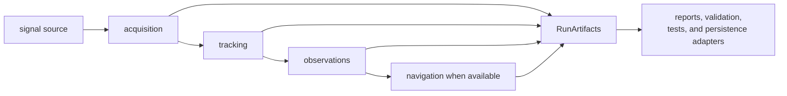
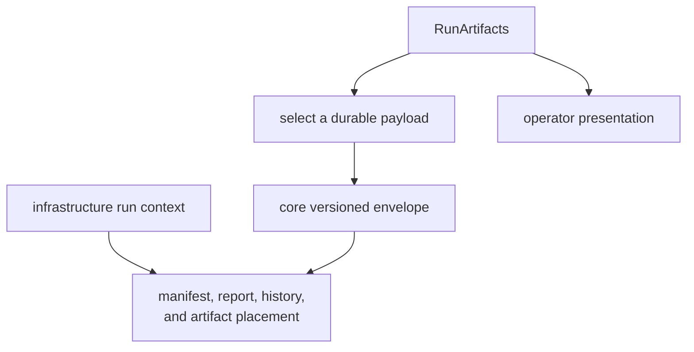

# Receiver Run Artifact Contracts

`RunArtifacts` is the in-memory result returned by a successful receiver engine
run. It aggregates stage evidence for immediate consumers. It is not a
versioned serialization envelope, run manifest, repository layout, or complete
stage-status ledger.

## How The Aggregate Is Produced

The [engine assembly](../../../crates/bijux-gnss-receiver/src/engine/engine.rs)
collects the aggregate after stage execution. `ReceiverEngine::run` returns it
only on success; callers do not receive a partial `RunArtifacts` value through
the error path.

## Field Families And Owners

The [public definition](../../../crates/bijux-gnss-receiver/src/api.rs) combines
shared core contracts with receiver-owned runtime reports:

| Field family | Contents | Semantic owner |
| --- | --- | --- |
| input accounting | consumed complex samples and code-period epochs | receiver runtime |
| acquisition | results and explainability records | core record meaning; receiver production |
| tracking transitions | run-level transition records | core record meaning; receiver lifecycle |
| channel state | per-channel receiver state reports | receiver |
| tracking results | satellite, acquisition handoff, carrier/code estimates, epochs, and transitions | receiver aggregate over core tracking records |
| observation decisions and epochs | accepted, degraded, or refused observation evidence | core record meaning; receiver production |
| observation residuals and quality | receiver-side residual and per-signal measurement reports | receiver |
| support matrix | optional stage support inventory | core shape; receiver inventory |
| navigation epochs | navigation outcomes produced at the receiver boundary | core outcome shape; navigation science and receiver orchestration |

Persistence does not transfer ownership. A core record remains core-defined
after infrastructure writes it; a receiver report remains receiver-defined
after a command renders it.

## In-Memory Aggregate Versus Durable Artifact

`RunArtifacts` does not derive serialization and has no schema version. A
durable writer must select an owned payload, wrap it in the appropriate
versioned contract, and attach repository context. Do not serialize the
aggregate ad hoc or treat its Rust field layout as a file format.

The [core serialization contract](../../bijux-gnss-core/foundation/change-principles.md)
governs versioned payload meaning. The
[infrastructure change contract](../../bijux-gnss-infra/foundation/change-principles.md)
governs identity, manifests, history, and storage recovery.

## Empty And Optional Fields Need Context

Empty collections do not all mean the same thing:

- acquisition can produce no accepted candidates
- tracking can have no active results
- observations can be absent after unsuccessful tracking or missing timing
- navigation can be disabled, lack capture time, lack ephemeris, or complete
  without a solution
- support inventory is optional in the type even though the standard engine
  currently populates it

The runtime trace distinguishes navigation-disabled, missing-time,
missing-data, and completed-empty cases. `RunArtifacts.navigation` does not.
Consumers that need the reason must retain stage trace or introduce a typed
stage outcome rather than infer from vector length.

Similarly, `RunArtifacts::default()` produces an entirely empty aggregate. It
is useful for construction but is not proof that a receiver pipeline executed.

## Related Views Must Stay Coherent

Some evidence appears in more than one view:

- run-level tracking transitions and transitions nested in each tracking result
- observation decisions derived from observation epochs
- observation epochs, residuals, and measurement-quality reports reconstructed
  by `observation_artifacts()`

The [observation reconstruction helper](../../../crates/bijux-gnss-receiver/src/artifacts.rs)
clones epochs, residuals, and measurement quality into the observation-stage
view; it does not include observation decisions. Consumers should not assume
that any arbitrary `RunArtifacts` value has coherent lengths or identities
merely because the standard engine constructs them together.

When adding duplicated or derived views:

1. identify the authoritative source
2. define keying and ordering
3. prove derivation agreement
4. avoid independent mutation
5. state what an empty or missing derived view means

## Consumer Responsibilities

### Reports

Render typed statuses and diagnostics without converting empty evidence into a
successful claim. Operator wording and exit behavior remain command-owned.

### Validation

Select the stage evidence required by the validation claim. Observation
validation should use epochs, residuals, measurement quality, and decisions as
appropriate rather than treating the aggregate as one pass/fail object.

### Persistence

Persist versioned payloads with run context and provenance. Keep file names,
directories, manifests, history, atomicity, and reader compatibility in
infrastructure.

### Tests

Assert the smallest artifact family that proves the runtime claim. Useful
examples include:

- [streaming input accounting](../../../crates/bijux-gnss-receiver/tests/integration_receiver_streaming.rs)
- [acquisition explainability](../../../crates/bijux-gnss-receiver/tests/integration_acquisition_explainability.rs)
- [tracking channel state reports](../../../crates/bijux-gnss-receiver/tests/integration_tracking_channel_state_reports.rs)
- [observation measurement quality](../../../crates/bijux-gnss-receiver/tests/integration_observations_measurement_quality.rs)
- [support inventory](../../../crates/bijux-gnss-receiver/tests/integration_receiver_support_matrix_inventory.rs)
- [navigation prerequisites](../../../crates/bijux-gnss-receiver/tests/integration_multisat_pvt_readiness.rs)

These tests prove their named runtime views, not durable schema compatibility.

## Review A New Field

A new field needs:

1. one named producer and authoritative source
2. one real consumer
3. units, identity, ordering, validity, and empty semantics
4. feature behavior when its producer is unavailable
5. consistency rules with related views
6. a decision about in-memory-only versus versioned persistence
7. focused evidence for production and refusal

If a field exists only for one report layout, keep it in the report adapter. If
it defines portable shared meaning, place the record in core. If it defines
repository context, place it in infrastructure.

## Current Contract Limits

- The aggregate has no schema version or serialization contract.
- The type permits states the standard engine does not normally produce.
- Navigation emptiness loses the stage-level reason unless trace evidence is
  retained.
- Successful construction does not validate cross-vector identity or length
  coherence as a separate invariant.
- The observation reconstruction helper omits decision artifacts.
- A receiver error does not return partial aggregate evidence.

The [receiver artifact guide](../../../crates/bijux-gnss-receiver/docs/ARTIFACTS.md)
summarizes the runtime families. The contract remains trustworthy when every
consumer distinguishes in-memory execution evidence from versioned payloads,
repository state, and operator presentation.
