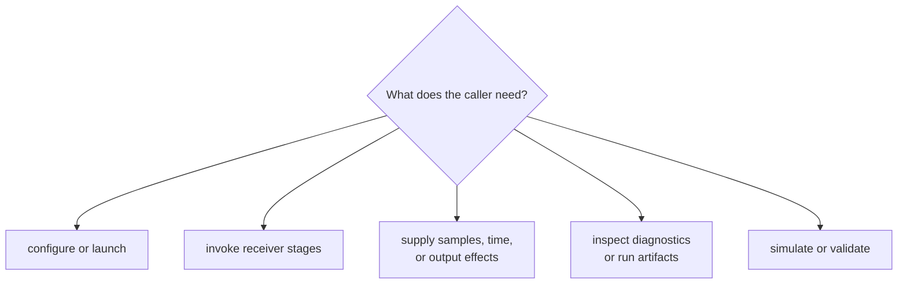

# Receiver Interface Guide

Callers use `bijux_gnss_receiver::api` to configure and execute receiver
behavior without depending on private stage modules. Public contracts cover
runtime composition, stage engines, effects, diagnostics, in-memory artifacts,
and feature-gated validation and navigation integration.

## Choose The Runtime Contract



| caller need | contract | caller-visible meaning |
| --- | --- | --- |
| Configure defaults, validate settings, create runtime context, or launch a receiver | [Runtime contracts](runtime-contracts.md) | explicit receiver policy and injected effects |
| Search, track, construct observations, or invoke optional navigation | [Stage contracts](stage-contracts.md) | typed handoffs, lifecycle, uncertainty, and refusal |
| Provide sample frames, clocks, or artifact sinks | [Port contracts](port-contracts.md) | minimal effect seams with caller-owned implementation lifecycle |
| Interpret severity, stage state, transition reasons, or runtime health | [Diagnostic contracts](diagnostic-contracts.md) | structured evidence rather than inferred prose |
| Consume acquisition, tracking, observation, support, or navigation outcomes | [Artifact contracts](artifact-contracts.md) | in-memory evidence before repository persistence |
| Run synthetic scenarios or compare receiver outputs with reference truth | [Validation and simulation contracts](validation-and-simulation-contracts.md) | receiver-boundary evidence with explicit scope and feature requirements |

## Read A Run Result

```mermaid
flowchart LR
    call["receiver call completed"]
    artifacts["run artifacts"]
    stages["stage evidence"]
    status{"claim supported?"}
    supported["supported outcome"]
    degraded["degraded or refused"]
    persistence["infrastructure persistence"]

    call --> artifacts --> stages --> status
    status --> supported
    status --> degraded
    artifacts --> persistence
```

Completion means runtime control returned according to its contract. It does
not prove acquisition, lock, accepted observations, or a valid navigation
solution. Read the earliest stage evidence that bears on the claim.

`RunArtifacts` and related reports are in-memory receiver results.
Infrastructure decides run identity, directories, manifests, history, and
persisted artifact locations.

## Public Surface And Features

Use the [API surface](api-surface.md) and
[public imports](public-imports.md) rather than private modules. Navigation
execution, covariance realism, reference validation, validation reports, and
synthetic runtime exports depend on the `nav` feature. Core acquisition,
tracking, observations, ports, and carrier-smoothed validation remain available
without it.

Selected core, signal, and navigation contracts are re-exported for integration
convenience. Ownership remains with their defining package.

## Interface Review Questions

- Does the type describe durable receiver behavior or only one stage’s
  implementation workspace?
- Are configuration defaults and runtime effects explicit?
- Can callers distinguish accepted, degraded, refused, and failed outcomes?
- Does a stage output retain timing, uncertainty, quality, and transition
  context required downstream?
- Is feature-gated availability visible in code, docs, and compatibility
  evidence?
- Can the operation remain independent of command syntax and repository layout?

Use [compatibility commitments](compatibility-commitments.md) before changing
public behavior and [entrypoints and examples](entrypoints-and-examples.md) for
consumer-shaped calls.

## Sources Of Truth

The [curated receiver API](https://github.com/bijux/bijux-gnss/blob/main/crates/bijux-gnss-receiver/src/api.rs) is
the supported import boundary. The
[public API guide](https://github.com/bijux/bijux-gnss/blob/main/crates/bijux-gnss-receiver/docs/PUBLIC_API.md),
[runtime guide](https://github.com/bijux/bijux-gnss/blob/main/crates/bijux-gnss-receiver/docs/RUNTIME.md),
[pipeline guide](https://github.com/bijux/bijux-gnss/blob/main/crates/bijux-gnss-receiver/docs/PIPELINE.md),
[port guide](https://github.com/bijux/bijux-gnss/blob/main/crates/bijux-gnss-receiver/docs/PORTS.md), and
[artifact guide](https://github.com/bijux/bijux-gnss/blob/main/crates/bijux-gnss-receiver/docs/ARTIFACTS.md) define
the contract families behind it.
