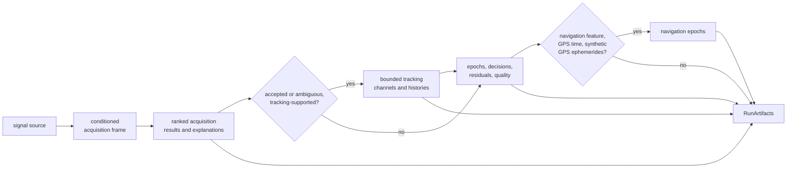
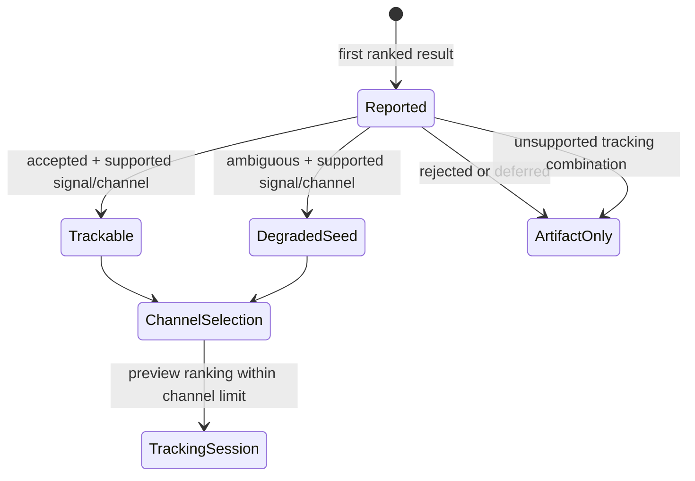

# Receiver Stage Handoffs

The receiver does not pass one opaque success value from stage to stage.
Acquisition hypotheses control tracking admission, tracking histories determine
observation construction, and optional navigation requires time and ephemeris
context. Typed run artifacts, runtime traces, runtime metrics, and local
`StepReport` values carry different evidence and must not be described as one
report.

## Actual Pipeline

The [top-level engine](../../../crates/bijux-gnss-receiver/src/engine/engine.rs)
is the composition authority. The
[public receiver API](../../../crates/bijux-gnss-receiver/src/api.rs) defines
what a caller receives. Stage-local APIs can expose more detail than the
top-level run preserves.

## Entry Contract

`Receiver::run` derives acquisition requests from configuration and source
metadata. Explicit-request and explicit-satellite entrypoints converge on the
same internal pipeline after constellation-policy filtering.

The first source read asks for the acquisition frame:

- end of source before a frame is a successful empty run returning default
  artifacts
- a source error becomes `ReceiverError::Input` and triggers diagnostic dumping
- an available frame is front-end conditioned before acquisition
- the same acquisition frame also seeds tracking, preserving sample continuity
- subsequent tracking reads continue until source exhaustion

An empty successful run is therefore not evidence that acquisition executed.
Callers must inspect processed counts and stage artifacts rather than process
status alone.

## Acquisition to Tracking

Acquisition searches up to four ranked results for each request. The top-level
run keeps the first result from each non-empty request result set in
`RunArtifacts.acquisitions`, regardless of whether its hypothesis is accepted,
ambiguous, rejected, or deferred. Explanations are retained separately.

Tracking admission is narrower:

| Handoff concern | Contract |
| --- | --- |
| identity | satellite, signal band/code, and GLONASS channel where applicable stay attached |
| seed state | accepted acquisition enters as accepted; ambiguous acquisition records a degraded acquisition-to-track state |
| timing | source and front-end group delays are applied to acquisition alignment evidence before tracking |
| eligibility | rejected, deferred, and unsupported combinations remain acquisition evidence but do not create tracking channels |
| capacity | eligible candidates are previewed and ranked, then bounded by configured channel capacity |
| explainability | ranked rationale remains in acquisition explain artifacts, not in the tracking result |

The trace field currently named `accepted_candidates` records the number of
first-ranked acquisition results, not the number whose hypothesis is accepted.
Use acquisition statistics or hypotheses for acceptance counts; do not infer
them from that trace label.

See the [acquisition implementation](../../../crates/bijux-gnss-receiver/src/pipeline/acquisition.rs)
and [acquisition explainability proof](../../../crates/bijux-gnss-receiver/tests/integration_acquisition_explainability.rs)
when changing this boundary.

## Tracking to Observations

A tracking result carries the acquisition seed, final carrier and code
estimates, epoch history, and transitions for one admitted channel. Parallel
channel-state reports preserve stable channel identity, final state, reasons,
and emitted lifecycle events such as acquired, pull-in, locked, degraded, lost,
reacquired, or refused.

The observation stage receives all tracking results, not only channels whose
final state is locked. It constructs:

- observation epochs with accepted or rejected decisions
- decision artifacts derived from those epochs
- residual reports
- per-signal measurement-quality reports

This separation matters. An observation epoch may exist and be rejected, while
its decision and quality evidence explain why it cannot support navigation.
Cardinality across the four vectors is not a general one-to-one contract;
assert relationships only where the changed constructor guarantees them.

The [tracking artifact types](../../../crates/bijux-gnss-receiver/src/pipeline/tracking/session_artifacts.rs),
[channel lifecycle types](../../../crates/bijux-gnss-receiver/src/pipeline/tracking/channel_lifecycle.rs),
and [observation artifact type](../../../crates/bijux-gnss-receiver/src/pipeline/observations.rs)
define the detailed handoff. The
[channel-state integration proof](../../../crates/bijux-gnss-receiver/tests/integration_tracking_channel_state_reports.rs)
checks the exported tracking/report relationship for receiver runs.

## Observation to Navigation

Automatic navigation in the top-level run is more constrained than the
availability of public navigation helpers suggests. It executes only when:

- the receiver is built with navigation support
- capture-start GPS time is configured
- the signal source is the receiver’s synthetic source type
- that synthetic source exposes at least one GPS ephemeris

Otherwise the run returns an empty navigation vector and records a trace status
such as disabled, missing capture time, or missing navigation data. Those
conditions are not `ReceiverError` failures. Even when execution starts, a
solver may produce no navigation epochs and report completed-empty.

Public receiver methods can solve supplied observation epochs against explicit
GPS ephemerides or broadcast navigation data. Those methods are separate from
the automatic source-to-navigation bridge and must not be used to imply that a
generic file or memory source automatically carries ephemerides.

Use the [navigation bridge](../../../crates/bijux-gnss-receiver/src/engine/receiver.rs)
and [multisatellite readiness proof](../../../crates/bijux-gnss-receiver/tests/integration_multisat_pvt_readiness.rs)
when changing this handoff.

## Evidence Channels

| Channel | Preserved evidence | Important limit |
| --- | --- | --- |
| `RunArtifacts` | processed counts; acquisition results and explanations; tracking transitions, state reports, and histories; observation decisions, epochs, residuals, and quality; support matrix; navigation epochs | no stage duration, acquisition statistics, trace status, or aggregate `StepReport` |
| runtime trace sink | stage start/completion, status, selected counts, and diagnostic context | only available through the configured sink; field names are not substitutes for typed hypotheses |
| runtime metric sink | stage durations, acquisition counters, tracking counts, observation counts, and navigation counts | not returned in `RunArtifacts` |
| metrics summary | aggregate acquisition, tracking, observation, and navigation measures | written only when a run directory is configured |
| `StepReport<T>` | stage-local output, diagnostic events, and optional processing time | observation helpers return it, but the top-level engine currently retains only its output and discards its events and stats |

`StepStats` currently contains only optional processing milliseconds. It is a
public stage-helper contract, not a top-level pipeline accounting record. The
crate-local [pipeline guide](../../../crates/bijux-gnss-receiver/docs/PIPELINE.md)
should be read with this distinction; its “step reporting” row does not mean
that `RunArtifacts` contains step reports.

## Degraded, Empty, and Error Outcomes

| Condition | Run behavior | Evidence to inspect |
| --- | --- | --- |
| source ends before acquisition frame | successful default artifacts | zero processed counts and empty vectors |
| no accepted or ambiguous supported acquisition | observations still execute over an empty tracking set | acquisition hypotheses, explanations, zero tracking channels |
| tracking loses or refuses a channel | run continues | transitions, state report reasons, epoch lock evidence |
| observation is inconsistent or lacks accepted observables | epoch may be retained as rejected | decision artifact, residual, and quality report |
| navigation prerequisite absent | run continues with empty navigation | navigation trace status |
| source read fails | run returns input error | diagnostic dump and error context |
| configured metrics-summary write fails | write helper currently suppresses many failures by returning early | sink/output inspection; successful run alone is insufficient |

The final row is an implementation limitation: metrics-summary persistence is
best-effort and not represented in the receiver result type.

## Reviewing a Handoff Change

1. Name the producer type, consumer type, eligibility rule, ordering, units,
   and identity fields.
2. Prove accepted, ambiguous/degraded, rejected/refused, empty, and source-error
   paths that can occur at that boundary.
3. Check which evidence channel retains the decision and which details are
   dropped.
4. Follow the changed artifact into command reporting and infrastructure
   persistence before claiming compatibility.
5. Keep reusable signal math in the [signal package](../../bijux-gnss-signal/),
   navigation science in the [navigation package](../../bijux-gnss-nav/),
   persisted run interpretation in the [infrastructure package](../../bijux-gnss-infra/),
   and operator syntax in the [command package](../../bijux-gnss/).

A stage contract is complete when success, refusal, degradation, emptiness,
error, and evidence loss are all visible to the next reader.
