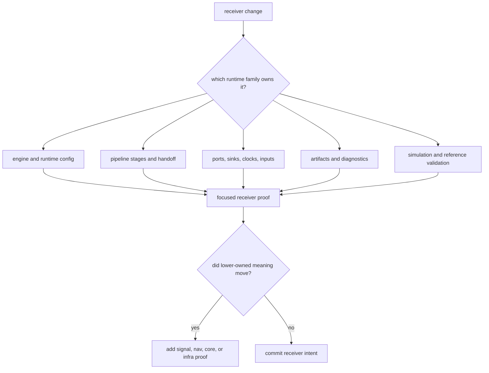

# Change Sequence

Use this sequence when a receiver change affects runtime composition, stage
handoff, ports, artifacts, diagnostics, synthetic proof, or reference
validation. The receiver is where many lower truths become an execution path,
so the sequence must prevent stage-local edits from becoming accidental
cross-crate contracts.

## Decision Flow

## Recommended Sequence

1. Name the owning runtime family and confirm the boundary.
2. Read the crate-local doc for that family before editing.
3. Inspect the current stage or runtime proof before changing behavior.
4. Make one coherent receiver change and only tightly coupled docs or tests.
5. Run the narrowest test that proves the runtime-visible claim.
6. Add lower-owner proof only when shared, signal, nav, or infra meaning moved.
7. Commit the receiver intent before widening to another runtime family.

## Why The Sequence Matters

This crate is broad enough that one "small" runtime or validation edit can
have public consequences. Committing by runtime intent keeps reviewable history
aligned with package meaning.

## Proof Selection

| changed family | first proof |
| --- | --- |
| engine, runtime config, or metrics | `crates/bijux-gnss-receiver/docs/RUNTIME.md` plus focused engine/config tests |
| acquisition or tracking handoff | `crates/bijux-gnss-receiver/docs/PIPELINE.md` plus the focused acquisition or tracking integration test |
| observations and measurement metadata | observation tests that assert timing, residual, rejection, or lock-state metadata |
| ports, sinks, clocks, and inputs | `crates/bijux-gnss-receiver/docs/PORTS.md` plus the affected seam test |
| artifacts, diagnostics, and state reports | `ARTIFACTS.md`, diagnostic contracts, and artifact/state-report integration proof |
| simulation or reference comparison | `SIMULATION.md`, `REFERENCE_VALIDATION.md`, and the focused validation proof |

Start from `crates/bijux-gnss-receiver/docs/TESTS.md` and
`docs/bijux-gnss-receiver/operations/verification-commands.md`. A broad
receiver run is not a substitute for naming the stage or runtime seam that
moved.
