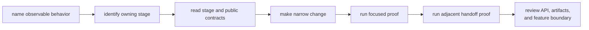

# Local Development

Receiver changes are easiest to review when one runtime contract, one focused
proof set, and one ownership boundary move together. Start by describing the
observable behavior, not by editing whichever broad integration test failed.

## Development Loop

1. State the accepted, degraded, or refused behavior that should change.
2. Locate the owner with the [Module Map](../architecture/module-map.md) or
   [Code Navigation](../architecture/code-navigation.md).
3. Read the [pipeline contract](../../../crates/bijux-gnss-receiver/docs/PIPELINE.md)
   and the stage-specific guide before editing.
4. Change the narrowest runtime family and preserve typed evidence at its
   handoff.
5. Run a module or single integration target that directly observes the
   behavior.
6. Run one adjacent-stage target when the handoff changed.
7. Review the [public API](../../../crates/bijux-gnss-receiver/src/api.rs),
   emitted artifacts, and `nav` availability before committing.

## Select Focused Proof

| changed surface | useful first command | adjacent concern |
| --- | --- | --- |
| receiver configuration or startup | `cargo test -p bijux-gnss-receiver --test integration_basic` | determinism and support reporting |
| acquisition | `cargo test -p bijux-gnss-receiver --test integration_acquisition_smoke` | tracking handoff and acquisition artifacts |
| tracking | `cargo test -p bijux-gnss-receiver --test integration_tracking_cn0` | observation timing, lock state, and transitions |
| observations | `cargo test -p bijux-gnss-receiver --test integration_observations_measurement_quality` | navigation handoff and residual reports |
| support inventory | `cargo test -p bijux-gnss-receiver --test integration_receiver_support_matrix_inventory` | command and signal inventory consumers |
| optional navigation | `cargo test -p bijux-gnss-receiver --test integration_navigation_pvt_accuracy_budget` | navigation-owned algorithms and receiver reports |

These commands are entrypoints, not universal proof. Select the exact target
whose name describes the changed contract, then use the
[receiver test guide](../../../crates/bijux-gnss-receiver/docs/TESTS.md) to
decide whether a broader family is justified.

## Preserve Evidence

- Keep success, degraded, and refusal outcomes typed.
- Update stage reports and durable artifacts when their observable meaning
  changes.
- Do not replace an uncertainty or lifecycle assertion with "did not panic."
- Preserve deterministic seeds and independent truth inputs where the test
  claims accuracy.
- Keep slow scientific proof in the governed slow lane; consult the
  [repository test policy](../../bijux-gnss-dev/quality/repository-test-policy.md)
  before changing lane membership.

## Avoid Misleading Shortcuts

- Do not widen the public API to reach a private helper from one test.
- Do not weaken a truth threshold merely because a broad target is expensive.
- Do not change acquisition, tracking, and observations together unless one
  explicit handoff contract requires all three.
- Do not copy signal or navigation logic into receiver to make a local test
  easier to arrange.
- Do not treat a passing broad suite as proof of a specific loop, timing, or
  uncertainty claim.

Before committing, use [Verification Commands](verification-commands.md) to
record exact checks and [Review Scope](review-scope.md) to inspect downstream
effects without turning the change into an unrelated workspace sweep.
