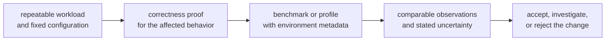
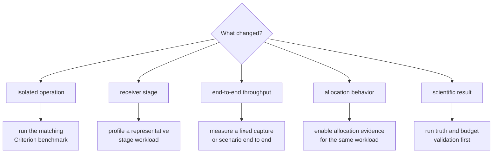

# Receiver Performance Evidence

A receiver can be scientifically correct and still miss its runtime budget. It
can also become faster by silently doing less work. Treat correctness and
performance as separate claims, then require evidence for both.

This page explains what the repository measures today, how to investigate a
regression, and what a performance result can support. For command ownership
and report formats, use the
[benchmark governance guide](https://github.com/bijux/bijux-gnss/blob/main/crates/bijux-gnss-dev/docs/BENCHMARKS.md).

## Build An Evidence Chain



Do not start from a single elapsed-time observation. First decide which claim
you need:

| question | suitable evidence | unsuitable substitute |
| --- | --- | --- |
| Did one receiver operation become slower? | repeated microbenchmark measurements from comparable builds | one full test duration |
| Where is time being spent? | a profile of a representative receiver workload | a Criterion summary without call attribution |
| Can the receiver keep up with the input stream? | end-to-end throughput or real-time-factor measurement | an isolated acquisition or tracking microbenchmark |
| Did allocations change? | allocation instrumentation on the same workload and feature set | wall-clock timing alone |
| Is the result still scientifically valid? | receiver tests, truth comparisons, and validation budgets | a faster benchmark |

## What The Repository Measures

The receiver owns three Criterion microbenchmarks. Each isolates one operation
using a small synthetic input and the default receiver configuration.

| benchmark | measured operation | interpretation limit |
| --- | --- | --- |
| [acquisition search](https://github.com/bijux/bijux-gnss/blob/main/crates/bijux-gnss-receiver/benches/bench_acquisition_fft.rs) | one FFT acquisition over a default GPS L1 C/A code-period frame | does not represent a multi-satellite search, a broad Doppler window, or a full receiver run |
| [tracking correlation](https://github.com/bijux/bijux-gnss/blob/main/crates/bijux-gnss-receiver/benches/bench_correlator.rs) | one correlator epoch over a default code-period frame | does not include the complete channel lifecycle or sustained stream processing |
| [tracking update](https://github.com/bijux/bijux-gnss/blob/main/crates/bijux-gnss-receiver/benches/bench_tracking_update.rs) | one tracking epoch update over a zero-valued frame | isolates update cost; it is not a tracking-accuracy or lock-retention result |

Run a focused benchmark while developing:

```console
cargo bench -p bijux-gnss-receiver --bench bench_acquisition_fft
cargo bench -p bijux-gnss-receiver --bench bench_correlator
cargo bench -p bijux-gnss-receiver --bench bench_tracking_update
```

The maintainer comparison command runs these receiver benchmarks together with
the navigation filter benchmark:

```console
cargo run -p bijux-gnss-dev -- bench-compare
```

### Baseline Status

As of this review, the repository does not contain the benchmark baseline
consumed by the comparison command. The command still writes current
measurements and a log, but it skips regression comparison when the baseline is
absent. A successful command therefore proves that the benchmarks ran; it does
not prove that performance stayed within a governed threshold.

Do not describe a measurement as a regression pass until a reviewed baseline
exists and the command actually compares against it. Do not create or replace a
baseline merely to make a change appear acceptable. Establish it from a known
commit, record the machine and toolchain context, and review it as performance
policy.

## Choose The Right Investigation



### Acquisition

Record signal identity, sample rate, coherent integration interval, Doppler
window, Doppler step, candidate limits, and the number of searched satellites.
Those parameters determine the amount of work. Use the acquisition
microbenchmark only when its default single-frame workload represents the code
you changed.

### Tracking

Record channel count, signal families, epoch duration, lock state, and whether
reacquisition or degraded-state handling occurs. A clean one-epoch correlator
measurement cannot support a claim about fade recovery, navigation-bit
transitions, or sustained tracking throughput.

### Observation And Navigation Handoff

Use a repeatable receiver scenario and inspect stage artifacts to separate
observation construction from downstream solver or filter cost. The
[runtime contract](../interfaces/runtime-contracts.md) explains stage
boundaries, while the
[artifact contract](../interfaces/artifact-contracts.md) identifies the
evidence emitted at those boundaries.

### End-To-End Runs

Measure a fixed capture or deterministic synthetic scenario. Report processed
sample duration alongside wall time so the result can be expressed as
throughput or real-time factor. Include startup and artifact-writing cost only
when they are part of the claim.

The repository currently has no dedicated end-to-end throughput benchmark.
Until one exists, describe these measurements as scenario results rather than
as a general receiver performance guarantee.

## Instrumentation Features

The [receiver feature declarations](https://github.com/bijux/bijux-gnss/blob/main/crates/bijux-gnss-receiver/Cargo.toml)
expose diagnostic instrumentation for targeted investigations:

| feature | use |
| --- | --- |
| `tracing` | emit structured runtime spans and events |
| `trace-dump` | retain trace output for inspection |
| `trace-heavy` | enable more expensive diagnostic evidence |
| `alloc-trace` | collect allocation observations |
| `alloc-audit` | run allocation-audit coverage |

Instrumentation changes runtime behavior. Compare only builds with the same
profile and feature set. Use instrumented runs to locate or explain cost, not
as direct substitutes for uninstrumented release measurements.

The repository does not prescribe one platform profiler. Record the profiler,
version, sampling mode, build profile, symbols, and command used so another
maintainer can interpret or repeat the result.

## Record Enough Context

Every performance result used in review should identify:

- the commit and whether the worktree was clean;
- the Rust toolchain, build profile, and enabled features;
- processor model, operating system, power mode, and competing load;
- the benchmark, capture, or synthetic scenario;
- sample rate, frame duration, signal set, satellite count, and search bounds;
- warm-up policy, sample count, repetitions, and reported statistic;
- whether tracing, allocation tracking, or artifact writing was enabled;
- the correctness checks run against the same behavior.

Without this context, numbers from different runs are observations, not a
comparison.

## Prove An Optimization

1. Reproduce the cost on an unchanged workload.
2. Run the narrow correctness test before changing the implementation.
3. Capture a benchmark or profile that identifies the expensive operation.
4. Change one owned cost center without weakening diagnostics or validation.
5. Repeat the same measurement under comparable conditions.
6. Run the affected receiver tests and truth-budget checks.
7. Report the result, uncertainty, environment, and any remaining limitation.

Receiver correctness guidance is in the
[test strategy](../quality/test-strategy.md) and
[validation budgets](../quality/validation-budgets.md). The
[receiver test guide](https://github.com/bijux/bijux-gnss/blob/main/crates/bijux-gnss-receiver/docs/TESTS.md)
separates unit, integration, truth, and reference evidence.

## Keep Slow Tests Separate

Test duration is not benchmark evidence. The default test lane excludes tests
listed in the governed slow roster; the slow and complete lanes exercise them.
Moving a scientifically necessary test between lanes changes developer
feedback time, not receiver runtime.

If a test unexpectedly crosses the slow threshold, determine whether the test
workload changed, the implementation regressed, or the environment was noisy.
Do not weaken assertions or shorten a truth scenario merely to restore a
duration label.

## Known Evidence Gaps

- No reviewed benchmark baseline is present, so repository benchmark comparison
  is not currently an enforced regression gate.
- The three receiver benchmarks cover isolated default operations, not
  multi-signal or multi-channel workloads.
- No dedicated benchmark reports end-to-end throughput or real-time factor.
- No stable benchmark reports peak working set or retained memory.
- Performance results remain machine-sensitive and must carry environment
  metadata to be reviewable.

These gaps bound the claims the current suite can support. They are not reasons
to treat an unmeasured performance property as acceptable.
