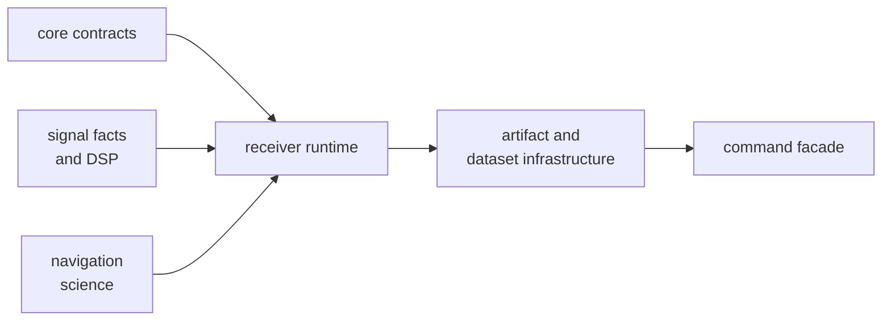
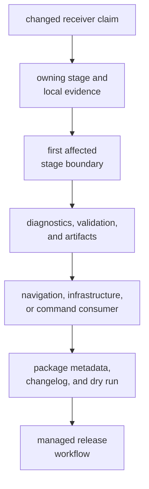

# Releasing the Receiver Runtime

The receiver package turns signal samples into acquisition, tracking,
observation, diagnostic, and optional navigation evidence. A release can keep
the Rust API unchanged while moving lock behavior, uncertainty, artifacts, or
scientific claims. Review behavioral and data compatibility alongside source
compatibility.

This page defines readiness evidence. External publication occurs later
through managed GitHub workflows.

## Publication Position

The [release contract](https://github.com/bijux/bijux-gnss/blob/main/configs/release/crates.toml) places receiver
after core, signal, and navigation, and before infrastructure and the command
facade. It shares the workspace version with the other five public packages.



Navigation support is enabled by default. Changes to the default feature,
optional navigation dependency, precise-product forwarding, tracing, reference
checks, or audit features require explicit release review.

## Classify Receiver Impact

| Changed surface | Release impact |
| --- | --- |
| Acquisition ranking, ambiguity, uncertainty, or refusal | behavioral and scientific compatibility |
| Tracking loops, state transitions, fades, or reacquisition | continuity, lifecycle, and numerical compatibility |
| Observation construction, quality, covariance, or exclusion | downstream measurement and navigation compatibility |
| Runtime configuration, defaults, clocks, or ports | execution and integration compatibility |
| Artifact field, diagnostic, validation report, or unit | machine-readable and persisted interpretation |
| Synthetic scenario, truth table, or validation budget | evidence compatibility; explain whether model, threshold, or runtime meaning changed |
| Public export or feature | Rust API and build compatibility |
| Performance optimization | runtime compatibility only after equivalent scientific evidence remains green |

Do not classify a corrected algorithm as harmless solely because it is more
accurate. State the old behavior, authority for the correction, affected
artifacts, and downstream consequences.

## Trace Release Evidence



Start with the [runtime contract](https://github.com/bijux/bijux-gnss/blob/main/crates/bijux-gnss-receiver/docs/RUNTIME.md)
and [pipeline contract](https://github.com/bijux/bijux-gnss/blob/main/crates/bijux-gnss-receiver/docs/PIPELINE.md).
Use the [artifact guide](https://github.com/bijux/bijux-gnss/blob/main/crates/bijux-gnss-receiver/docs/ARTIFACTS.md)
for emitted evidence, the
[simulation guide](https://github.com/bijux/bijux-gnss/blob/main/crates/bijux-gnss-receiver/docs/SIMULATION.md) for
truth-backed claims, and the
[public API guide](https://github.com/bijux/bijux-gnss/blob/main/crates/bijux-gnss-receiver/docs/PUBLIC_API.md) for
exports and features.

A final position or broad receiver run cannot substitute for proof at the
earliest changed stage.

## Prove Package Readiness

The workspace release validator covers all six packages:

```sh
make release-check
make publish-rs
```

Cargo publication is dry-run by default. It checks whether the packaged
receiver can resolve registry dependencies in publication order without
uploading it. Keep actual publication disabled during review.

Build the governed receiver source bundle through the
[release make targets](https://github.com/bijux/bijux-gnss/blob/main/makes/release.mk). GHCR receives that source
bundle, not a runnable receiver container. GitHub Releases attach release
artifacts from the same tagged source.

## Current Automation Status

The [managed workflow manifest](https://github.com/bijux/bijux-gnss/blob/main/.github/standards/repo-config.manifest.json)
declares crates.io, GHCR, GitHub Release, and source-artifact workflows, but
their runtime workflow files are not currently present in the tracked workflow
directory. Receiver release is therefore not externally triggerable from the
current tree.

An accepted standards synchronization must install those managed workflows
before release. Do not hand-create replacements or modify synchronized workflow
content locally. After installation, verify that the workflow matrix includes
the receiver package, uses the reviewed stable tag, waits for CI on the same
commit, and preserves dependency publication order.

## Write the Release Record

The [receiver changelog](https://github.com/bijux/bijux-gnss/blob/main/crates/bijux-gnss-receiver/CHANGELOG.md)
should identify:

- the affected stage, public contract, feature, artifact, or validation budget
- old and new behavior, including degraded and refused states
- units, thresholds, uncertainty, and scenario scope
- impact on navigation, infrastructure, and command consumers
- focused stage evidence and the first affected integration boundary
- limitations not covered by synthetic or reference scenarios

The workspace changelog should summarize coordinated package and publication
status. If one channel fails or remains unavailable, report the partial state
instead of hiding it behind a successful package build.

The receiver is release-ready when scientific behavior, public API, features,
artifacts, consumers, metadata, changelogs, dry-run publication, and source
bundles agree. Actual crates.io, GHCR, and GitHub publication remains a later
managed-workflow action.
