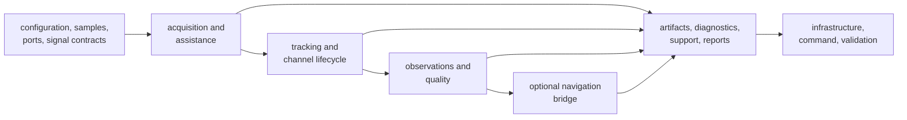
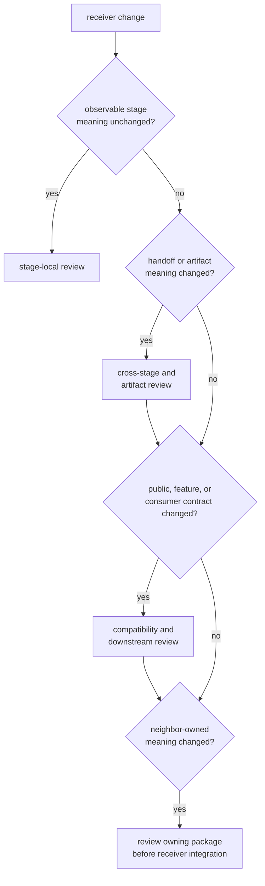

# Receiver Change Review

Scope a receiver review by the runtime contract that changes and how far its
meaning travels. File count is irrelevant: one threshold can change candidate
acceptance for every signal, while a large private reorganization may preserve
all observable behavior.

## Trace Contract Reach

Review the first changed meaning, every affected handoff, and the first
consumer that interprets emitted evidence. A final position or report cannot
substitute for checking an earlier stage contract.

## Classify Review Breadth

| Review scope | Appropriate when | Minimum review |
| --- | --- | --- |
| stage-local | private computation changes while input, output, state transition, thresholds, and diagnostics remain unchanged | owning stage invariant, focused positive and refusal proof, deterministic behavior |
| handoff | data, uncertainty, ordering, identity, or refusal meaning changes between adjacent stages | both stage owners, transition evidence, artifact propagation, next-stage consumer |
| runtime-wide | configuration defaults, ports, source/sink behavior, support inventory, common frequency, shared state, or determinism changes | affected stages, lifecycle, effects, replay, diagnostics, and package consumers |
| public contract | exported type, function, trait, default, error, schema, artifact, diagnostic, or validation claim changes | compatibility, feature availability, direct downstream use, docs, and migration decision |
| cross-package | change requires new signal meaning, navigation science, persistence policy, command behavior, or core record semantics | owning package evidence first, receiver integration second, explicit ownership boundaries |

A change may belong to more than one row. Use the widest contract actually
affected, not the narrowest description of the implementation edit.

## Review by Runtime Family

| Changed family | Questions the review must answer | Evidence beyond the local calculation |
| --- | --- | --- |
| configuration and defaults | Which omitted or invalid input changes behavior? Is the resolved configuration observable? | invalid configuration, default resolution, artifact/configuration evidence, affected stages |
| sample source, clock, or sink port | Are ordering, end-of-stream, time, failures, and side effects preserved? | adapter boundary, interruption or failure, deterministic source, sink evidence |
| acquisition and assistance | Which hypotheses, thresholds, ambiguity rules, uncertainty, and refusal decisions move? | signal-specific truth, negative detection, assistance handoff, tracking promotion |
| tracking and channel lifecycle | Which code/carrier state, loop, lock, fade, slip, reacquisition, or refusal transition moves? | continuity, transition ordering, truth evidence, observation handoff |
| observation construction | Which tracked state becomes a measurement, exclusion, covariance, residual, or quality result? | invalid-lock rejection, uncertainty propagation, navigation input, artifact evidence |
| navigation bridge | Which observation products, prerequisites, feature states, and nav-owned outcomes are carried? | enabled and disabled behavior, typed refusal, nav-owner proof, receiver artifact |
| artifacts, diagnostics, and reports | Can a later reader reconstruct the runtime decision, threshold, value, identity, and state? | schema or compatibility decision, serialization-facing proof, infrastructure and command consumers |
| validation and simulation | Is expected truth independent, bounded, and specific to receiver behavior? | truth provenance, refused/degraded scenario, limits, no circular fixture generation |
| support inventory | Does advertised support match executable acquisition, tracking, observation, and optional navigation capability? | supported and unsupported cases, feature matrix, report consumer |

The [pipeline contract](https://github.com/bijux/bijux-gnss/blob/main/crates/bijux-gnss-receiver/docs/PIPELINE.md)
defines stage ownership, and the
[public API guide](https://github.com/bijux/bijux-gnss/blob/main/crates/bijux-gnss-receiver/docs/PUBLIC_API.md)
defines the supported downstream surface.

## Escalate on Semantic Triggers

Escalate review when any of these changes:

- threshold, default, acceptance, lock, downgrade, or refusal policy
- ordering, identity, timing, phase, units, uncertainty, or covariance
- state transition, interruption, recovery, or deterministic replay
- artifact membership, diagnostic code, severity, schema, or interpretation
- support claim or signal/component pairing
- public export, trait obligation, error, or re-export
- feature-enabled versus feature-disabled behavior
- first infrastructure, command, validation, or navigation consumer

## Preserve Neighbor Ownership

Receiver may compose but must not redefine:

- signal catalogs, codes, modulation, reusable DSP, or raw-IQ meaning
- core identities, units, shared records, diagnostics, and envelopes
- orbit, correction, positioning, integrity, PPP, or RTK science
- dataset discovery, run directories, manifests, histories, or persistence
- operator syntax, report presentation, or exit policy

If a receiver failure exposes a defect below or above its boundary, fix that
owner and add receiver integration evidence. Do not copy the behavior locally
to avoid a cross-package review.

## Account for Features

Navigation is enabled by default. Precise products imply navigation; tracing,
trace dumps, allocation tracing, reference checks, and allocation audits expose
additional behavior. Review must identify the selected feature set and check:

- coherent behavior when the capability is enabled
- explicit absence, refusal, or reduced evidence when disabled
- no unconditional assumptions in common runtime paths
- support and artifact reporting that matches the build
- public exports that remain visibly feature-gated

A default-feature pass does not cover optional tracing, reference, allocation,
or precise-product behavior.

## Evaluate Evidence Quality

Require evidence that can fail for the changed claim:

- independent or specification-derived truth for signal and physical behavior
- exact assertions for identity, ordering, transitions, diagnostics, support,
  and artifact membership
- justified tolerances for phase, Doppler, CN0, uncertainty, residuals, and
  navigation-facing quantities
- accepted, degraded, refused, interrupted, and recovered behavior where the
  contract supports those outcomes
- first handoff and first downstream consumer
- scenario, signal, rate, duration, feature set, threshold, and stable window

Do not accept softened fixtures, broader tolerances, shorter scenarios, or
regenerated expected values without an independent reason that the contract
itself changed.

## Block the Review When

- a stage succeeds without enough evidence to explain why
- a later result is used to excuse an earlier ambiguity or discontinuity
- state or artifact meaning changes without a compatibility decision
- unsupported behavior silently disappears from support reporting
- a side effect bypasses a port or runtime control
- simulation output supplies its own expected truth
- feature-disabled behavior is assumed rather than exercised
- a cross-package concern is hidden inside receiver code
- review scope is justified by changed line count

Use the [receiver invariants](../quality/invariants.md) to name the contract,
[stage contracts](../interfaces/stage-contracts.md) to follow handoffs, and the
[receiver test guide](https://github.com/bijux/bijux-gnss/blob/main/crates/bijux-gnss-receiver/docs/TESTS.md) to
select evidence.

The review is complete when the first changed runtime meaning, affected
handoffs, emitted evidence, feature scope, compatibility impact, neighbor
ownership, first consumer, and untested limits are explicit.
