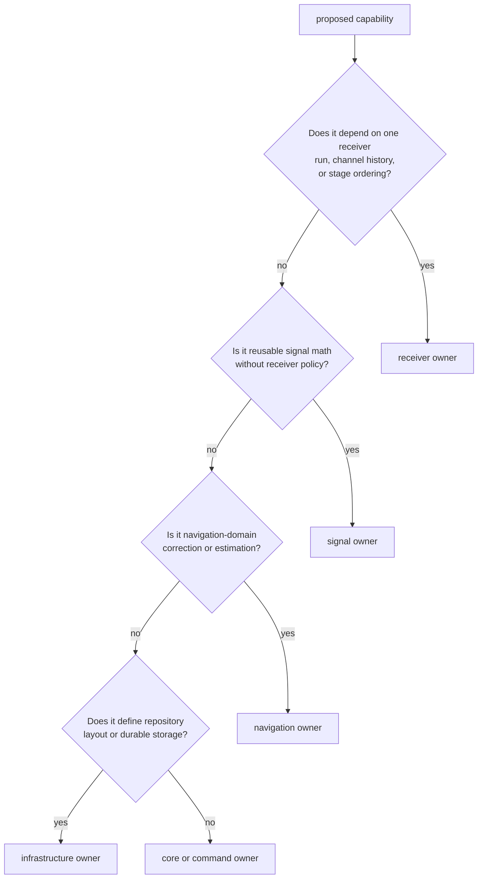
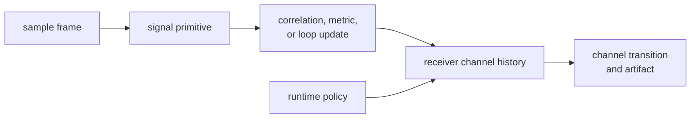
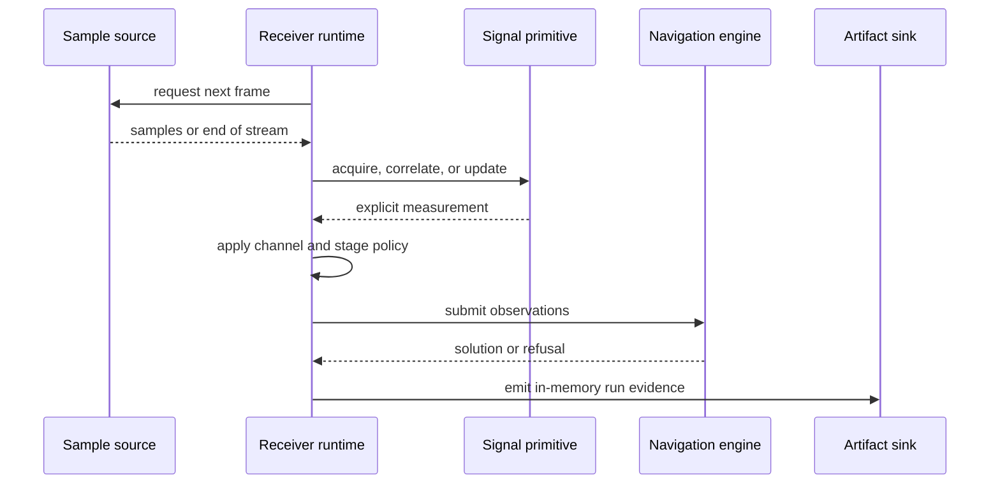
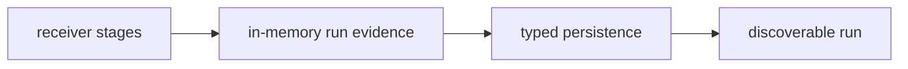

# Receiver Ownership Boundaries

`bijux-gnss-receiver` owns live receiver execution: configuration, sample
consumption, acquisition and tracking stages, channel lifecycle, observation
production, optional navigation handoff, runtime diagnostics, and in-memory run
evidence.

It coordinates signal and navigation capabilities without taking ownership of
their science. It emits artifacts without defining repository persistence.

## Place Runtime Behavior

Receiver is the right owner for:

- composing acquisition, tracking, observation, and navigation stages;
- consuming samples through runtime source boundaries;
- scheduling channels and retaining per-channel history;
- declaring lock, degradation, refusal, loss, and reacquisition transitions;
- applying runtime configuration and stage budgets;
- converting stage outputs into observations and run artifacts;
- emitting metrics, traces, diagnostics, and sink events;
- executing deterministic synthetic scenarios through the receiver pipeline;
- receiver-boundary validation that assesses emitted runtime evidence.

## Reusable Math Versus Operational Policy

Signal and receiver code both discuss code phase, carrier phase, correlation,
C/N0, loop updates, and uncertainty. The boundary is how much run context the
decision requires.

| reusable signal responsibility | receiver responsibility |
| --- | --- |
| generate or sample a code at an explicit phase | choose the code, phase seed, and search interval for a channel |
| advance an NCO or local-code model | preserve channel continuity across epochs and interruptions |
| compute a discriminator or loop update from explicit inputs | choose loop profile, apply lifecycle policy, and decide degradation |
| correlate samples with an explicit replica | schedule correlations and retain prompt history |
| calculate a lock metric or calibrated threshold | declare and report channel lock using run history and policy |
| estimate uncertainty from explicit statistics | attach uncertainty to channel and observation evidence |

Move behavior to [signal processing](../bijux-gnss-signal/index.md) when it can be
tested with explicit mathematical inputs and remains useful outside a receiver
session. Keep it here when channel history, stage ordering, configured
thresholds, degraded-state handling, or run evidence changes the outcome.

## Navigation Boundary

Receiver owns when observations are handed to navigation and how navigation
results participate in a receiver run. [Navigation science](../bijux-gnss-nav/index.md)
owns:

- product decoding and orbit state;
- correction models and combinations;
- weighting, filtering, integrity, PPP, and RTK algorithms;
- navigation convergence, ambiguity, maturity, and refusal semantics.

The receiver may retain a navigation engine or filter as part of runtime
composition. That does not make estimator formulas or scientific thresholds
receiver-owned. Receiver tests should prove the stage handoff and artifact
continuity; navigation tests should prove the scientific decision.

## Ports And Effects

The [receiver public facade](https://github.com/bijux/bijux-gnss/blob/main/crates/bijux-gnss-receiver/src/api.rs)
exposes runtime configuration, metrics, traces, clocks, sample and artifact
ports, concrete sample sources, stage engines, tracking sessions, observation
builders, and run artifacts.

Signal may define minimal source, sink, and correlator traits because consumers
need reusable abstraction seams. Receiver owns operational use of those seams:
polling, buffering, scheduling, error propagation, clocks, metrics, and
lifecycle.

## Artifact Boundary

Receiver owns `RunArtifacts` and the acquisition, tracking, observation,
navigation, diagnostic, and support evidence accumulated in memory. It also
owns the invariant that those records truthfully reflect stage execution.

[Repository infrastructure](../bijux-gnss-infra/index.md) owns:

- run directory identity and file placement;
- manifests, run reports, and history;
- persistent naming and discovery;
- repository provenance and hashing;
- post-run artifact inspection.

Do not add file paths or manifest policy to a runtime artifact merely because
infrastructure will later persist it. Do not let infrastructure recalculate a
receiver state that should already be explicit in the artifact.

## Shared Contracts And Presentation

[Shared GNSS contracts](../bijux-gnss-core/index.md) define portable request,
result, observation, lifecycle, diagnostic, uncertainty, and artifact record
meaning. Receiver decides when runtime evidence takes those values.

[Command workflows](../bijux-gnss/index.md) define operator syntax, workflow
selection, and report rendering. A command default may select a receiver
configuration, but receiver owns validation and runtime consequences of that
configuration.

The receiver facade re-exports lower package APIs for downstream convenience.
Those exports do not transfer authorship. Documentation should route a signal
formula to signal and an estimator policy to navigation even when callers
import it through receiver.

## Simulation And Validation

Receiver-owned simulation exercises the actual staged runtime with controlled
samples and truth. Signal owns reusable replica and noise primitives.
Scientific test support may provide independent expected values. Infrastructure
owns persisted validation workflows.

A synthetic scenario is not independent evidence merely because it is
deterministic. State whether truth comes from a separate model, a fixture, or
the implementation under test.

## Reject Boundary Drift

Reject a receiver change that:

- duplicates a code generator, correlation formula, or navigation model;
- adds repository layout or command presentation to runtime types;
- turns a lower-package refusal into a successful channel or solution;
- makes a stage depend on an internal lower-package module;
- hides channel lifecycle changes behind a generic helper;
- optimizes away diagnostic or uncertainty evidence;
- treats final position quality as sufficient proof of acquisition or tracking.

Use the [pipeline contract](https://github.com/bijux/bijux-gnss/blob/main/crates/bijux-gnss-receiver/docs/PIPELINE.md),
[runtime contract](https://github.com/bijux/bijux-gnss/blob/main/crates/bijux-gnss-receiver/docs/RUNTIME.md),
[port contract](https://github.com/bijux/bijux-gnss/blob/main/crates/bijux-gnss-receiver/docs/PORTS.md),
[artifact contract](https://github.com/bijux/bijux-gnss/blob/main/crates/bijux-gnss-receiver/docs/ARTIFACTS.md), and
[receiver test guide](https://github.com/bijux/bijux-gnss/blob/main/crates/bijux-gnss-receiver/docs/TESTS.md) to review
the affected boundary.
