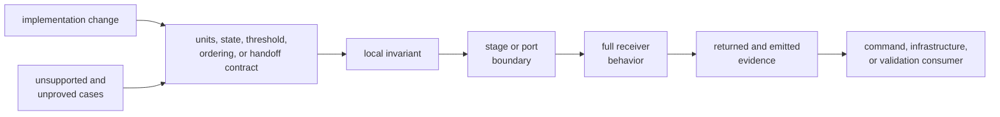
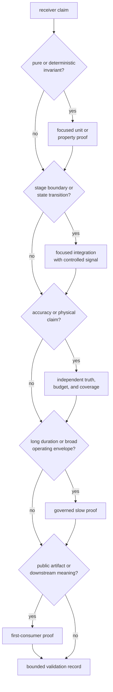

# Validating Receiver Changes

Validate the receiver claim that changed, not the directory or function that
was edited. A stage-local equation, acquisition-to-tracking admission rule,
returned artifact, runtime side effect, and navigation bridge need different
evidence even when they share implementation.

## Trace the Claim



Most behavior changes require more than one layer, but not every layer. Choose
the first assertion that can fail for the changed decision, then follow the
decision only as far as its observable meaning moves.

## Route by Contract

| Changed contract | Local evidence | Boundary evidence | Consumer evidence |
| --- | --- | --- | --- |
| configuration field, default, or validation | accepted and rejected values, units, and cross-field constraints | runtime-ready configuration and feature behavior | schema, command config loading, or recorded profile where exposed |
| sample source or front-end conditioning | format conversion, rate, IF, delay, chunk, and error behavior | acquisition/tracking continuity across real source calls | processed counts, timing trace, and raw-IQ caller |
| acquisition search or decision | code/Doppler/refinement math and threshold boundary | accepted, ambiguous, rejected, deferred, wrong-PRN, and interference cases | tracking admission, explanation, uncertainty, and report fields |
| tracking loop or lifecycle | discriminator, loop, phase, code, CN0, and state invariants | pull-in, lock, degradation, loss, reacquisition, fades, and nav-bit transitions | observations, state reports, transitions, and uncertainty |
| observation construction | timing, units, smoothing, covariance, and status rules | accepted and rejected epochs from representative tracking states | decision artifacts, residuals, quality reports, and navigation readiness |
| automatic navigation bridge | prerequisite and feature-gate behavior | missing time, missing ephemeris, completed-empty, and solved epochs | navigation artifacts and validation reports |
| returned artifact or support matrix | type fields, identity, ordering, and cardinality | top-level `RunArtifacts` population on success, degradation, and emptiness | command rendering and infrastructure persistence/inspection |
| trace, metric, logger, or diagnostic | exact event and field semantics | configured sink receives expected behavior on success and failure | operator report or artifact consumer, if one exists |
| reference validation | alignment, coordinate conversion, residual, and statistic math | unmatched, interpolated, discontinuous, and outlier trajectories | accuracy budget or report interpretation |

Use the [receiver stage handoffs](../interfaces/stage-contracts.md) to identify
what the top-level run preserves and drops. Use the
[receiver proof inventory](https://github.com/bijux/bijux-gnss/blob/main/crates/bijux-gnss-receiver/docs/TESTS.md)
to find existing families, but inspect assertions before assuming a filename
proves the required claim.

## Evidence Layers



### Local invariant

Prove equations and state decisions near their owner. Include units, signs,
wrap boundaries, zero/empty inputs, invalid values, and numerical tolerances.
Property tests are appropriate when generated ranges have physical bounds and
durable regression seeds.

### Controlled integration

Use the narrowest synthetic or constructed input that reaches the changed
boundary. Assert typed state and evidence, not merely completion. Include the
nearest refusal or degraded path so a permissive implementation cannot pass.

### Truth and budget

Accuracy, detection probability, false-alarm rate, uncertainty coverage, lock
stability, and navigation error require truth known independently enough for
the claim. Record signal model, sampling profile, duration, CN0/noise model,
seed, expected value, tolerance, and coverage.

Generated expected values that reuse production logic are regression evidence,
not independent truth. Keep fixture provenance and regeneration review visible.

### Downstream behavior

When a public field, hypothesis, state, uncertainty, reason, ordering, or
cardinality changes, exercise the first consumer. A receiver integration may
prove artifact construction while still breaking command rendering or
infrastructure persistence.

## Stage-Specific Starting Points

These are examples of focused executable targets, not mandatory bundles:

```sh
cargo test -p bijux-gnss-receiver --test integration_acquisition_explainability
cargo test -p bijux-gnss-receiver --test integration_tracking_channel_state_reports
cargo test -p bijux-gnss-receiver --test integration_observations_measurement_quality
cargo test -p bijux-gnss-receiver --test integration_multisat_pvt_readiness
cargo test -p bijux-gnss-receiver --test integration_receiver_streaming
cargo test -p bijux-gnss-receiver --test integration_receiver_support_matrix_inventory
```

Choose by assertion:

- [acquisition explainability](https://github.com/bijux/bijux-gnss/blob/main/crates/bijux-gnss-receiver/tests/integration_acquisition_explainability.rs)
  protects ranked rationale, not every acquisition operating condition
- [channel-state reporting](https://github.com/bijux/bijux-gnss/blob/main/crates/bijux-gnss-receiver/tests/integration_tracking_channel_state_reports.rs)
  protects exported lifecycle evidence, not loop accuracy
- [observation measurement quality](https://github.com/bijux/bijux-gnss/blob/main/crates/bijux-gnss-receiver/tests/integration_observations_measurement_quality.rs)
  protects quality propagation, not every pseudorange truth budget
- [multisatellite navigation readiness](https://github.com/bijux/bijux-gnss/blob/main/crates/bijux-gnss-receiver/tests/integration_multisat_pvt_readiness.rs)
  protects a receiver-to-navigation handoff, not general navigation science
- [streaming receiver behavior](https://github.com/bijux/bijux-gnss/blob/main/crates/bijux-gnss-receiver/tests/integration_receiver_streaming.rs)
  protects multi-frame consumption and continuity, not all source formats
- [support-matrix inventory](https://github.com/bijux/bijux-gnss/blob/main/crates/bijux-gnss-receiver/tests/integration_receiver_support_matrix_inventory.rs)
  protects registered signal coverage and stage status, not implementation
  maturity

For accuracy changes, select the corresponding truth-table, budget, profile,
and uncertainty-coverage targets. Do not substitute a smoke target for a
quantitative claim.

## Configuration and Feature Matrix

Navigation is enabled by default but remains an optional package feature.
Precise-product support implies navigation. Tracing and diagnostic features
change effect surfaces without changing the core stage sequence.

When feature behavior moves, validate:

- default feature set
- navigation-disabled public API and pipeline behavior
- precise-product implication and unavailable behavior
- tracing or dump behavior only when the corresponding effect changed
- schema and documentation for feature-dependent exports

A default-feature integration pass does not prove the navigation-disabled
build. Conversely, a compile-only feature check does not prove runtime
navigation semantics.

## Determinism and Time

Determinism has several scopes:

- repeated synthetic generation
- repeated stage results
- stable artifact ordering and identity
- equivalent chunking and streaming
- feature and thread configuration
- environment-sensitive timing and metrics

The [synthetic determinism proof](https://github.com/bijux/bijux-gnss/blob/main/crates/bijux-gnss-receiver/tests/integration_determinism.rs)
and [observation-stage determinism proof](https://github.com/bijux/bijux-gnss/blob/main/crates/bijux-gnss-receiver/tests/integration_pipeline_determinism.rs)
cover different scopes. Neither proves byte-identical command or persisted
output.

Do not assert exact processing durations. Timing fields and benchmark results
need tolerances or environment qualification; scientific epochs and sample
indices need exact or model-derived expectations.

## Slow and Broad Proof

Long tracking sessions, operating-envelope sweeps, noise characterization,
truth-profile matrices, and end-to-end navigation can be too expensive for the
fast lane. Place them in the governed slow ledger because they defend a
stronger claim, not because they fail or are inconvenient.

Before adding or changing a slow test:

- state the claim unavailable from a narrower test
- keep deterministic seeds and bounded profiles
- preserve failure diagnostics
- verify ledger identity and fast/slow selection separately
- retain one narrow fast assertion for the core decision where practical

Do not run every receiver test merely to confirm a documentation or isolated
assertion change. A broad run is collateral confidence after focused evidence,
not a replacement for it.

## Failure and Degradation

Receiver success is not binary. Validation must distinguish:

- configuration rejection
- source read error
- no acquisition result
- rejected or deferred acquisition
- ambiguous acquisition entering degraded tracking
- channel refusal, loss, or reacquisition
- rejected observation epoch
- absent navigation prerequisites
- navigation completed without a solution
- diagnostic or best-effort evidence write failure

Assert the typed hypothesis, state, reason, empty artifact, or error at the
boundary that owns it. Do not force all degraded outcomes into `ReceiverError`.

## Validation Record

Report:

1. changed receiver claim and owner
2. units, signs, thresholds, states, and ordering affected
3. focused local and boundary assertions
4. negative, degraded, empty, and error paths
5. truth source, profile, seed, tolerance, and coverage
6. feature and streaming variants
7. first public artifact and downstream consumer
8. slow or expensive evidence deliberately not run
9. remaining unsupported conditions

The change is validated when the evidence can fail for the changed decision and
the claim is no broader than the tested model, profile, feature set, duration,
and consumer.
