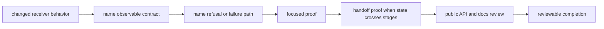
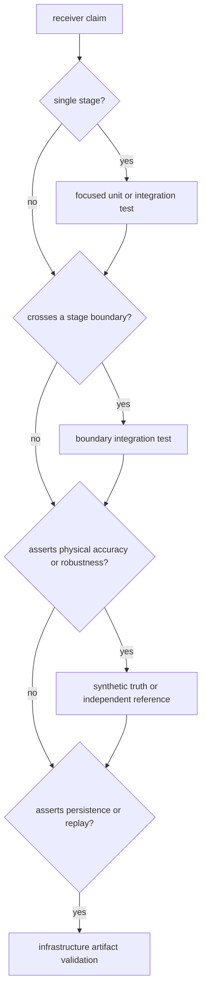

# Definition Of Done

A receiver change is complete when its runtime claim, failure behavior, and
evidence boundary agree. Compilation and one broad scenario are insufficient:
reviewers must be able to identify what would regress, where that regression
would become observable, and which crate owns the meaning.

## Close The Evidence Loop

If a step is not relevant, record why. Do not silently omit failure-path proof
for a change that can reject a candidate, degrade a channel, discard an
observation, or refuse a navigation claim.

## Completion By Runtime Contract

| changed contract | observable evidence | required negative case | boundary review |
| --- | --- | --- | --- |
| configuration or derived defaults | accepted configuration and exact derived behavior | invalid, contradictory, or unsupported value is rejected with the documented error | command configuration and schema consumers |
| acquisition | ranked candidates, hypothesis, uncertainty, assistance, and explanation agree | absent, ambiguous, unsupported, or below-threshold signal remains distinguishable | acquisition-to-tracking handoff |
| tracking | lock state, phase/code continuity, uncertainty, transitions, and processed counts agree | fade, loss of lock, unstable discriminator, or refused channel is represented honestly | observation construction and telemetry |
| observations | measurements, residuals, quality, decisions, smoothing, and timing stay traceable | rejected or degraded measurement retains reason and does not silently enter a stronger solution | core record meaning and navigation input |
| navigation handoff | attempted solutions preserve nav-owned status, validity, integrity, and refusal | insufficient or inconsistent evidence remains a refusal rather than a plausible position | navigation scientific owner and command report |
| artifacts or diagnostics | returned evidence explains the affected stage | empty, partial, or unavailable evidence cannot be mistaken for success | command publication and infrastructure persistence |
| public API or feature | downstream use compiles through `api` with the intended feature set | disabled-feature behavior and unavailable exports are explicit | direct callers and lower-owner facades |

## Choose Proof From The Claim

Use the [receiver test map](../../../crates/bijux-gnss-receiver/docs/TESTS.md)
to locate executable families and the
[change validation guide](change-validation.md) to select scope. Slow scenarios
belong in the governed slow lane; moving them out of a fast lane does not remove
their requirement from a claim that depends on long duration or difficult
conditions.

## Ownership Review

Before commit, answer these in the change description:

- Is the changed meaning receiver execution, or does it belong to a
  [core contract](../../bijux-gnss-core/foundation/ownership-boundary.md),
  [signal primitive](../../bijux-gnss-signal/foundation/ownership-boundary.md),
  or [navigation model](../../bijux-gnss-nav/foundation/ownership-boundary.md)?
- If command output changed, does the
  [command reporting contract](../../bijux-gnss/interfaces/reporting-contracts.md)
  still preserve receiver refusal and uncertainty?
- If files or run identity changed, was the
  [infrastructure artifact contract](../../bijux-gnss-infra/interfaces/persisted-artifact-contracts.md)
  reviewed instead of adding persistence policy here?
- If a public export changed, were defaults, feature availability, units, and
  semantic ownership reviewed through the [API surface](../interfaces/api-surface.md)?

## Completion Record

Record the exact claim, focused proof, necessary boundary proof, feature set,
fixture or capture provenance, and any relevant slow evidence. If independent
field or reference evidence was not run, say so and keep the claim within the
tested envelope.

A broad green lane is useful repository evidence. It is not a substitute for
showing which receiver contract the change protects.
