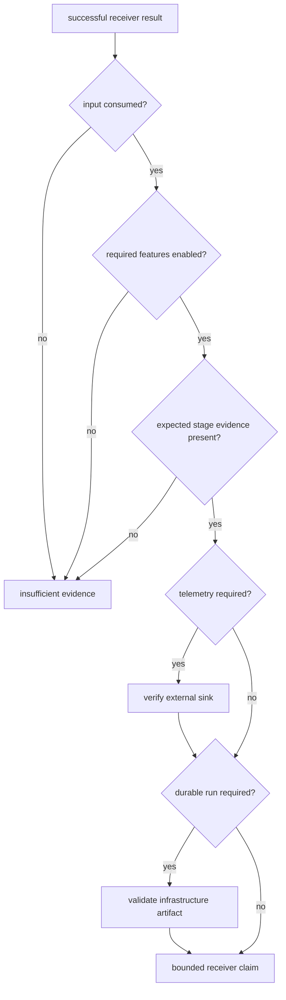
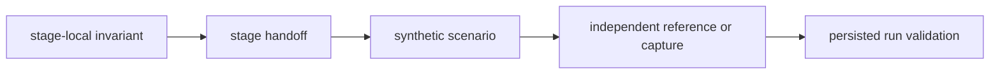

# Known Limitations

The receiver has broad deterministic and reference-backed evidence, but its
proof is bounded by input models, feature selection, runtime observability, and
the distinction between in-memory results and persisted runs. These limits
affect how callers should interpret success.

## Limits In The Current Contract

| limitation | consequence | responsible interpretation |
| --- | --- | --- |
| Empty input returns an empty default artifact set rather than an error. | `Ok` alone does not prove that any signal data was processed. | Require nonzero processed counts and stage-specific evidence for claims that need execution. |
| Navigation is feature-gated and empty results are not self-describing. | An empty navigation collection does not by itself distinguish disabled support, no attempted solution, or no emitted solution. | Record the build feature set and inspect support, observations, diagnostics, and command-level attempt evidence. |
| Runtime sinks are best-effort. | Default sinks discard events, and sink methods cannot return storage failures. | Treat returned typed artifacts as receiver evidence; verify required telemetry independently. |
| `RunArtifacts` is not a versioned serialization contract. | Ad hoc serialization can freeze unstable field layout without schema or migration policy. | Persist through infrastructure-owned contracts and schemas. |
| The public API includes broad lower-owner re-exports. | A source-compatible receiver facade can still hide a semantic change in core, signal, or navigation. | Review the original owner and feature matrix, not only the receiver import path. |
| Synthetic and checked-in captures cover selected models. | A passing scenario cannot establish behavior for unmodeled antennas, propagation, interference, front ends, oscillators, or field conditions. | Name the scenario envelope and add independent capture evidence when the claim extends beyond it. |
| End-to-end receiver proof is expensive. | Running only a fast stage test can miss handoff and long-duration dynamics; running only a broad test can hide the failed contract. | Pair the narrowest contract test with the necessary boundary or scenario test and record deferred slow evidence. |

## Evidence Escalation

Use only as much of this chain as the claim needs:

- a loop-filter formula change may stop at focused signal and tracking proof;
- a changed acquisition-to-tracking field needs boundary evidence;
- a lock or navigation accuracy claim needs a scenario with explicit truth;
- a field-performance statement needs evidence independent of the generator
  used by the receiver tests;
- a reproducibility or history statement additionally needs infrastructure
  validation.

The [receiver change validation guide](change-validation.md) maps runtime claims
to appropriate evidence. The [test guide](https://github.com/bijux/bijux-gnss/blob/main/crates/bijux-gnss-receiver/docs/TESTS.md)
describes the major executable families.

## What A Successful Run Does Not Say

A successful return does not guarantee:

- that every requested satellite or component acquired;
- that every channel remained locked;
- that every observation was accepted;
- that navigation produced a valid or stable solution;
- that diagnostics, traces, or metrics reached external storage;
- that returned artifacts were persisted atomically or registered in history.

Inspect the relevant candidates, channel-state reports, observation decisions,
solution validity, and persisted manifest before making those claims. The
[state and persistence guide](../architecture/state-and-persistence.md)
explains where each form of evidence ends.

## Reporting A Gap

State the missing proof by physical or operational condition: for example,
“validated with deterministic dual-frequency synthetic input; no independent
front-end capture was evaluated.” Do not hide the gap behind “tests passed” or
infer a stronger claim from the size of the test suite.
