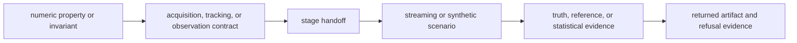
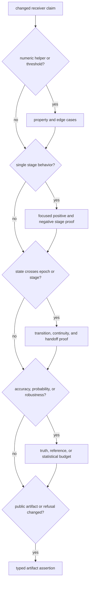

# Test Strategy

Receiver evidence spans pure DSP properties, stage contracts, streaming
lifecycle, scientific truth, and cross-stage artifacts. Test size is not a
measure of confidence: each claim needs the narrowest test that isolates its
cause and the smallest boundary test that proves its public effect.

## Proof Layers

Not every change needs every layer. A loop coefficient can stop after property
and focused tracking proof if no public behavior changes. A new channel state
must continue through handoff and artifact evidence. An accuracy or robustness
claim must reach independent truth or a clearly bounded statistical model.

## What Each Family Can Establish

| family | strongest justified claim | common overclaim | representative evidence |
| --- | --- | --- | --- |
| guardrails | source layout, module limits, and pipeline purity rules hold | receiver runtime is correct | [receiver source guardrail](https://github.com/bijux/bijux-gnss/blob/main/crates/bijux-gnss-receiver/tests/integration_guardrails.rs) |
| public boundary | imports and dependency direction remain within the intended surface | every re-export has stable semantics | [navigation boundary guardrail](https://github.com/bijux/bijux-gnss/blob/main/crates/bijux-gnss-receiver/tests/nav_api_guardrail.rs) |
| property and numerical sanity | bounded mathematical invariants hold over generated inputs or tolerances | acquisition or tracking works end to end | [receiver properties](https://github.com/bijux/bijux-gnss/blob/main/crates/bijux-gnss-receiver/tests/prop_receiver.rs) |
| stage integration | one stage reports expected behavior under a controlled input | neighboring stage handoff remains correct | [acquisition uncertainty evidence](https://github.com/bijux/bijux-gnss/blob/main/crates/bijux-gnss-receiver/tests/integration_acquisition_uncertainty.rs) |
| handoff and determinism | public records preserve ordering, identity, or repeatability across a boundary | physical accuracy or broad runtime determinism | [observation determinism evidence](https://github.com/bijux/bijux-gnss/blob/main/crates/bijux-gnss-receiver/tests/integration_pipeline_determinism.rs) |
| scenario and truth | a declared signal condition produces bounded runtime behavior | unmodeled field conditions are covered | [tracking truth evidence](https://github.com/bijux/bijux-gnss/blob/main/crates/bijux-gnss-receiver/tests/integration_tracking_truth_table.rs) |
| operating envelope or statistics | behavior meets a sampled probability, noise, or dynamics budget | all conditions between or outside sampled points are safe | [acquisition operating envelope](https://github.com/bijux/bijux-gnss/blob/main/crates/bijux-gnss-receiver/tests/integration_acquisition_operating_envelope.rs) |
| golden or fixture | reviewed output remains byte- or value-stable for one fixture | the frozen output is scientifically correct | [acquisition golden evidence](https://github.com/bijux/bijux-gnss/blob/main/crates/bijux-gnss-receiver/tests/golden_acquisition.rs) |

Test names are not contracts. Inspect assertions before citing a test. For
example, the current pipeline determinism test proves repeatable observation
output and events from constructed tracking results; it does not run the entire
sample-to-navigation receiver.

## Select Evidence By Failure Mode

Negative evidence is part of the contract:

- acquisition must preserve absent, ambiguous, below-threshold, and unsupported
  outcomes;
- tracking must expose loss, degradation, instability, phase slip, failed
  reacquisition, and refusal;
- observations must retain rejection and uncertainty rather than silently
  dropping unusable measurements;
- navigation handoff must preserve unavailable, refused, degraded, and
  integrity-failed results.

The [completion gate](definition-of-done.md) maps these outcomes to review
requirements.

## Fast And Slow Evidence

Long-duration tracking, probability characterization, broad operating
envelopes, and expensive truth captures belong in the governed slow lane when
they exceed the fast budget. The
[slow-test roster](https://github.com/bijux/bijux-gnss/blob/main/configs/rust/nextest-slow-roster.txt) is a scheduling
contract, not a waiver. A change whose claim depends on long duration, weak
signal, statistical confidence, or multi-stage capture behavior still requires
that evidence before release.

During development, run focused evidence first so failures remain attributable.
Record slow evidence separately rather than replacing it with a faster test
that proves a narrower claim.

## Evidence Independence

Synthetic truth is strongest when the assertion does not reuse the algorithm
under test. Prefer:

- checked-in external or independently generated references;
- closed-form expectations for local computations;
- separate truth builders with explicit provenance;
- multiple rates, constellations, dynamics, or noise points where the claim
  spans them.

Golden fixtures protect compatibility only after their scientific meaning has
been reviewed. Updating a golden file to match new output is not proof that the
new output is correct.

Use the [change validation guide](change-validation.md) to scope a receiver
change and the [known limitations](known-limitations.md) to state what the
selected evidence cannot support.
