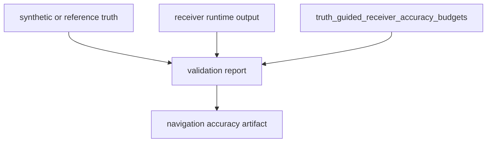

# Validation Budgets

`bijux-gnss-receiver` owns the runtime validation budgets that compare receiver
evidence against known truth. These budgets are not decoration around tests.
They are the thresholds that decide whether acquisition, tracking,
observation, and PVT evidence is strong enough for receiver-side claims.

## Budget Families

| family | what the budget limits | primary proof |
| --- | --- | --- |
| acquisition | Doppler error, Doppler-bin error, code-phase samples, and code-phase chips. | acquisition accuracy-budget test |
| tracking | Carrier error, Doppler error, code-phase error, and CN0 error over stable epochs. | tracking accuracy-budget test |
| observation | Pseudorange, carrier phase, Doppler, and CN0 observation errors. | observation accuracy-budget test |
| receiver clock and PVT | Position error, clock-bias error, residual RMS, and PDOP. | navigation PVT and clock accuracy-budget tests |
| serialized evidence | Observed maxima and threshold values survive artifact serialization. | navigation accuracy artifact test |

## Reader Rule

Read the budget report as a comparison between truth, receiver output, and
named threshold. A passing report should tell the reader:

- which scenario or truth table was evaluated
- which threshold was applied
- which observed maximum came closest to the threshold
- whether every satellite or epoch passed
- where the same threshold appears in emitted artifacts

If any of those answers are missing, the budget proof is too weak even when the
test is green.

## Change Rule

- Tightening a threshold requires proof that the receiver consistently remains
  inside the new bound.
- Loosening a threshold requires an explanation of the physical, simulation, or
  numerical reason; "the test failed" is not enough.
- Changing a field name, unit, or serialized shape is also a core contract
  question; inspect [Numerical Budgets](../../bijux-gnss-core/quality/numerical-budgets.md).
- Changing synthetic truth generation must update the budget proof that consumes
  it, not only the fixture.

## First Proof Check

Start with the [receiver reference-validation guide](https://github.com/bijux/bijux-gnss/blob/main/crates/bijux-gnss-receiver/docs/REFERENCE_VALIDATION.md)
and [receiver test guide](https://github.com/bijux/bijux-gnss/blob/main/crates/bijux-gnss-receiver/docs/TESTS.md).
Then inspect the synthetic artifact-type source, the synthetic foundation tests,
and the accuracy-budget tests for acquisition, tracking, observations,
navigation PVT, receiver clock, and serialized navigation evidence.

## Boundary Rule

Receiver validation budgets prove runtime behavior. They may consume signal
truth, shared core units, and navigation outputs, but they do not redefine those
owners. If a budget change depends on altered signal facts, core record meaning,
or navigation estimator policy, review that owner in the same change set.
