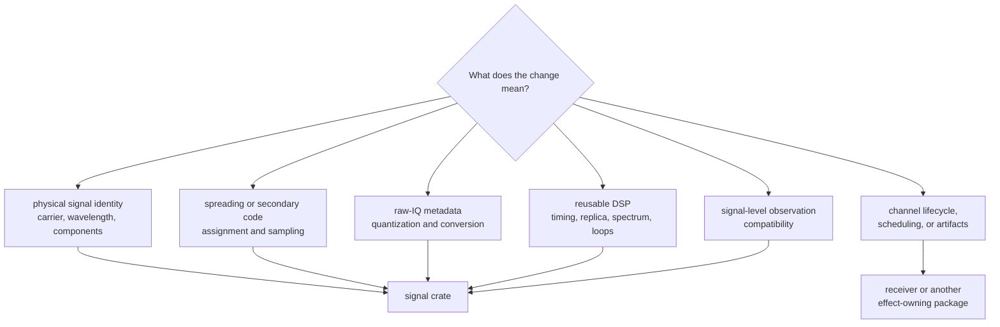
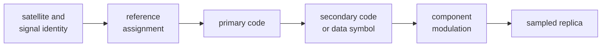
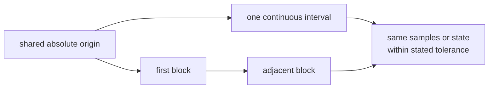
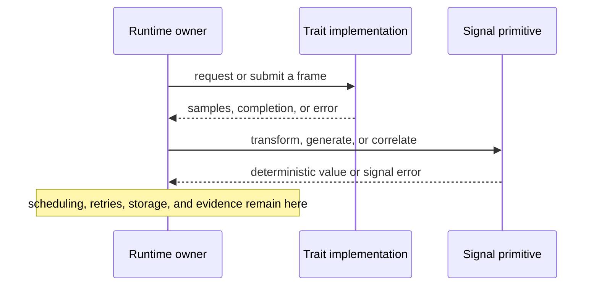

# Finding Signal Behavior

Read the signal crate by responsibility, not by directory order. Start with the
observable behavior you need to understand, identify its owner, and then read
the evidence that constrains it. This avoids mistaking an internal helper for a
supported API or moving receiver policy into reusable signal math.

The [curated signal API](https://github.com/bijux/bijux-gnss/blob/main/crates/bijux-gnss-signal/src/api.rs) is the
supported downstream surface. The package keeps its implementation modules
private and re-exports selected types, constants, functions, and traits through
that facade. Source layout is therefore a maintenance map, not a stability
promise.

## Find The Owner

| reader question | owned surface | read next |
| --- | --- | --- |
| Which signals and components are supported? | catalog and physical relationships | [signal catalog](https://github.com/bijux/bijux-gnss/blob/main/crates/bijux-gnss-signal/docs/CATALOG.md) |
| How is a primary, secondary, pilot, or data code generated? | constellation code families | [code-family contracts](https://github.com/bijux/bijux-gnss/blob/main/crates/bijux-gnss-signal/docs/CODE_FAMILIES.md) |
| How does phase advance across sample blocks? | sample timing, NCOs, local codes, and replicas | [DSP contracts](https://github.com/bijux/bijux-gnss/blob/main/crates/bijux-gnss-signal/docs/DSP.md) |
| What does a capture sample mean in memory or storage? | raw-IQ metadata and sample conversion | [raw-IQ contract](https://github.com/bijux/bijux-gnss/blob/main/crates/bijux-gnss-signal/docs/RAW_IQ.md) and [sample conversion contract](https://github.com/bijux/bijux-gnss/blob/main/crates/bijux-gnss-signal/docs/SAMPLES.md) |
| Are two observations signal-compatible? | dual-frequency and inter-frequency validation | [signal validation](https://github.com/bijux/bijux-gnss/blob/main/crates/bijux-gnss-signal/docs/VALIDATION.md) |
| What may a downstream crate import? | curated facade | [public API guide](https://github.com/bijux/bijux-gnss/blob/main/crates/bijux-gnss-signal/docs/PUBLIC_API.md) |
| Who opens streams or schedules work? | consumer-owned effects and lifecycle | [signal boundary](https://github.com/bijux/bijux-gnss/blob/main/crates/bijux-gnss-signal/docs/BOUNDARY.md) |

## Catalog And Physical Meaning

Use the catalog when a question can be answered without a receiver session:

- carrier frequency and wavelength;
- code rate and primary-code length;
- constellation, band, code, and component identity;
- data, pilot, or combined component roles;
- secondary-code timing metadata;
- GLONASS frequency-channel carrier resolution;
- cycle, meter, Doppler, and shared-path scaling relationships;
- default acquisition identities shared by consumers.

The [catalog implementation](https://github.com/bijux/bijux-gnss/blob/main/crates/bijux-gnss-signal/src/catalog.rs)
is the canonical source for those relationships. A receiver may choose among
catalog entries, but it should not duplicate or reinterpret their physical
meaning.

When changing catalog data, read the component-registry and wavelength evidence
before editing. Then check the affected constellation reference tests. A
registry lookup returning a value is not enough; component roles, rates,
carriers, and conversions must remain mutually coherent.

## Code Families

Code-family behavior includes more than producing a chip vector. Depending on
the signal, the contract can include:

- satellite-to-sequence assignment;
- primary-code generation and periodicity;
- fractional-rate sampling;
- data and pilot component selection;
- secondary-code or Neumann-Hoffman overlays;
- navigation-symbol timing;
- BOC, CBOC, QPSK, or time-multiplexed composition;
- continuity when a long interval is sampled in separate blocks.

Start from the [code-family guide](https://github.com/bijux/bijux-gnss/blob/main/crates/bijux-gnss-signal/docs/CODE_FAMILIES.md),
then follow its links to the relevant family implementation. Read the matching
reference catalog and independent test helper before trusting a compact
generator: recurrence code can be internally consistent while using a wrong
assignment, tap, initial state, or component convention.

For an added signal family, prove assignment coverage, reference agreement,
periodicity, sampling at non-integer samples per chip, and continuity at block
boundaries. If the signal has data and pilot components, prove them separately
before proving their combined modulation.

## Timing, Replicas, And Reusable DSP

The DSP layer owns computations that remain meaningful outside one receiver
run:

| responsibility | concepts to trace |
| --- | --- |
| absolute sample timing | sample index, code position, wrap domain, chunk origin |
| oscillator state | phase, frequency, update interval, long-duration drift |
| local code | code model, code rate, early/prompt/late sampling |
| replicas | signal identity, component modulation, carrier trajectory, amplitude |
| front-end analysis | filter response, IQ quality metrics, spectral normalization |
| tracking math | discriminators, loop coefficients, uncertainty, lock thresholds |

Read the [DSP implementation map](https://github.com/bijux/bijux-gnss/blob/main/crates/bijux-gnss-signal/src/dsp/mod.rs)
only after identifying the responsibility. For replica work, the
[replica boundary](https://github.com/bijux/bijux-gnss/blob/main/crates/bijux-gnss-signal/src/dsp/replica.rs)
separates signal identity, code model, carrier trajectory, and modulation.

State does not make a primitive receiver-owned. An NCO or filter can preserve
mathematical state while remaining reusable. The behavior crosses into receiver
ownership when it schedules channels, interprets channel history, declares a
lifecycle state, performs reacquisition, or commits run evidence.

### Continuity Is A Contract

For time-evolving behavior, compare one continuous evaluation with the same
interval split into adjacent blocks:

Check long-duration tests when changing phase wrapping, sample-index
conversion, carrier wipeoff, code sampling, NCO updates, or secondary-code
progression. A short local test can miss precision loss, a reset at a block
boundary, or an off-by-one epoch transition.

## Samples And Raw IQ

The sample boundary has two different responsibilities:

- raw-IQ metadata states sample rate, center frequency, quantization, layout,
  endianness, and related capture meaning;
- conversion helpers map integer or floating-point IQ representations into the
  core sample type and encode quantized storage values.

Neither responsibility includes opening a file, choosing a dataset, or owning
device I/O. Those effects belong to infrastructure or another runtime owner.
Read the raw-IQ and sample guides before changing numeric scaling: an apparently
reasonable normalization change can alter every downstream C/N0, threshold,
and truth comparison.

## Observation Compatibility

Signal validation answers whether observations form a supported signal-level
combination and whether inter-frequency timing is aligned. It can report
missing, unsupported, or lagged pair evidence. It does not decide whether a
navigation solution should be accepted, rejected, weighted, or published.

Use the [validation implementation](https://github.com/bijux/bijux-gnss/blob/main/crates/bijux-gnss-signal/src/obs_validation.rs)
for pair construction and alignment behavior. Route estimator policy to the
navigation package and receiver lifecycle policy to the receiver package.

## Public Traits And Effects

The public facade defines source, sink, and correlator traits so consumers can
inject implementations without moving effects into this crate.

Before extending a trait, check every implementation and consumer. Prefer a
free computational function when polymorphic I/O is not required. Trait
expansion creates an integration obligation even when a default method makes
the compiler quiet.

## Match A Change To Proof

| changed behavior | minimum proof family |
| --- | --- |
| registry identity or physical relationship | registry, component, wavelength, and affected constellation reference tests |
| primary or secondary code | independent reference, assignment, period, and sampling tests |
| phase or timing progression | property, chunk-continuity, and long-duration tests |
| modulation or spectrum | component reference and spectral-shape tests with explicit normalization |
| raw-IQ metadata or conversion | metadata round-trip and quantization conversion tests |
| tracking primitive | discriminator or loop unit evidence plus receiver integration evidence when lifecycle behavior changes |
| observation compatibility | pair-status, missing-data, unsupported-band, and alignment property tests |
| public facade or trait | API guardrail plus downstream compilation and behavior tests |

The [signal test guide](https://github.com/bijux/bijux-gnss/blob/main/crates/bijux-gnss-signal/docs/TESTS.md) maps
these proof families. Use reference evidence for physical facts, property
evidence for broad structural invariants, and receiver integration evidence
only when a reusable primitive changes receiver behavior.

## Review Boundary

Keep the change in this package when it defines reusable signal identity,
codes, samples, spectra, replicas, tracking math, or compatibility. Move it
upward when it needs:

- acquisition or tracking scheduling;
- channel lock, degradation, refusal, or reacquisition policy;
- navigation estimation or solution acceptance;
- filesystem, device, network, or dataset ownership;
- independently produced expected values used only by tests.

The [architecture guide](https://github.com/bijux/bijux-gnss/blob/main/crates/bijux-gnss-signal/docs/ARCHITECTURE.md)
shows the package relationships. If ownership is still ambiguous, describe the
required state and side effects. Reusable computation belongs here; operational
decisions and effects do not.
