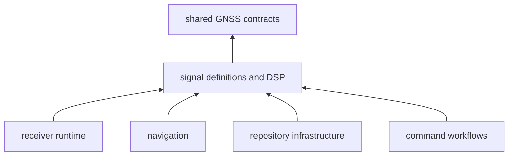
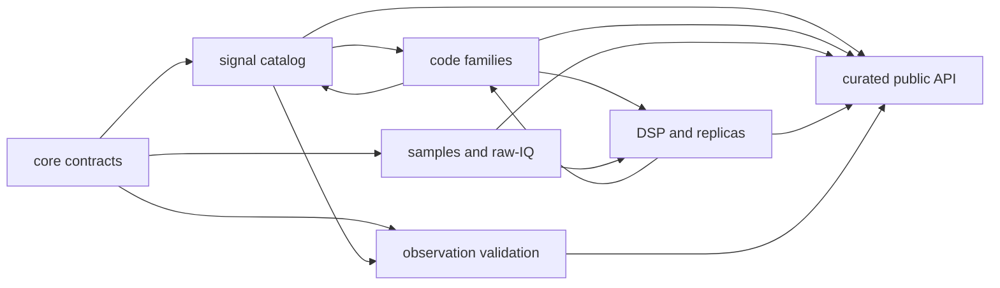

# Signal Dependency Direction

Signal sits between shared GNSS contracts and packages that execute or persist
signal behavior. It may depend on core meaning and general numerical libraries;
it must remain independent of receiver scheduling, navigation estimation,
repository state, command workflows, and test-fixture orchestration.

## Workspace Direction

Core is signal’s only production workspace dependency. The
[package manifest](https://github.com/bijux/bijux-gnss/blob/main/crates/bijux-gnss-signal/Cargo.toml) declares no
features and no optional workspace edges.

Receiver, navigation, infrastructure, and command packages depend directly on
signal. Their use does not authorize an upward dependency. If a signal helper
needs channel history, estimator state, a dataset registry, or operator
configuration, the helper belongs with that higher owner or requires a smaller
input contract.

The [workspace dependency guardrail](https://github.com/bijux/bijux-gnss/blob/main/crates/bijux-gnss-policies/tests/integration_dep_rules.rs)
permits only the core edge for signal. The
[package guardrail](https://github.com/bijux/bijux-gnss/blob/main/crates/bijux-gnss-signal/tests/integration_guardrails.rs)
checks package policy but does not prove scientific correctness.

## What Each Production Dependency Provides

| Dependency | Signal-owned use | Boundary |
| --- | --- | --- |
| core | identities, samples, observations, units, uncertainty, and shared errors | signal must not redefine foundational meaning locally |
| complex numbers | complex samples, replicas, spectra, filters, and correlations | numeric representation carries no receiver policy |
| FFT | spectrum estimation | FFT planning does not own front-end acceptance or reporting |
| serialization and schema support | raw-IQ metadata, DSP reports, and validation records | serializable shape is not repository persistence |
| error derivation | signal-specific error taxonomy | errors remain presentation-independent |

Property testing, repository policy, TOML parsing, and fixture hashing are
development dependencies. They support evidence and guardrails without entering
the published runtime graph.

## Internal Modules Collaborate, They Do Not Form A Strict Stack

The previous layer description implied a one-way catalog-to-code-to-DSP flow.
The source has deliberate cross-family collaboration:

- catalog entries use constants defined by code families
- code families use common sampling and correlation helpers
- local-code and replica models combine catalog identity with code generators
- spectrum and quality modules combine core sample contracts with local DSP
- observation validation uses catalog compatibility and core observations

This collaboration is acceptable because all modules share one signal owner.
It should not become an excuse for circular concepts. Catalog records define
signal facts; code modules define deterministic sequences; DSP modules transform
or measure samples. A helper belongs where its primary invariant is defined.

## The Public API Is The Downstream Boundary

Implementation modules are private. The
[curated signal API](https://github.com/bijux/bijux-gnss/blob/main/crates/bijux-gnss-signal/src/api.rs) re-exports
catalog, code, sample, DSP, validation, error, and trait contracts. Downstream
packages should depend on that surface rather than source layout.

The API also defines source, sink, and correlator traits. These traits invert
effect ownership: signal specifies the minimal sample interaction, while an
implementing package owns files, devices, buffering, scheduling, retries, and
evidence.

Before adding a public item:

- identify the signal invariant it preserves
- make units, phase origin, rate, and wrapping behavior explicit
- prefer a free computational function unless polymorphic I/O is required
- avoid exposing implementation types only to simplify one receiver caller
- check deterministic behavior across chunk boundaries where time evolves
- add direct evidence for invalid rates, assignments, and metadata

The [public API guide](https://github.com/bijux/bijux-gnss/blob/main/crates/bijux-gnss-signal/docs/PUBLIC_API.md)
describes the supported families, and the
[trait guide](https://github.com/bijux/bijux-gnss/blob/main/crates/bijux-gnss-signal/docs/TRAITS.md) defines effect
ownership.

## Review A Dependency Change

For every new edge:

1. state whether it is production or development-only
2. name the signal contract that needs it
3. confirm the dependency does not introduce runtime, scientific-estimator,
   repository, or command policy
4. check the workspace DAG guardrail
5. verify the affected signal behavior with focused numerical evidence
6. review the first direct consumer

General-purpose does not automatically mean appropriate. A filesystem, async
runtime, networking, database, or command framework dependency would change the
effect model even if it is not a workspace package.

## Direction Violations

- importing receiver configuration to choose loop or lock policy
- importing navigation models to interpret observations
- opening captures or resolving datasets inside sample primitives
- adding command types to select a signal algorithm
- moving testkit expected-value generation into production code
- exposing a private implementation type because one consumer already knows
  its layout
- using serialization support as justification for owning file placement

The [signal boundary](https://github.com/bijux/bijux-gnss/blob/main/crates/bijux-gnss-signal/docs/BOUNDARY.md)
defines the computational effect model. Dependency direction remains correct
when signal facts and transformations stay reusable without knowledge of a run,
repository, estimator, or operator workflow.
