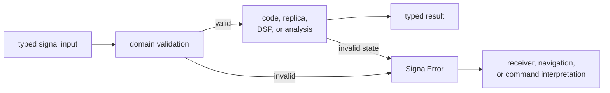
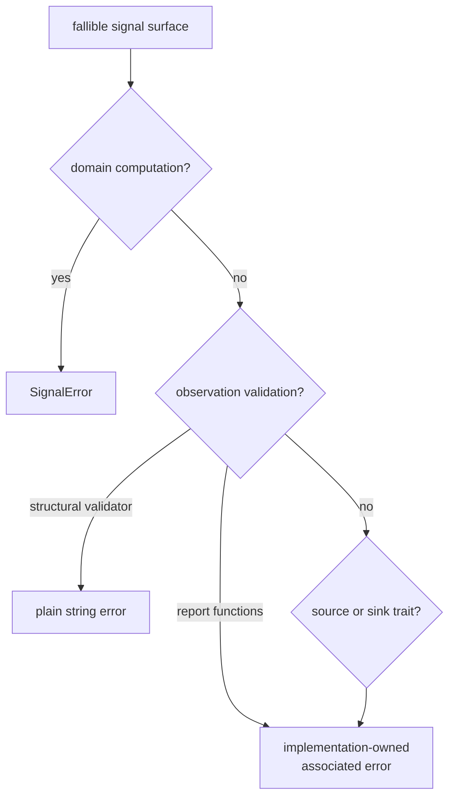

# Signal Failure Semantics

Signal operations reject invalid physical inputs, unsupported signal meaning,
and malformed computational requests before they can produce plausible
samples or measurements. Most fallible public computations use `SignalError`,
but the crate does not yet have one uniform failure representation.

## Typed Failure Flow

The signal layer identifies what is invalid. A higher-level owner decides
whether to retry, refuse a channel, downgrade a report, or present an operator
error.

## Published Error Families

| Family | Current typed variants | Meaning |
| --- | --- | --- |
| unsupported identity | `UnsupportedPrn`, `MissingGlonassFrequencyChannel`, `UnsupportedSignalDefinition` | the requested satellite or signal definition cannot support the operation |
| invalid physical scalar | `InvalidSampleRate`, `InvalidCodeRate`, `InvalidCarrierFrequency`, `InvalidCodePhase`, `InvalidElapsedDuration` | a rate, frequency, phase, or duration is non-finite, non-positive, or outside the operation's domain |
| malformed signal sequence | `EmptyNavigationSymbolStream`, `InvalidNavigationSymbol`, `EmptyCodeSequence`, `CorrelationLengthMismatch` | required chips, symbols, or matching sequence dimensions are absent or invalid |
| analysis configuration | `InvalidFrontEndFilter`, `InvalidSpectrumAnalysis` | filter design, response measurement, or spectrum analysis cannot interpret its inputs |

`SignalError` is public, cloneable, comparable, and intended for reusable
signal computations. Preserve variant identity in tests and adapters instead
of matching display text.

## Error Boundaries That Differ

There are three important exceptions to a single-error narrative:

- Observation epoch validation currently returns `Result<(), String>`. Its
  caller receives readable text but no stable variant for programmatic
  handling.
- Front-end and spectrum variants contain free-form message strings. The outer
  family is typed, while the specific reason is not.
- Source and sink traits use implementation-associated error types because the
  implementing package owns device, file, network, or buffering failures.

These are current contracts, not patterns to extend casually. New signal-domain
failure meaning should use a typed variant with the data a caller needs.
Changing observation validation to typed errors would be a public compatibility
change and should include downstream migration evidence.

## What Belongs in a Signal Error

A signal error may describe:

- invalid constellation, satellite, signal, component, code, or channel input
- invalid chips, symbols, phase, frequency, rate, duration, or dimensions
- unsupported modulation or signal definition
- invalid configuration of a reusable filter, spectrum, replica, or tracking
  primitive
- signal-level observation incompatibility when represented as a typed
  contract

It must not describe:

- capture file discovery, sidecar lookup, or repository paths
- receiver scheduling, lock policy, channel lifecycle, or reacquisition
- navigation solution acceptance, integrity, PPP, or RTK
- persisted artifact layout or schema migration
- command syntax, presentation policy, or operator exit codes

Wrap or translate at the owner boundary while preserving the original signal
meaning as structured evidence where possible.

## Design a New Variant

Before adding a variant, determine:

1. which public operation can emit it
2. which input or invariant failed
3. which structured fields a caller needs to identify the failure
4. whether the caller can repair, retry, refuse, or only report it
5. whether an existing variant already expresses the same meaning
6. which downstream match statements and serialized diagnostics may change

Prefer data-bearing variants for identity or dimension failures. Avoid
embedding values that are incidental, huge, sensitive, or tied to repository
layout. Display text should explain the failure to a human, while variant and
fields carry stable machine meaning.

## Proof Obligations

For each failure path, prove:

- the smallest invalid and nearest valid inputs
- NaN, infinity, zero, negative, empty, and boundary values where applicable
- exact variant and structured fields
- no partial output or state advance on refusal
- first downstream translation or refusal behavior
- display text only when human diagnostics are themselves contractual

Use the [signal contract guide](https://github.com/bijux/bijux-gnss/blob/main/crates/bijux-gnss-signal/docs/CONTRACTS.md),
[validation guide](https://github.com/bijux/bijux-gnss/blob/main/crates/bijux-gnss-signal/docs/VALIDATION.md), and
[public API guide](https://github.com/bijux/bijux-gnss/blob/main/crates/bijux-gnss-signal/docs/PUBLIC_API.md) to
locate affected consumers.

The failure model is sound when invalid signal meaning remains typed and local,
effect failures remain owned by trait implementations, and higher layers do not
need to parse strings to recover domain decisions.
