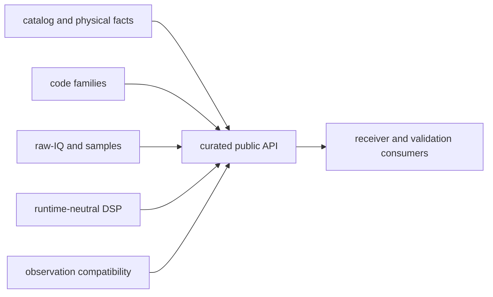

# Module Map

Use this map when a signal-layer change needs an owner. The crate exposes one
curated API over private regions organized by physical signal facts, code
families, sample meaning, reusable DSP, observation compatibility, and errors.

## Ownership Flow

## Find the Region

| responsibility | owner |
| --- | --- |
| signal registry, components, wavelength, shared-path scaling, and default acquisition choices | [physical signal catalog](https://github.com/bijux/bijux-gnss/blob/main/crates/bijux-gnss-signal/src/catalog.rs) |
| constellation-specific primary, secondary, and multiplexed codes | [code-family boundary](https://github.com/bijux/bijux-gnss/blob/main/crates/bijux-gnss-signal/src/codes/mod.rs) |
| timing, oscillators, replicas, spectra, quality, front-end, and tracking math | [DSP boundary](https://github.com/bijux/bijux-gnss/blob/main/crates/bijux-gnss-signal/src/dsp/mod.rs) |
| raw capture format, quantization, metadata, and encoded sample conversion | [raw-IQ contracts](https://github.com/bijux/bijux-gnss/blob/main/crates/bijux-gnss-signal/src/raw_iq.rs) and [sample conversion](https://github.com/bijux/bijux-gnss/blob/main/crates/bijux-gnss-signal/src/samples.rs) |
| dual-frequency and inter-frequency observation compatibility | [observation validation](https://github.com/bijux/bijux-gnss/blob/main/crates/bijux-gnss-signal/src/obs_validation.rs) |
| reusable signal failures | [signal error taxonomy](https://github.com/bijux/bijux-gnss/blob/main/crates/bijux-gnss-signal/src/error.rs) |
| supported exports and streaming interfaces | [curated signal API](https://github.com/bijux/bijux-gnss/blob/main/crates/bijux-gnss-signal/src/api.rs) |

## Code-Family Ownership

| signal family | implementation |
| --- | --- |
| GPS L1 C/A | [C/A code generation and correlation](https://github.com/bijux/bijux-gnss/blob/main/crates/bijux-gnss-signal/src/codes/ca_code.rs) |
| GPS L2C | [component composition](https://github.com/bijux/bijux-gnss/blob/main/crates/bijux-gnss-signal/src/codes/gps_l2c.rs), [CL code](https://github.com/bijux/bijux-gnss/blob/main/crates/bijux-gnss-signal/src/codes/gps_l2c_cl.rs), and [CM code](https://github.com/bijux/bijux-gnss/blob/main/crates/bijux-gnss-signal/src/codes/gps_l2c_cm.rs) |
| GPS L5 | [L5 primary and secondary codes](https://github.com/bijux/bijux-gnss/blob/main/crates/bijux-gnss-signal/src/codes/gps_l5.rs) |
| Galileo E1 | [E1 data, pilot, BOC, and CBOC behavior](https://github.com/bijux/bijux-gnss/blob/main/crates/bijux-gnss-signal/src/codes/galileo_e1.rs) |
| Galileo E5 | [E5 code behavior](https://github.com/bijux/bijux-gnss/blob/main/crates/bijux-gnss-signal/src/codes/galileo_e5.rs) and [E5 assignments](https://github.com/bijux/bijux-gnss/blob/main/crates/bijux-gnss-signal/src/codes/galileo_e5_assignments.rs) |
| BeiDou B1I and B2I | [B1I codes](https://github.com/bijux/bijux-gnss/blob/main/crates/bijux-gnss-signal/src/codes/beidou_b1i.rs) and [B2I codes](https://github.com/bijux/bijux-gnss/blob/main/crates/bijux-gnss-signal/src/codes/beidou_b2i.rs) |
| BeiDou D1 | [D1 symbol and secondary-code timing](https://github.com/bijux/bijux-gnss/blob/main/crates/bijux-gnss-signal/src/codes/beidou_d1.rs) |
| GLONASS L1 | [ST code and symbol behavior](https://github.com/bijux/bijux-gnss/blob/main/crates/bijux-gnss-signal/src/codes/glonass_l1.rs) |

Register-state helpers and generated Galileo lookup tables remain private
implementation support. Consumers use the owning family API rather than table
or register internals.

## DSP Ownership

| mathematical role | implementation |
| --- | --- |
| front-end filtering and measured response | [front-end response](https://github.com/bijux/bijux-gnss/blob/main/crates/bijux-gnss-signal/src/dsp/front_end.rs) |
| local-code and sample-index timing | [local-code model](https://github.com/bijux/bijux-gnss/blob/main/crates/bijux-gnss-signal/src/dsp/local_code.rs) and [sample timing](https://github.com/bijux/bijux-gnss/blob/main/crates/bijux-gnss-signal/src/dsp/sample_timing.rs) |
| oscillator phase progression | [numerically controlled oscillator](https://github.com/bijux/bijux-gnss/blob/main/crates/bijux-gnss-signal/src/dsp/nco.rs) |
| carrier, code, modulation, and acquisition replicas | [replica boundary](https://github.com/bijux/bijux-gnss/blob/main/crates/bijux-gnss-signal/src/dsp/replica.rs) |
| front-end quality and spectra | [quality metrics](https://github.com/bijux/bijux-gnss/blob/main/crates/bijux-gnss-signal/src/dsp/quality.rs) and [spectrum analysis](https://github.com/bijux/bijux-gnss/blob/main/crates/bijux-gnss-signal/src/dsp/spectrum.rs) |
| code-phase and carrier helpers | [signal processing utilities](https://github.com/bijux/bijux-gnss/blob/main/crates/bijux-gnss-signal/src/dsp/signal.rs) |
| loop, discriminator, lock, CN0, and uncertainty math | [tracking primitives](https://github.com/bijux/bijux-gnss/blob/main/crates/bijux-gnss-signal/src/dsp/tracking.rs) |
| adaptive loop-profile decisions | [tracking adaptation](https://github.com/bijux/bijux-gnss/blob/main/crates/bijux-gnss-signal/src/dsp/tracking_adaptation.rs) |

These modules own mathematical behavior, not receiver channel lifecycle. A
change that requires acquisition scheduling, lock-state transitions, or
artifact persistence belongs in receiver code.

## Follow a Change

- For a new signal, start with the [catalog](https://github.com/bijux/bijux-gnss/blob/main/crates/bijux-gnss-signal/docs/CATALOG.md),
  then add code-family and receiver evidence.
- For phase, wrapping, or sampling changes, use the
  [DSP guide](https://github.com/bijux/bijux-gnss/blob/main/crates/bijux-gnss-signal/docs/DSP.md) and preserve
  long-duration continuity.
- For capture interpretation, use the
  [raw-IQ guide](https://github.com/bijux/bijux-gnss/blob/main/crates/bijux-gnss-signal/docs/RAW_IQ.md) and verify
  metadata and sample conversion together.
- For a new export, use the
  [public API guide](https://github.com/bijux/bijux-gnss/blob/main/crates/bijux-gnss-signal/docs/PUBLIC_API.md) and
  the [test guide](https://github.com/bijux/bijux-gnss/blob/main/crates/bijux-gnss-signal/docs/TESTS.md).
