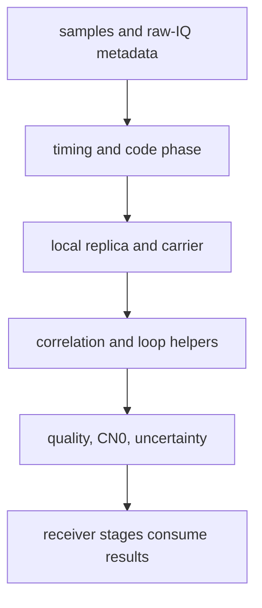

# DSP Contracts

DSP contracts in `bijux-gnss-signal` are runtime-neutral promises. They may be
used by receiver stages, commands, validation helpers, and test fixtures, but
they do not decide receiver scheduling, artifact policy, or navigation solver
meaning.

## Public DSP Map

| module | contract | first proof |
| --- | --- | --- |
| `front_end` | FIR front-end specification and response measurement | front-end source |
| `quality` | I/Q metrics, noise-floor estimation, DC-offset handling | quality source |
| `local_code`, `sample_timing`, `signal` | code phase, samples-per-code, wrapping, carrier wipeoff, sample-index timing | local-code, sample-timing, and signal source |
| `nco` | oscillator state and phase progression | NCO source |
| `replica` | acquisition signal models, code models, carrier trajectories, synthetic modulation | replica source |
| `spectrum` | PSD estimation, expected spectra, transfer application, null finding | spectrum source |
| `tracking` | correlators, DLL/FLL/PLL helpers, discriminators, lock thresholds, CN0, tracking uncertainty | tracking DSP source |

## Contract Flow

## What Callers May Rely On

- DSP types and helpers are reusable without a `Receiver` or command runtime.
- Long-duration timing, phase wrapping, and code-phase behavior must remain
  deterministic across chunk boundaries.
- Front-end and spectrum helpers report signal quality without deciding what a
  receiver should do with that quality.
- Tracking helpers expose reusable math; the receiver decides channel
  lifecycle, state names, reacquisition policy, and emitted artifacts.

## What Callers Must Not Assume

- That internal helpers in `dsp/math.rs` are public promises just because
  receiver code happens to call nearby DSP modules.
- A DSP threshold is automatically a receiver lock policy.
- Replica generation owns synthetic scenario truth; receiver simulation owns
  scenario execution and truth artifacts.
- Signal-layer observation validation replaces core record meaning or
  receiver-side observation artifacts.

## First Proof Check

Inspect the [DSP guide](https://github.com/bijux/bijux-gnss/blob/main/crates/bijux-gnss-signal/docs/DSP.md), DSP
source, and the focused signal integration tests for long-duration NCO phase,
replica continuity, CBOC spectrum behavior, and local-code continuity.

If a downstream receiver test changes because a DSP primitive changed, update
the signal proof first, then update receiver expectations only when the runtime
handoff changed too.
