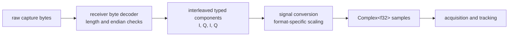
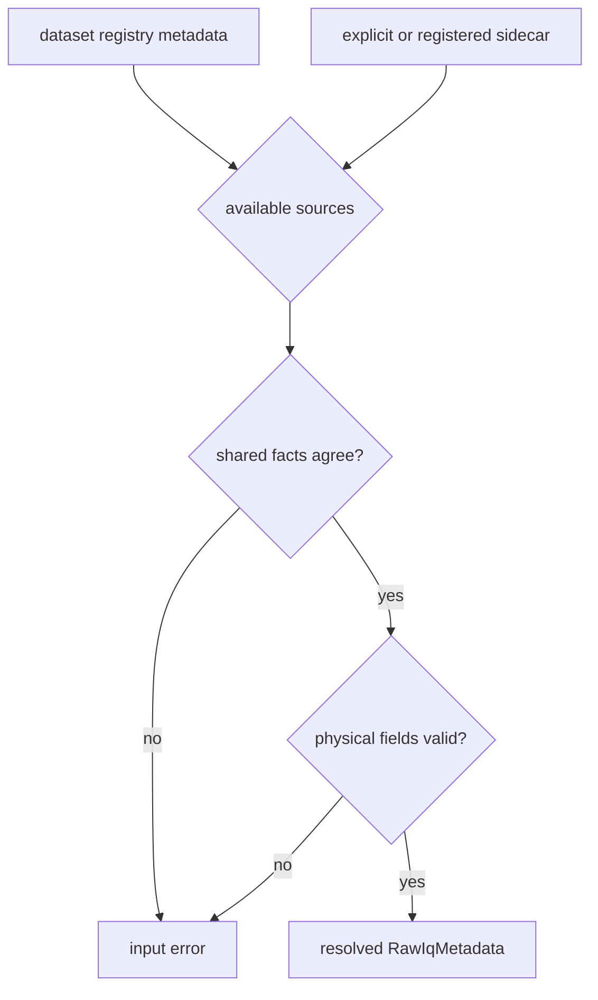
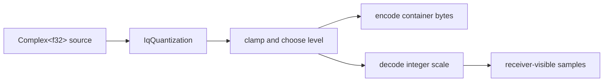

# Raw IQ and Sample Contracts

A raw capture is useful only when its bytes and physical meaning travel
together. `bijux-gnss-signal` supplies the shared vocabulary for that
agreement: container format, capture metadata, normalized complex samples, and
controlled storage quantization. It does not choose files, discover sidecars,
or decide whether two metadata sources agree.

## From Capture to Samples

The byte decoder is responsible for little-endian interpretation and complete
complex-sample boundaries. Signal conversion begins after bytes have become an
`i8`, `i16`, or `f32` component slice.

| Declared format | Serialized complex sample | Width | Conversion to `Complex<f32>` |
| --- | --- | ---: | --- |
| `Iq8` | signed `i8` I, then signed `i8` Q | 2 bytes | divide each component by 128 |
| `Iq16Le` | little-endian signed `i16` I, then Q | 4 bytes | divide each component by 32768 |
| `Cf32Le` | little-endian `f32` I, then Q | 8 bytes | preserve both values |

Integer normalization is asymmetric at the positive rail because signed
integers contain one more negative value: `-128` maps to `-1.0`, while `127`
maps to `0.9921875`; `-32768` maps to `-1.0`, while `32767` maps to
approximately `0.9999695`.

The three conversion helpers consume pairs with `chunks_exact(2)`. An unmatched
typed component is ignored. That behavior is suitable only after a caller has
validated framing. The receiver's file decoder performs that validation and
returns `InvalidIqLength` when a byte buffer cannot contain whole complex
samples.

## Metadata Is Capture Meaning

`RawIqMetadata` describes how to interpret one capture:

| Field | Meaning |
| --- | --- |
| `format` | one of the three serialized layouts above |
| `sample_rate_hz` | sampling frequency used to establish sample time |
| `intermediate_freq_hz` | center offset from baseband; `0.0` means zero IF |
| `capture_start_utc` | UTC start label supplied with the capture |
| `offset_bytes` | number of leading bytes before the first I component |
| `quantization_bits` | optional effective depth associated with the container |
| `notes` | optional human context with no processing semantics |

The last three fields default when absent during deserialization:
`offset_bytes` becomes zero, and both optional fields become `None`. The format,
sample rate, intermediate frequency, and capture start remain required.

Serialization preserves the record; it does not establish that the values are
physically credible. Infrastructure rejects non-positive or non-finite sample
rates, non-finite intermediate frequencies, empty capture-start labels, and a
declared quantization depth that conflicts with the container. It also rejects
disagreement between registry and sidecar values for format, sample rate,
intermediate frequency, or capture start.

`offset_bytes`, `quantization_bits`, and `notes` are not part of the current
registry-versus-sidecar equality check. Callers must not interpret successful
resolution as proof that those optional values were independently corroborated.

## Storage Quantization

`IqQuantization` describes an intentional export profile, not the measured
precision of an arbitrary input capture.

| Profile | Effective levels | Storage container | Stable identifier |
| --- | ---: | --- | --- |
| `Float32` | float32 values | `Cf32Le` | `float32` |
| `Bipolar1Bit` | negative or non-negative rail | `Iq8` | `bipolar1_bit` |
| `Signed2Bit` | 4 uniformly spaced levels | `Iq8` | `signed2_bit` |
| `Signed4Bit` | 16 uniformly spaced levels | `Iq8` | `signed4_bit` |
| `Signed8Bit` | 256 uniformly spaced levels | `Iq8` | `signed8_bit` |
| `Signed16Bit` | 65,536 uniformly spaced levels | `Iq16Le` | `signed16_bit` |

Integer profiles clamp finite inputs to `[-1.0, 1.0]`, choose the nearest
uniform level, scale to the storage integer, round, and clamp once more to the
container range. Non-finite inputs become zero before level selection.
`Bipolar1Bit` maps negative values to the negative rail and zero or positive
values to the positive rail.

`encode_quantized_samples` returns interleaved bytes in the declared container.
`quantize_samples_for_storage` instead returns the complex samples a receiver
would observe after the same quantization and integer normalization. For
`Float32`, both operations preserve the input values; the encoder writes each
component in little-endian order.

## Compatibility Decisions

Treat these changes as cross-crate interface changes:

- adding or renaming a serialized format or quantization variant
- changing enum identifiers, component order, byte order, or container width
- changing integer scales, rounding, saturation, or non-finite handling
- making a defaulted metadata field required, or changing a field's physical
  meaning
- changing which metadata disagreements infrastructure rejects
- changing odd-component or partial-byte behavior

A new container is not complete when the enum compiles. It needs byte decoding,
normalization, metadata validation, public re-exports, capture round-trip proof,
and acquisition parity before readers can rely on it.

## Evidence

- [Raw IQ implementation](https://github.com/bijux/bijux-gnss/blob/main/crates/bijux-gnss-signal/src/raw_iq.rs)
  defines the serialized vocabulary and metadata defaults.
- [Sample conversion implementation](https://github.com/bijux/bijux-gnss/blob/main/crates/bijux-gnss-signal/src/samples.rs)
  defines scaling, quantization, saturation, and encoding.
- [Raw IQ contract tests](https://github.com/bijux/bijux-gnss/blob/main/crates/bijux-gnss-signal/tests/integration_raw_iq_metadata.rs)
  protect encoded widths and metadata round trips.
- [Sample conversion tests](https://github.com/bijux/bijux-gnss/blob/main/crates/bijux-gnss-signal/tests/integration_iq_sample_conversion.rs)
  protect normalization, profile identity, quantized levels, and output widths.
- [Receiver capture source tests](https://github.com/bijux/bijux-gnss/blob/main/crates/bijux-gnss-receiver/tests/integration_raw_iq_source.rs)
  protect byte decoding, offsets, framing errors, and sample timing.
- [Infrastructure metadata validation](https://github.com/bijux/bijux-gnss/blob/main/crates/bijux-gnss-infra/src/datasets/raw_iq_metadata/validation.rs)
  defines physical validation and source-agreement checks.
