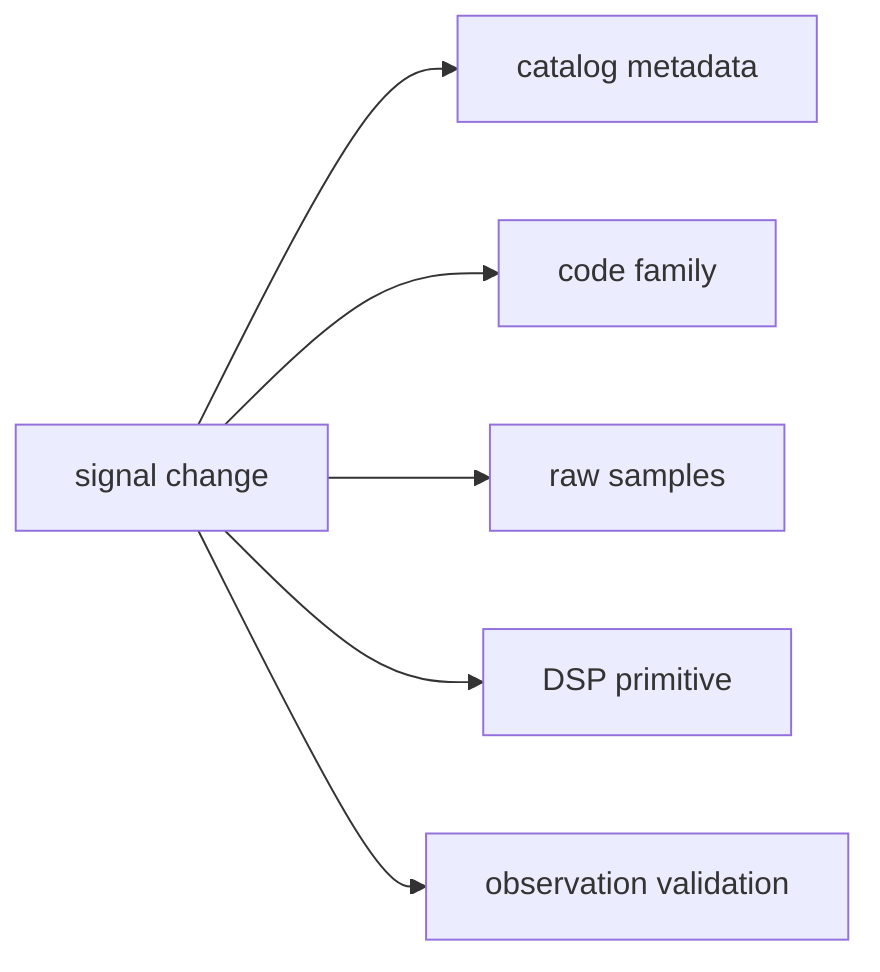

# Common Workflows

Signal work should start by naming the owned surface. The crate contains
catalogs, code families, sample contracts, validation, and reusable DSP; those
are related but not interchangeable review lanes.

## Typical Change Families

- add or extend a signal family in `codes/`
- adjust a reusable DSP primitive in `dsp/`
- extend raw-IQ or sample contracts
- strengthen or fix signal-layer validation logic
- refresh reference catalogs or independent support fixtures

## Workflow Rule

Choose the workflow based on the owning surface. A code-family change is not
reviewed the same way as a metadata-contract change, even if both are in the
same crate.

## Workflow Map

| change family | first reader question | proof shape |
| --- | --- | --- |
| catalog metadata | Which signal identity, frequency, or component is being named? | catalog docs and component registry tests |
| code generation | Which deterministic sequence or secondary code changed? | code-family docs, references, and sequence tests |
| DSP primitive | Which reusable timing, replica, spectrum, or loop behavior moved? | DSP docs plus focused numeric tests |
| raw samples | Which metadata, quantization, or sample conversion contract changed? | raw-IQ and sample docs plus conversion tests |
| validation | Which signal-level compatibility claim changed? | validation docs plus observation compatibility tests |

## Proof Path

Use the [code family guide](https://github.com/bijux/bijux-gnss/blob/main/crates/bijux-gnss-signal/docs/CODE_FAMILIES.md),
[DSP guide](https://github.com/bijux/bijux-gnss/blob/main/crates/bijux-gnss-signal/docs/DSP.md),
[raw IQ guide](https://github.com/bijux/bijux-gnss/blob/main/crates/bijux-gnss-signal/docs/RAW_IQ.md), and
[validation guide](https://github.com/bijux/bijux-gnss/blob/main/crates/bijux-gnss-signal/docs/VALIDATION.md) as the
workflow map. Then choose the matching proof family before deciding whether the
work is really one change family or several independent ones.
