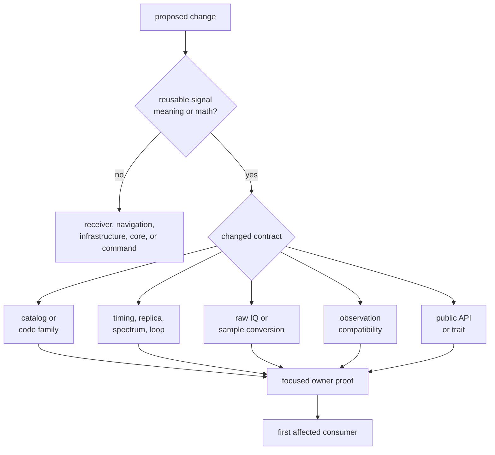
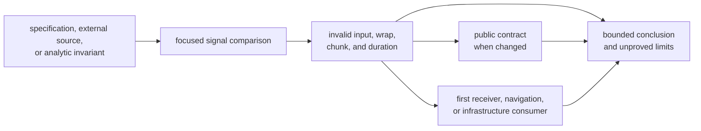

# Changing Signal Behavior

Signal changes need proof at the physical contract they alter. A broad receiver
pass cannot establish that a code sequence, phase convention, spectrum, or
sample conversion is correct. Use this section to identify the changed claim,
choose independent evidence, and follow that meaning to its first consumer.

## Route the Change

| Intent | Use |
| --- | --- |
| understand the normal edit order | [Signal change sequence](change-sequence.md) |
| add a signal family, modulation, or reusable primitive | [Signal extension guide](signal-extension-guide.md) |
| choose exact focused proof | [Signal verification guide](verification-commands.md) |
| change a checked catalog or expected value | [Reference and fixture care](fixture-and-reference-care.md) |
| decide review depth and downstream evidence | [Signal change review](review-scope.md) |
| understand compatibility and release impact | [Signal release and versioning](release-and-versioning.md) |
| perform routine local work | [Local signal development](local-development.md) |
| identify common maintenance routes | [Common signal workflows](common-workflows.md) |

## Evidence Order

The authority must be independent enough for the claim. A hash of current
output detects later drift but does not establish correctness. A separately
written generator that reads production assignment tables can test recurrence
logic while leaving table transcription unproved. Record that distinction.

## Minimum Change Record

Before implementation, name:

- constellation, band, code, component, and affected satellite range
- changed units, polarity, phase/time origin, rate, container, or validation
  rule
- source authority and its revision or provenance
- exact versus toleranced comparisons
- invalid, boundary, chunked, and long-duration behavior
- public exports or serialized records affected
- first downstream behavior that consumes the result
- reference or expensive proof that cannot currently be reproduced

This record belongs in the change, tests, changelog, or review description
according to the surface. It must not exist only in an untracked notebook or
conversation.

## Stop and Reassign Ownership

Move the primary change out of signal when its meaning depends on:

- receiver channel scheduling, search policy, lock lifecycle, or session
  history
- navigation products, corrections, estimation, integrity, PPP, or RTK
- dataset discovery, sidecar precedence, run layout, or persisted evidence
- command parsing, operator rendering, or exit policy
- a test-only expected-value generator with no production consumer

Signal may still need a reusable primitive, but that primitive and the
higher-level policy are separate contracts.

## Core References

- [Signal boundary](https://github.com/bijux/bijux-gnss/blob/main/crates/bijux-gnss-signal/docs/BOUNDARY.md) defines
  package ownership.
- [Signal architecture](https://github.com/bijux/bijux-gnss/blob/main/crates/bijux-gnss-signal/docs/ARCHITECTURE.md)
  maps catalogs, codes, samples, DSP, validation, and traits.
- [Signal proof inventory](https://github.com/bijux/bijux-gnss/blob/main/crates/bijux-gnss-signal/docs/TESTS.md)
  identifies active proof families.
- [Curated public API](https://github.com/bijux/bijux-gnss/blob/main/crates/bijux-gnss-signal/docs/PUBLIC_API.md)
  defines downstream commitments.
- [Signal quality](../quality/index.md) covers invariants, review gates, limitations,
  and risk.
