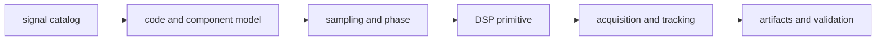

# Release And Versioning

`bijux-gnss-signal` supplies physical signal facts and deterministic DSP
behavior to acquisition, tracking, synthetic generation, and validation. A
release can preserve its Rust API while changing every receiver result, so
behavioral compatibility is a first-class release concern.

## Decide the Compatibility Level

| changed surface | release decision |
| --- | --- |
| new registry entry | additive only when existing lookups, defaults, and component roles are unchanged |
| carrier, code rate, wavelength, or component metadata | scientific behavior change; verify every consuming crate |
| primary or secondary code sequence | breaking behavior change unless correcting a documented unsupported result |
| phase origin, sample indexing, wrapping, or NCO progression | breaking for chunked and long-running consumers |
| sample conversion or quantization rule | data interpretation change; document scaling, clipping, and container assumptions |
| raw-IQ metadata field or default | serialized contract change across signal, infrastructure, receiver, and CLI layers |
| discriminator, loop, spectrum, or quality math | numerical behavior change; state units, normalization, and expected tolerance |
| curated export removed, renamed, or moved | breaking public API change |

Do not classify a correction as harmless because it moves output closer to a
reference. State which old result was wrong, which reference establishes the
new behavior, and which downstream results can change.

## Follow the Impact

Use the document that owns the changed meaning:

- [signal catalog](../../../crates/bijux-gnss-signal/docs/CATALOG.md) for
  carrier, code-rate, wavelength, component, and default-selection facts
- [code-family guide](../../../crates/bijux-gnss-signal/docs/CODE_FAMILIES.md)
  for assignments, chip polarity, primary codes, and secondary-code timing
- [sample guide](../../../crates/bijux-gnss-signal/docs/SAMPLES.md) for encoded
  sample conversion and numeric representation
- [DSP guide](../../../crates/bijux-gnss-signal/docs/DSP.md) for phase,
  frequency, wrapping, loop, quality, and spectrum behavior
- [raw-IQ guide](../../../crates/bijux-gnss-signal/docs/RAW_IQ.md) for capture
  format, sample rate, intermediate frequency, offset, and quantization meaning
- [public API guide](../../../crates/bijux-gnss-signal/docs/PUBLIC_API.md) for
  the curated Rust surface

## Require Matching Evidence

| release claim | minimum evidence |
| --- | --- |
| registry and component metadata remain coherent | [component registry integration](../../../crates/bijux-gnss-signal/tests/integration_signal_component_registry.rs) and the affected constellation reference test |
| code and carrier progression remain chunk-stable | [local-code continuity](../../../crates/bijux-gnss-signal/tests/integration_local_code_continuity.rs), [replica continuity](../../../crates/bijux-gnss-signal/tests/integration_replica_continuity.rs), and [long-duration carrier wipeoff](../../../crates/bijux-gnss-signal/tests/integration_carrier_wipeoff_long_duration.rs) |
| raw captures keep the same meaning | [raw-IQ metadata integration](../../../crates/bijux-gnss-signal/tests/integration_raw_iq_metadata.rs) and [IQ sample conversion](../../../crates/bijux-gnss-signal/tests/integration_iq_sample_conversion.rs) |
| oscillator boundaries remain stable | [NCO properties](../../../crates/bijux-gnss-signal/tests/prop_nco.rs) and [long-duration NCO phase](../../../crates/bijux-gnss-signal/tests/integration_nco_long_duration_phase.rs) |
| modulation or filtering remains physically coherent | the affected spectrum integration test described in the [test guide](../../../crates/bijux-gnss-signal/docs/TESTS.md) |

Reference fixtures are evidence, not snapshots to regenerate automatically.
Record the specification, formula, or independently generated source behind an
intentional fixture change.

## Write the Release Entry

The [package changelog](../../../crates/bijux-gnss-signal/CHANGELOG.md) must
identify the signal and component, units, old behavior, new behavior, receiver
impact, and supporting reference or test. If a change affects persisted raw-IQ
interpretation or a core artifact, also update the owning package changelog.

The workspace version and publication procedure are defined in the
[release handbook](../../bijux-gnss-dev/operations/release-and-versioning.md).
