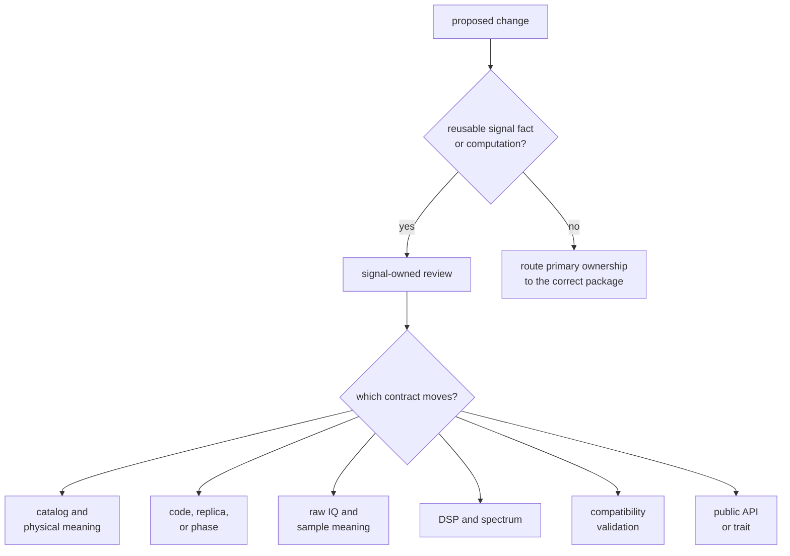
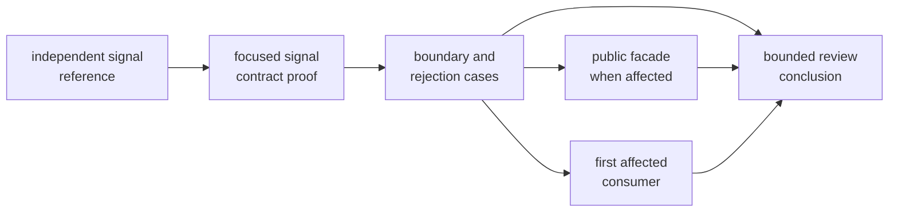

# Signal Change Review

Review signal changes by the meaning they alter and the consumers that rely on
that meaning. A small catalog edit can change acquisition behavior across the
receiver, while a large private reorganization may leave every signal contract
unchanged. Diff size is not a useful measure of review depth.

## Establish Ownership Before Impact

Signal owns definitions and runtime-neutral computation. Receiver scheduling,
channel state, persisted datasets, navigation estimation, and operator policy
belong to neighboring packages even when they consume signal values. The
[signal boundary guide](https://github.com/bijux/bijux-gnss/blob/main/crates/bijux-gnss-signal/docs/BOUNDARY.md)
defines this ownership line.

Ownership and impact are separate questions. A signal-owned change may require
receiver evidence, but that does not move receiver policy into the signal
crate.

## Review by Changed Meaning

| Changed meaning | Inspect in the signal layer | Evidence to require | First downstream risk |
| --- | --- | --- | --- |
| Catalog identity, component, carrier, chip rate, modulation, wavelength, or acquisition default | canonical entry, units, aliases, component relationships, and lookup behavior | registry and wavelength proof against an independent reference | acquisition selection, observation interpretation, and support reporting |
| Primary or secondary spreading code | assignment, indexing, period, polarity, chip convention, sampler, and reference provenance | constellation-specific reference vector plus period, repetition, and correlation properties | acquisition peaks, data/pilot pairing, and tracking replicas |
| Fractional or chunked code sampling | phase convention, rate conversion, boundary carry, and long-duration accumulation | integer and arbitrary-rate sampling plus chunk-equivalence and long-duration continuity | code-phase continuity across receiver buffers |
| Replica, NCO, carrier wipeoff, or code-phase math | sign convention, normalization, phase units, wrap behavior, initial state, and chunk invariance | analytic property, long-duration continuity, and representative rates | acquisition Doppler sign and tracking phase continuity |
| Spectrum, front-end filter, or modulation helper | expected response, frequency normalization, bandwidth, sample rate, and comparison metric | modulation-specific spectrum and front-end response proof | acquisition sensitivity and receiver configuration assumptions |
| Raw-IQ metadata or sample conversion | layout, endianness, signedness, scale, saturation, channel order, and conversion loss | metadata round trip, conversion boundaries, and incompatible-input rejection | sample ingestion and amplitude assumptions |
| Observation compatibility validation | signal pairing rule, lock-state meaning, band identity, rejection reason, and report completeness | property tests plus accepted and rejected representative observations | navigation input eligibility and receiver diagnostics |
| Public export or trait | reusable semantics, stability commitment, errors, ownership, and consumer need | public guardrail plus direct consumer-shaped use | package compatibility and semver obligations |

Use the [catalog guide](https://github.com/bijux/bijux-gnss/blob/main/crates/bijux-gnss-signal/docs/CATALOG.md),
[code-family guide](https://github.com/bijux/bijux-gnss/blob/main/crates/bijux-gnss-signal/docs/CODE_FAMILIES.md),
[DSP guide](https://github.com/bijux/bijux-gnss/blob/main/crates/bijux-gnss-signal/docs/DSP.md), and
[raw-IQ guide](https://github.com/bijux/bijux-gnss/blob/main/crates/bijux-gnss-signal/docs/RAW_IQ.md) for the
contract under review.

## Demand Independent Signal Evidence

Reference evidence must identify:

- specification, published table, external catalog, analytic property, or
  independently generated vector
- constellation, signal, component, satellite range, and revision
- chip, symbol, phase, frequency, sample, and polarity conventions
- any transformation from the source into the checked fixture
- checksum or review method for governed reference data

A fixture produced by the current implementation can detect later byte
changes, but it cannot establish that the original output was correct.

For numeric DSP proof, record the sample rate, signal duration, initial phase,
chunk pattern, normalization, expected value, metric, and tolerance. Exact
reference chips and metadata should remain exact; floating-point phase,
spectrum, and filter comparisons need justified numeric budgets.

## Follow the Contract to Its First Consumer

Add consumer evidence when the changed value controls downstream behavior:

- Catalog, code, component, or acquisition-default changes need the first
  affected receiver selection or acquisition case.
- Code-phase, NCO, replica, or wipeoff changes need the first tracking or
  correlator continuity case.
- Raw-IQ and conversion changes need the first ingestion or receiver sample
  boundary.
- Observation validation changes need the first consumer of the accepted,
  rejected, or degraded report.
- Public exports need a direct downstream-style import and use, not only an
  internal unit test.

Do not use a broad receiver pass as the only signal proof. It may fail far from
the cause or pass without exercising the changed signal family.

## Review Public Commitments Deliberately

Any change to the [public API facade](https://github.com/bijux/bijux-gnss/blob/main/crates/bijux-gnss-signal/src/api.rs)
is public-boundary work. So is a change to the semantics of an already exported
type, function, constant, error, trait, or default even when the facade itself
does not change.

Confirm:

- the export represents reusable signal meaning rather than one caller's
  convenience
- internal tables and implementation modules remain private
- names include enough physical meaning to avoid caller convention
- errors distinguish invalid input from unsupported capability
- serialization or schema meaning remains compatible when applicable
- the [public API guide](https://github.com/bijux/bijux-gnss/blob/main/crates/bijux-gnss-signal/docs/PUBLIC_API.md)
  describes the resulting commitment

A new export is not justified merely because a downstream package can avoid a
local adapter.

## Keep the Change Reviewable

One commit may carry an inseparable contract change: canonical signal fact,
implementation, focused proof, public exposure, and directly affected
documentation. Separate work when it has independent intent, such as:

- adding an independent reference fixture before changing behavior
- changing a public contract separately from a private reorganization
- updating a downstream receiver policy that merely consumes the new signal
  meaning
- regenerating governed reference data separately from handwritten analysis

Never split a contract so that an intermediate commit exposes unsupported
metadata, unverified code generation, or a public API without its meaning.

## Block the Review When

- the source of a signal constant or code assignment is unknown
- chips, samples, symbols, radians, cycles, hertz, or seconds are implicit
- code or carrier sign conventions exist only in caller assumptions
- a long-duration claim is inferred from one period or one buffer
- a reference fixture was regenerated without explaining why truth changed
- a receiver symptom is addressed by adding scheduling or lock policy here
- a public export exposes internal organization rather than a durable contract
- downstream impact is dismissed because the local diff is small
- only happy-path conversion or compatibility behavior is exercised

Use the [signal test guide](https://github.com/bijux/bijux-gnss/blob/main/crates/bijux-gnss-signal/docs/TESTS.md)
to locate focused proof and the [review checklist](../quality/review-checklist.md)
for the final ownership and evidence gates.

The review is complete when the changed signal meaning, independent authority,
units and conventions, exact or toleranced assertions, invalid-input behavior,
public commitment, first affected consumer, and untested limits are explicit.
