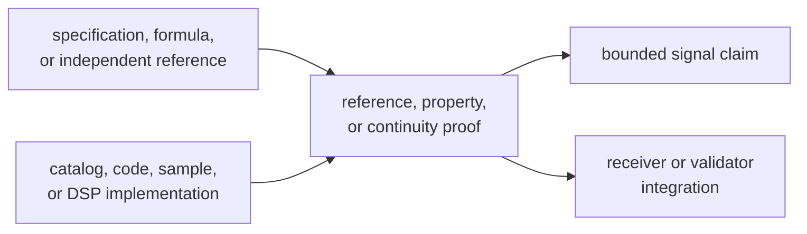
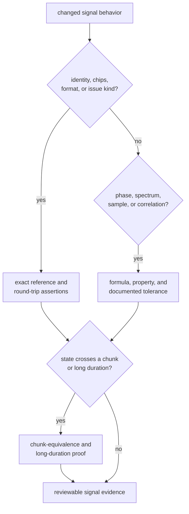

# Signal Evidence

The signal crate publishes reusable physical facts, code families, sample
meaning, and DSP behavior. Its evidence must therefore stand without receiver
state. A receiver lock can expose a signal defect, but it cannot replace a
reference sequence, phase-continuity proof, spectrum check, or conversion
contract.

## Route the Claim

| Claim | Read first | Required evidence |
| --- | --- | --- |
| A signal identity, carrier, code rate, component role, or wavelength is canonical | [Catalog contract](https://github.com/bijux/bijux-gnss/blob/main/crates/bijux-gnss-signal/docs/CATALOG.md) | registry consistency and a named specification or reference |
| A primary or secondary code is correct | [Code contracts](../interfaces/code-contracts.md) | reference chips, period, component identity, and boundary behavior |
| Sampling, NCO, replica, wipeoff, correlation, or spectrum math is correct | [DSP contracts](../interfaces/dsp-contracts.md) | formula or independent reference, edge properties, and long-duration continuity where state advances |
| Raw samples preserve declared numeric meaning | [Raw-IQ and sample contracts](../interfaces/raw-iq-and-sample-contracts.md) | metadata round trip, quantization semantics, byte order, and numeric conversion |
| An observation is compatible with signal constraints | [Validation contracts](../interfaces/validation-contracts.md) | structured issues, alignment evidence, and property coverage |
| A public helper remains safe to consume | [API surface](../interfaces/api-surface.md) | guardrail proof plus the domain-specific evidence above |

The [test strategy](test-strategy.md) maps these claims to reference,
continuity, spectrum, conversion, property, and API guardrail tests. Use the
[invariant catalog](invariants.md) when the concern spans more than one
specific example.

## Build Proof from Independent Meaning

The consumer integration is downstream evidence, not the authority. If a
reference fixture is generated with the implementation under test, it can show
repeatability but not correctness. The
[fixture and reference guide](../operations/fixture-and-reference-care.md)
explains how to preserve independent expectations when signal definitions
change.

## Prove the Property That Can Drift

Signal defects often appear only outside a convenient frame:

- a correct first code period can still wrap incorrectly later
- a stable short oscillator run can still accumulate phase error
- a conversion can preserve ordinary values while mishandling extrema,
  signedness, endianness, or quantization depth
- a plausible spectrum can still encode the wrong modulation or front-end
  assumption
- valid catalog fields can still identify the wrong component or secondary
  code relationship

Use exact assertions for identities, chip sequences, component roles, encoded
formats, issue kinds, and ordering. Use tolerances only for numeric quantities
whose contract names the unit and acceptable error. When state advances over
time or input chunks, compare segmented execution with equivalent continuous
execution.

## Keep the Claim Inside the Signal Boundary

Signal evidence can support statements such as:

- a registered component carries the intended physical metadata
- a generated sequence matches its declared reference
- an oscillator or replica remains continuous across chunk boundaries
- a spectrum calculation represents its stated modulation assumptions
- raw-IQ conversion preserves its documented container and numeric semantics
- signal-level validation emits the expected structured compatibility issues

It cannot establish acquisition sensitivity, tracking lock, navigation
accuracy, persisted artifact integrity, or command behavior. Those claims need
evidence from the owning crate. The [known limitations](known-limitations.md)
describes these boundaries in operational terms.

## Reject Weak Evidence

Stop the review when:

- a receiver success is the only proof offered for changed signal math
- a reference source, formula, constellation, component, or chip order is
  unnamed
- a short test is used to claim long-duration or chunk-stable behavior
- a wide tolerance hides a discrete identity, sequence, format, or ordering
  change
- a spectral result omits modulation, sample-rate, or front-end assumptions
- raw-IQ metadata is inferred from receiver configuration rather than treated
  as a capture fact
- alignment lag or compatibility evidence is promoted into a receiver or
  navigation verdict

Use [change validation](change-validation.md) to select the narrow proof and
first affected consumer. Use the [review checklist](review-checklist.md),
[risk register](risk-register.md), and
[definition of done](definition-of-done.md) to close public compatibility and
remaining-risk questions.

A signal claim is ready when its authority, implementation boundary, exact or
toleranced property, continuity scope, and downstream impact are all visible.
