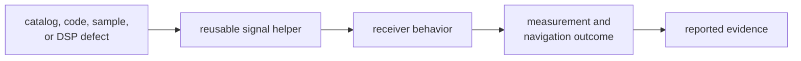
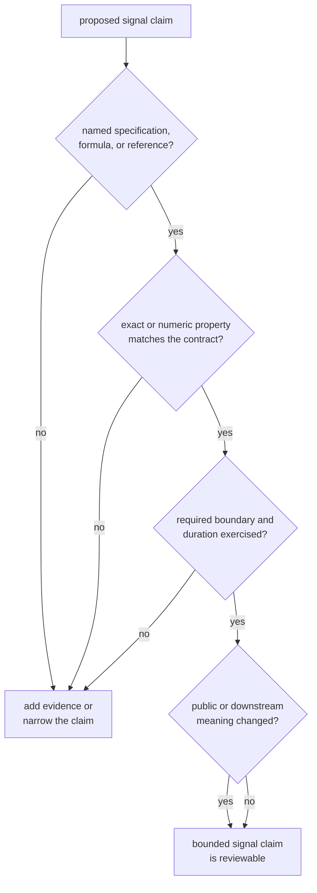

# Signal Evidence Risks

Signal defects are amplified downstream. Incorrect metadata can alter search
space, a one-chip error can corrupt every replica, and a small phase drift can
surface only after long execution. The risk register therefore focuses on
claims that can look plausible in a short or receiver-level test while the
reusable signal contract is wrong.

## How Weak Evidence Propagates

A downstream failure can reveal the defect, but the correction still needs
signal-layer proof at the first wrong boundary.

## Active Risk Register

| Risk | Warning sign | Required evidence | Claim limit |
| --- | --- | --- | --- |
| Catalog identity drift | Carrier, code rate, component role, secondary code, or wavelength changes without a named authority. | Registry consistency, exact metadata assertions, and the relevant specification or independent reference. | Correct metadata does not prove acquisition or tracking. |
| Reference circularity | Expected chips or periods are produced by the implementation being tested. | Checked-in or independently generated reference data with documented constellation, component, chip order, and provenance. | Self-consistency is not signal truth. |
| Short-window confidence | One period or frame passes while chunked or long-duration execution is untested. | Period-boundary, chunk-equivalence, and long-duration phase evidence. | A correct initial frame does not prove continuity. |
| Numeric tolerance masks discrete error | A broad epsilon permits the wrong chip, component, format, sign, or ordering. | Exact assertions for discrete meaning; derived tolerances only for continuous quantities. | Numerical proximity cannot repair identity. |
| Spectrum assumption drift | A plotted or computed shape omits modulation, sampling, normalization, or front-end bandwidth. | Formula or reference comparison with every physical assumption named. | A spectral helper does not prove receiver sensitivity. |
| Raw-IQ reinterpretation | Sample rate, intermediate frequency, byte order, signedness, or quantization is inferred from runtime configuration. | Metadata round trip plus boundary and conversion cases for each supported container. | Signal owns sample meaning, not dataset discovery or frame scheduling. |
| Validation becomes policy | Compatibility issues are promoted into lock, navigation, or operator verdicts. | Structured issue-kind properties and a clear consumer decision boundary. | Alignment evidence is not a receiver failure by itself. |
| Public surface outruns proof | A helper or table is exported because one caller needs convenient access. | Shared semantic argument, public guardrail, and domain-specific proof. | Reachability does not establish stable meaning. |
| Receiver evidence substitutes for signal proof | A receiver test passes, but no reference, property, or continuity test exercises the changed helper. | Focused signal proof followed by the first affected receiver boundary when needed. | Receiver success can corroborate but not define signal truth. |

The [test evidence guide](https://github.com/bijux/bijux-gnss/blob/main/crates/bijux-gnss-signal/docs/TESTS.md)
describes the active test families. The
[known limitations](known-limitations.md) keeps receiver, navigation, storage,
and command claims outside this package.

## Decide Whether the Claim Is Supported

For a public or downstream change, “supported” also requires compatibility
review. The diagram does not imply that consumer evidence may be skipped; it
shows that consumer evidence comes after the signal property is established.

## Block the Change When

- the authority for a changed signal fact is unnamed
- expected data is regenerated solely because the implementation changed
- a one-frame test is used to claim chunk-stable or long-duration behavior
- a tolerance hides changed identity, sequence, format, sign, or ordering
- spectrum evidence omits its physical assumptions
- raw capture facts are guessed from receiver settings
- signal validation starts deciding receiver or navigation quality
- public exposure is justified only by one caller’s import convenience

## Record Residual Risk

When complete evidence is unavailable, state the unsupported constellation,
component, sample format, duration, rate, bandwidth, or consumer. Do not use
“other signals should behave similarly” as proof. A family-specific reference
does not automatically cover another modulation or secondary-code structure.

Signal quality review is complete when the physical authority, exact or
toleranced property, duration, chunk behavior, public impact, downstream
boundary, and remaining coverage gap are all explicit.
