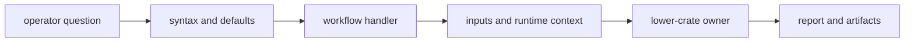

# Code Navigation

Choose an entrypoint from the operator question. The command package is
organized by stable workflow responsibility: syntax, execution, runtime
context, lower-crate adaptation, and reporting.

## Follow an Operator Request

| question | start here |
| --- | --- |
| Where is a command, flag, default, or argument group defined? | [command catalog](https://github.com/bijux/bijux-gnss/blob/main/crates/bijux-gnss/src/cli/command_catalog/mod.rs) and [argument parser](https://github.com/bijux/bijux-gnss/blob/main/crates/bijux-gnss/src/cli/command_line.rs) |
| Which workflow executes the request? | [command handlers](https://github.com/bijux/bijux-gnss/blob/main/crates/bijux-gnss/src/cli/commands/mod.rs) |
| How are datasets, environment, and report context prepared? | [command runtime](https://github.com/bijux/bijux-gnss/blob/main/crates/bijux-gnss/src/cli/command_runtime.rs) |
| How are captures, artifacts, and lower-crate outputs adapted? | [command support](https://github.com/bijux/bijux-gnss/blob/main/crates/bijux-gnss/src/cli/command_support/mod.rs) |
| How is operator or JSON output rendered? | [report renderer](https://github.com/bijux/bijux-gnss/blob/main/crates/bijux-gnss/src/cli/report.rs) |
| Why is a Rust API available from the facade? | [facade exports](https://github.com/bijux/bijux-gnss/blob/main/crates/bijux-gnss/src/lib.rs) and the [public API guide](https://github.com/bijux/bijux-gnss/blob/main/crates/bijux-gnss/docs/PUBLIC_API.md) |

## Find the Workflow Family

| operator intent | handler |
| --- | --- |
| register or inspect input | [ingest workflow](https://github.com/bijux/bijux-gnss/blob/main/crates/bijux-gnss/src/cli/commands/ingest.rs) |
| export or measure synthetic IQ | [synthetic workflow](https://github.com/bijux/bijux-gnss/blob/main/crates/bijux-gnss/src/cli/commands/synthetic.rs) |
| execute receiver stages and persist evidence | [pipeline workflow](https://github.com/bijux/bijux-gnss/blob/main/crates/bijux-gnss/src/cli/commands/run_pipeline.rs) |
| inspect or explain artifacts | [artifact workflow](https://github.com/bijux/bijux-gnss/blob/main/crates/bijux-gnss/src/cli/commands/artifact.rs) |
| validate capture, schema, observation, or reference evidence | [validation workflows](https://github.com/bijux/bijux-gnss/blob/main/crates/bijux-gnss/src/cli/commands/validate/mod.rs) |
| run diagnostics, replay, quality, or navigation-decode operations | [diagnostic workflows](https://github.com/bijux/bijux-gnss/blob/main/crates/bijux-gnss/src/cli/commands/diagnostics/mod.rs) |
| analyze existing evidence | [analysis workflow](https://github.com/bijux/bijux-gnss/blob/main/crates/bijux-gnss/src/cli/commands/analyze.rs) |

## Trace a Failure

| failure surface | evidence |
| --- | --- |
| configuration or capture validation | [configuration validation integration](https://github.com/bijux/bijux-gnss/blob/main/crates/bijux-gnss/tests/integration_validate_config.rs) and [capture validation integration](https://github.com/bijux/bijux-gnss/blob/main/crates/bijux-gnss/tests/integration_validate_capture.rs) |
| raw-IQ export or metadata | [synthetic export integration](https://github.com/bijux/bijux-gnss/blob/main/crates/bijux-gnss/tests/integration_export_synthetic_iq.rs) and [raw-IQ metadata integration](https://github.com/bijux/bijux-gnss/blob/main/crates/bijux-gnss/tests/integration_raw_iq_metadata.rs) |
| navigation decoding or RINEX routing | [navigation decode integration](https://github.com/bijux/bijux-gnss/blob/main/crates/bijux-gnss/tests/integration_nav_decode.rs) and [RINEX integration](https://github.com/bijux/bijux-gnss/blob/main/crates/bijux-gnss/tests/integration_rinex.rs) |
| command-support adaptation | [command-support coverage](https://github.com/bijux/bijux-gnss/blob/main/crates/bijux-gnss/src/cli/command_support/tests/mod.rs) |
| pipeline composition and PVT output | [pipeline workflow coverage](https://github.com/bijux/bijux-gnss/blob/main/crates/bijux-gnss/src/cli/commands/run_pipeline_tests/fixtures.rs) |

Start with the observable failure and owning workflow. Move into lower crates
only when the command has handed off valid inputs and preserved the returned
evidence correctly.
