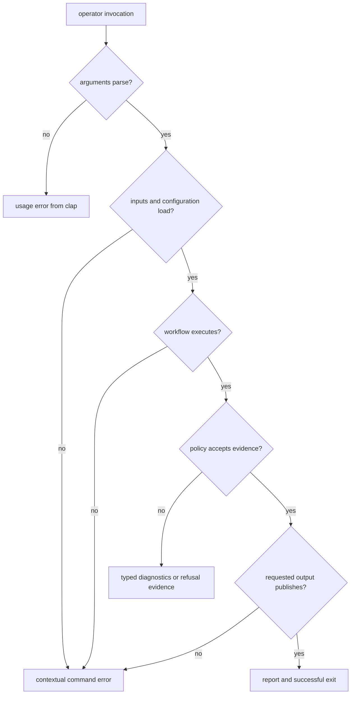

# Error Model

The command boundary has two ways to reject an invocation and one way to
describe an unsuccessful scientific outcome. They are deliberately different:
a malformed command should not look like a receiver refusal, and a valid report
containing warnings should not silently become command success or failure.

## Where Failure Becomes Visible

Argument parsing belongs to [`clap` command construction](https://github.com/bijux/bijux-gnss/blob/main/crates/bijux-gnss/src/cli/command_line.rs).
It rejects unknown commands, malformed values, and missing arguments declared as
required by the parser before a handler runs. Some requirements remain semantic
because they depend on the selected workflow; handlers return contextual errors
for those cases.

## Failure Classes

| class | example | representation | reader response |
| --- | --- | --- | --- |
| command syntax | unknown subcommand or invalid enum value | parser-generated usage failure | correct the invocation; no scientific work began |
| workflow precondition | a required file was not supplied, a profile is invalid, or a run directory is absent | command error with handler context | correct input or configuration before interpreting artifacts |
| lower-layer execution | sample loading, acquisition, tracking, navigation, schema validation, or repository access fails | lower error propagated through the command boundary | follow the error to the owning crate; the command crate does not redefine it |
| assessed outcome | a valid run produces warnings, refused navigation, rejected observations, or failed validation evidence | typed report data, sometimes promoted by a strict or fail policy | inspect the report and the policy that decided whether the process should fail |
| publication | rendering, schema checking, or writing requested output fails | command error after some work may already have completed | treat the output directory as incomplete until its manifest and expected artifacts validate |

The executable returns [`anyhow::Result`](https://github.com/bijux/bijux-gnss/blob/main/crates/bijux-gnss/src/main.rs),
so handler errors retain chained context and produce a non-successful process
exit. The architecture does not define stable numeric exit codes or a
machine-readable error envelope. Automation should therefore consume documented
JSON reports and artifact schemas, not parse display text from an error chain.

## Diagnostics Are Not Exceptions

Receiver and navigation code often completes execution while declining a
stronger claim. Lock degradation, observation rejection, an unavailable
position solution, or a validation warning can be legitimate domain evidence.
The command must preserve that evidence in the report instead of converting
every unfavorable value into a generic error.

Commands that expose strictness or failure-threshold options may deliberately
promote report evidence to a command failure. The
[artifact validation policy](https://github.com/bijux/bijux-gnss/blob/main/crates/bijux-gnss/src/cli/commands/artifact.rs)
is an example: diagnostics are produced first, then the selected severity policy
decides whether the handler returns an error. A caller must record both the
report and the policy; the exit result alone loses the reason.

## Errors After Output Begins

Command handlers can write an artifact, validate it, write further reports, and
publish a manifest as separate operations. There is no command-wide transaction
or rollback. A late schema or filesystem failure can therefore leave useful but
incomplete output.

Before accepting a run directory:

1. Require the expected manifest or command-specific report.
2. Validate artifacts through the documented artifact command rather than
   inferring success from file presence.
3. Preserve the original command error alongside the directory when debugging.
4. Do not register or compare an incomplete directory as a successful run.

The [state and persistence guide](state-and-persistence.md) explains which
layer owns those files after command execution. The [verification command
guide](../operations/verification-commands.md) maps command claims to focused
proof.
