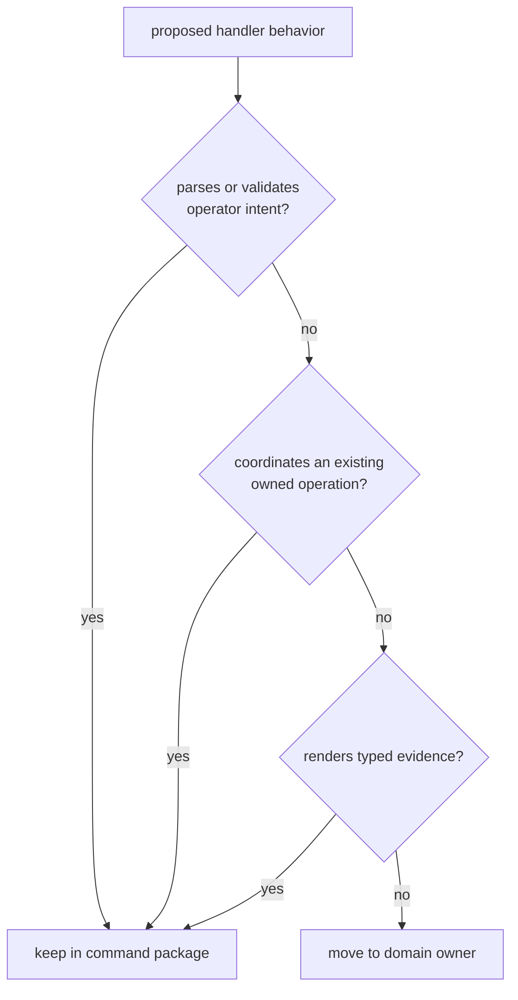

# Command Architecture Guide

`bijux-gnss` is a composition boundary. It parses operator intent, resolves
command context, delegates work to the package that owns the behavior, and
publishes evidence without reinterpreting it. The architecture is successful
when a reader can trace every option to a workflow and every result back to its
scientific or repository owner.

## Trace A Request

```mermaid
flowchart LR
    input["operator arguments"]
    catalog["typed command catalog"]
    parser["parser assembly"]
    handler["workflow handler"]
    context["runtime and input adapters"]
    owner["domain owner"]
    evidence["typed evidence"]
    report["operator report"]

    input --> catalog --> parser --> handler --> context --> owner
    owner --> evidence --> report
```

The command package owns the catalog, parser assembly, workflow selection,
adapters, and report presentation. The delegated package owns the behavior and
meaning of the evidence.

## Locate The Concern

| concern | architectural route | boundary |
| --- | --- | --- |
| Add or change a command, subcommand, option, or argument group | [Module map](module-map.md) | the catalog owns syntax, not domain semantics |
| Understand dispatch and workflow order | [Execution model](execution-model.md) | handlers compose work but do not absorb lower-package algorithms |
| Follow dependencies into infrastructure, receiver, navigation, signal, or core | [Dependency direction](dependency-direction.md) | lower packages never depend on the command package |
| Adapt datasets, captures, artifacts, or lower-package results | [Integration seams](integration-seams.md) | adaptation preserves typed meaning |
| Determine which state survives execution | [State and persistence](state-and-persistence.md) | infrastructure owns persisted layout and run identity |
| Classify operator, science, and internal failures | [Error model](error-model.md) | reporting must preserve the original failure class |
| Add a durable workflow family | [Extensibility model](extensibility-model.md) | a new family needs an operator job and a lower owner |
| Investigate excessive command-layer responsibility | [Architecture risks](architecture-risks.md) | convenience is not ownership |

## Keep The Handler Thin

A handler may select configuration, request a dataset, prepare run context, and
adapt a typed result for presentation. It must not implement acquisition math,
tracking lifecycle, navigation estimation, signal generation, artifact schema
meaning, or run-directory rules.

## Effects And Evidence

Input resolution and persistence are explicit seams. Commands can request a
dataset, sidecar, output location, or resume target, but infrastructure resolves
their repository meaning. Commands can render receiver or navigation outcomes,
but degraded and refused states must remain visible.

A successful process exit proves that the workflow completed its command
contract. It does not replace stage evidence or scientific validation.

## Implementation Evidence

Use the [code navigation guide](code-navigation.md) after identifying the
concern. The implementation authorities are the
[command catalog](https://github.com/bijux/bijux-gnss/blob/main/crates/bijux-gnss/src/cli/command_catalog/mod.rs),
[parser assembly](https://github.com/bijux/bijux-gnss/blob/main/crates/bijux-gnss/src/cli/command_line.rs),
[runtime dispatcher](https://github.com/bijux/bijux-gnss/blob/main/crates/bijux-gnss/src/cli/command_runtime.rs),
[workflow handlers](https://github.com/bijux/bijux-gnss/blob/main/crates/bijux-gnss/src/cli/commands/mod.rs),
[command adapters](https://github.com/bijux/bijux-gnss/blob/main/crates/bijux-gnss/src/cli/command_support/mod.rs),
and [report renderer](https://github.com/bijux/bijux-gnss/blob/main/crates/bijux-gnss/src/cli/report.rs).

The [crate architecture](https://github.com/bijux/bijux-gnss/blob/main/crates/bijux-gnss/docs/ARCHITECTURE.md)
states the same ownership boundary from the package perspective.
