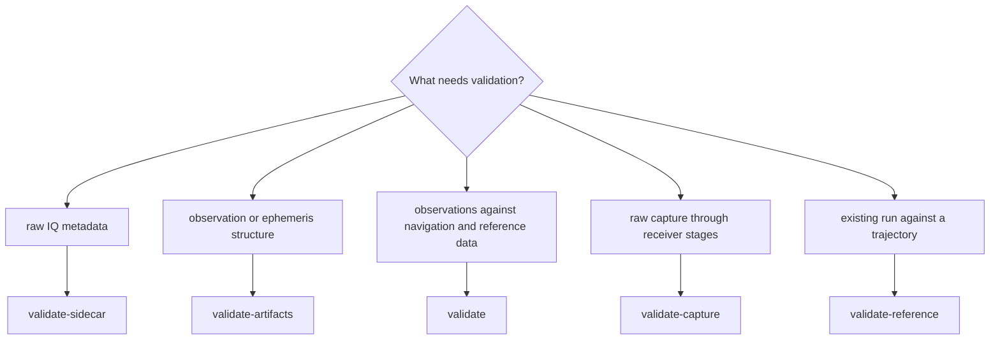
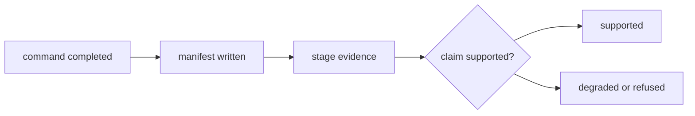

# Operator Questions

This page answers the decisions that arise before or after a `bijux gnss`
command. Use command help for the complete option list; use this page to choose
the right workflow and interpret its evidence without assigning too much
meaning to a successful exit.

## Which Command Should I Start With?

| intent | command family | expected evidence |
| --- | --- | --- |
| Examine capture metadata and sample quality | `inspect` | capture summary and signal-quality evidence |
| Search a capture for selected satellites | `acquire` | ranked acquisition candidates and search assumptions |
| Follow selected acquired signals over time | `track` | tracking epochs, lock state, and timing evidence |
| Execute the streaming receiver workflow | `run` | acquisition, tracking, observations, reports, and a run manifest |
| Solve positions from observation and navigation inputs | `pvt` | navigation-solution epochs and position-attempt evidence |
| Exercise a raw capture from acquisition through navigation attempts | `validate-capture` | stage evidence plus a validation report |
| Inspect or compare an existing run | `analyze`, `diff`, or `diagnostics` | derived summaries over persisted evidence |
| Create or check controlled synthetic inputs | synthetic export, validation, and measurement commands | generated capture evidence and validation results |

Choose the narrowest command that answers the question. Running the complete
pipeline to inspect metadata increases cost and creates evidence for stages the
operator did not ask about.

## Which Validation Command Do I Need?

The validation commands answer different questions and are not interchangeable.

- `validate-sidecar` checks raw-IQ metadata before receiver execution.
- `validate-artifacts` checks observation and ephemeris files against their
  schemas; strict mode also requires non-empty inputs.
- `validate` consumes observation epochs, navigation data, and a reference
  solution, then writes scientific validation evidence.
- `validate-capture` starts from raw IQ and records acquisition, tracking,
  observation, navigation-attempt, and validation evidence.
- `validate-reference` reads observations and position solutions from an
  existing run and aligns them with a supplied trajectory.

A schema check cannot establish receiver lock or positioning accuracy. A
reference comparison cannot repair missing acquisition or tracking evidence.

## Where Will The Result Go?

`--out` selects an explicit run destination. Without it, the infrastructure
layer derives the run location from command and dataset context. `--report
table` favors terminal reading; `--report json` favors automation. Report
selection does not remove persisted artifacts written by a workflow.

Treat the run manifest as the starting record for provenance, then inspect the
stage artifact relevant to the claim. See the
[persisted artifact contract](../../bijux-gnss-infra/interfaces/persisted-artifact-contracts.md)
for layout and identity semantics.

## Why Does Raw IQ Need More Than A File?

Samples do not encode their own sampling rate, intermediate frequency,
quantization, constellation context, or capture time. Supply a registered
dataset or a sidecar so those assumptions are explicit. Direct file overrides
are appropriate only when the operator can state and review the missing
metadata.

If metadata is absent or contradictory, stop before interpreting acquisition
peaks. The [raw-IQ contract](../../bijux-gnss-signal/interfaces/raw-iq-and-sample-contracts.md)
defines sample meaning; the infrastructure
[dataset contract](../../bijux-gnss-infra/interfaces/dataset-contracts.md)
defines how captures are resolved.

## What Does Deterministic Execution Prove?

`--deterministic` requests deterministic execution and records that request in
run context. It does not prove that two runs used identical inputs, build
features, configuration, or external products. Compare manifests and relevant
artifact hashes before claiming reproducibility; use replay diagnostics when a
run must be audited.

## Why Can A Successful Command Still Produce A Degraded Result?

Process success means the command completed its contract. Receiver evidence may
still report a refused channel, weak acquisition, lost lock, missing
observations, or an unsuccessful position attempt. Those states are scientific
or runtime outcomes, not command-parser failures.

Use the [receiver diagnostic contract](../../bijux-gnss-receiver/interfaces/diagnostic-contracts.md)
for stage-state meaning and the [report contract](../interfaces/reporting-contracts.md)
for presentation semantics.

## What Should I Preserve For Review?

Preserve the exact invocation, configuration, dataset identity or sidecar,
manifest, requested report, and every artifact needed to support the claim.
When comparing runs, preserve both evidence sets rather than only the rendered
delta. The [operator journeys](../operations/operator-journeys.md) show how
those records fit into complete workflows.

The implementation sources for these answers are the
[common command options](../../../crates/bijux-gnss/src/cli/command_line.rs),
[validation arguments](../../../crates/bijux-gnss/src/cli/command_catalog/validation_arguments.rs),
[validation handlers](../../../crates/bijux-gnss/src/cli/commands/validate/mod.rs),
and [run-context bridge](../../../crates/bijux-gnss/src/cli/execution_support.rs).
