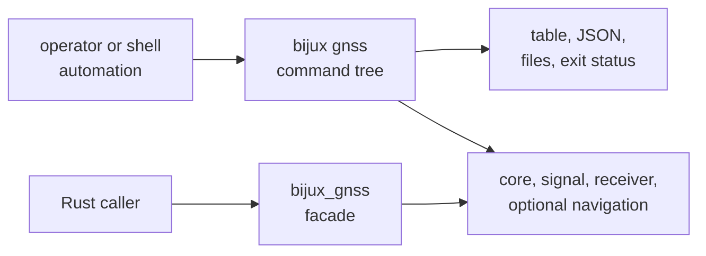
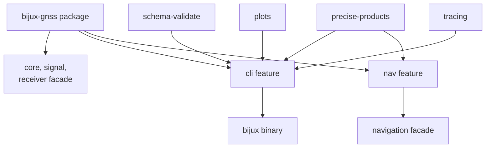

# Command and Rust API Boundaries

`bijux-gnss` publishes two independent interfaces. Operators and automation use
the `bijux gnss` command tree. Rust callers use a narrow facade that re-exports
the packages owning core, signal, receiver, and optional navigation behavior.
Compatibility must be evaluated separately for each interface.

## Two Public Routes

The command interface owns workflow selection and presentation. The facade owns
discoverable import routes. Neither surface transfers scientific or runtime
ownership from the lower package.

## Command Interface

The binary contract includes:

- `bijux gnss` and its command and nested-subcommand names
- flag names, aliases, value types, defaults, required combinations, and
  conflicts
- dataset, file, profile, sidecar, run, artifact, and reference selection
- table and JSON report behavior
- files intentionally written by a workflow
- standard output, diagnostics, and process exit status
- feature-dependent command availability

Command implementation may parse intent, assemble runtime inputs, call several
owners, and render a result. It must not redefine signal facts, receiver state,
navigation science, shared schema meaning, or persisted run layout.

The [command reference](https://github.com/bijux/bijux-gnss/blob/main/crates/bijux-gnss/docs/COMMANDS.md) groups the
supported workflows, and the
[execution contract](https://github.com/bijux/bijux-gnss/blob/main/crates/bijux-gnss/docs/EXECUTION.md) explains
the lower-package handoff.

## Rust Facade

The facade contains only package re-exports:

| Import route | Owning package | Availability |
| --- | --- | --- |
| `bijux_gnss::core` | core records, identities, units, artifacts, and diagnostics | always |
| `bijux_gnss::signal` | signal catalogs, codes, raw-IQ contracts, and DSP | always |
| `bijux_gnss::receiver` | receiver configuration, runtime, stages, and artifacts | always |
| `bijux_gnss::nav` | navigation products, corrections, positioning, integrity, PPP, and RTK | `nav` feature |

There are no facade-specific domain functions or types. Callers continue
through each re-exported package's curated API. A shorter import does not make
the command package the semantic owner.

## Feature Boundaries

The binary requires the `cli` feature. Precise-product support enables both CLI
and navigation capability. Schema validation, plotting, and tracing add
operator workflows or behavior without becoming facade modules.

Public documentation, help output, and tests must agree with Cargo feature
relationships. A default-feature build does not prove minimal facade-only or
individual optional-feature behavior.

## Compatibility by Surface

| Change | Compatibility questions |
| --- | --- |
| command or nested command | Do existing invocations still parse and select the same workflow? |
| flag, default, or accepted value | Does omitted or explicit input retain meaning? Are scripts affected? |
| table report | Can a human still identify status, units, refusal, and next evidence? |
| JSON report | Are field names, types, optionality, units, ordering promises, and status semantics compatible? |
| written file | Does the owning schema or run-layout contract remain readable and discoverable? |
| exit behavior | Do success, validation refusal, strict gate, and execution failure remain distinguishable? |
| facade re-export | Is the import available under the same features and still owned by the same package? |
| lower-package semantic change | Are command rendering and facade consumers updated without duplicating meaning? |

Human table layout may evolve more freely than machine-readable JSON, but it
must not hide refusal, units, identity, or artifact location. JSON consumers
should not have to parse human messages to recover status.

## Admit New Surface Deliberately

Add a command when an operator has a durable workflow with defined inputs,
effects, evidence, and failure behavior. Add a facade export when Rust callers
benefit from one-package discovery and ownership remains obvious.

Do not add:

- commands named after private implementation helpers
- flags that expose internal module layout
- facade helpers that duplicate lower-package APIs
- re-exports solely to shorten one local call site
- command-owned schemas for records already owned below
- machine reports whose status exists only in prose

## Review Evidence

A command change needs help-output or parser proof, positive and rejected
invocations, report assertions, effect and exit checks, and the first automation
consumer when applicable. A facade change needs feature-aware compile proof and
a direct downstream-style import. Both need the owning lower-package evidence
when semantics move.

Use the [reporting contract](https://github.com/bijux/bijux-gnss/blob/main/crates/bijux-gnss/docs/REPORTING.md) for
operator output and the [facade guide](https://github.com/bijux/bijux-gnss/blob/main/crates/bijux-gnss/docs/FACADE.md)
for import ownership.

The public surface is coherent when operators can predict command behavior,
Rust users can identify the semantic owner, and features, reports, effects, and
failure meaning remain explicit at both boundaries.
