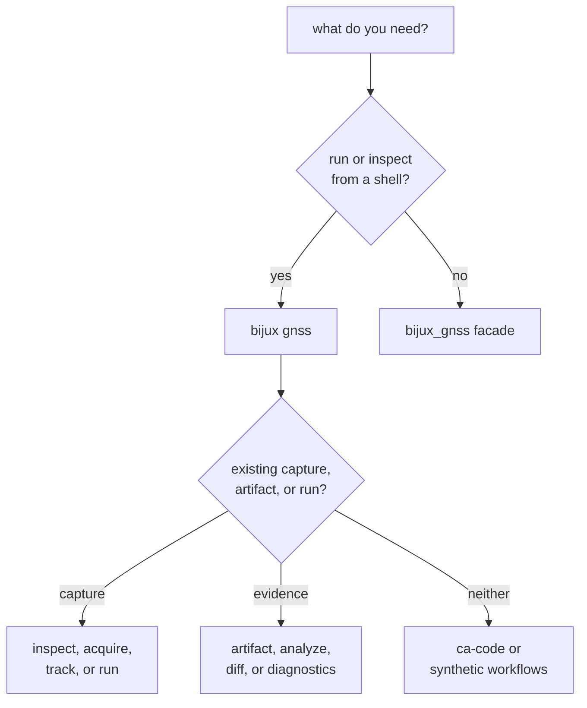
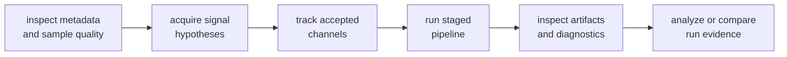

# Getting Started with Bijux GNSS

Choose the command interface for operator workflows and the Rust facade for
library integration. Start with the smallest operation that answers the
question; acquisition, tracking, navigation, and diagnostics have different
inputs and evidence.

## Choose an Entrypoint



Discover the installed command tree rather than guessing subcommands:

```sh
bijux gnss --help
bijux gnss artifact --help
bijux gnss diagnostics --help
bijux gnss nav --help
```

Navigation help depends on the build features used for the binary.

## Check a Signal Definition

This command has no capture or repository-write requirement:

```sh
bijux gnss ca-code --prn 1 --count 16 --with-reference
```

It prints the requested GPS L1 C/A chip range and published assignment
metadata. Add autocorrelation or cross-correlation options only when those
properties are the question being investigated.

## Inspect a Registered Capture

The repository registry contains a recorded GPS L1 excerpt:

```sh
bijux gnss inspect \
  --dataset gps_l1_2022_03_27_excerpt \
  --max-samples 4096 \
  --report json
```

Inspection resolves the registered capture and raw-IQ metadata, then reports
sample statistics. It does not perform acquisition or establish satellite
visibility.

For an unregistered capture, provide the file and metadata required by the
selected workflow. Use the
[dataset contract](https://github.com/bijux/bijux-gnss/blob/main/crates/bijux-gnss-infra/docs/DATASETS.md) to
understand registry and sidecar precedence rather than supplying contradictory
overrides until a command happens to accept them.

## Move from Capture to Receiver Evidence



These are separate claims:

- inspection establishes how samples and metadata are interpreted
- acquisition reports candidates, ambiguity, Doppler, code phase, and
  uncertainty
- tracking reports channel state, continuity, lock, degradation, and recovery
- a pipeline run assembles observations and optional navigation evidence
- artifact and diagnostic commands interpret persisted results
- analysis and comparison summarize recorded evidence without recreating the
  run

Do not skip directly to a broad pipeline conclusion when the open question is
raw-IQ interpretation or acquisition refusal.

## Work with Artifacts

The artifact family provides nested commands:

```sh
bijux gnss artifact validate --help
bijux gnss artifact explain --help
bijux gnss artifact convert --help
```

Validation checks schema and invariants, explanation reports header and summary
evidence, and conversion writes a requested target representation. Conversion
is an explicit write operation; validation and explanation should not be
described as equivalent to migration.

Use the [artifact workflow guide](https://github.com/bijux/bijux-gnss/blob/main/crates/bijux-gnss/docs/WORKFLOWS.md)
and [reporting contract](https://github.com/bijux/bijux-gnss/blob/main/crates/bijux-gnss/docs/REPORTING.md) before
building automation around report fields or exit behavior.

## Use the Rust Facade

Add the package as a dependency, then import the owning package through the
facade:

```rust
use bijux_gnss::{core, receiver, signal};

let carrier_hz = core::api::GPS_L1_CA_CARRIER_HZ;
let code_length = signal::api::CA_CODE_PERIOD_CHIPS;
let config = receiver::api::ReceiverConfig::default();

let _ = (carrier_hz, code_length, config);
```

Navigation is feature-gated:

```rust
#[cfg(feature = "nav")]
use bijux_gnss::nav;
```

The facade does not flatten lower-package APIs. Continue through each package's
`api` module so ownership remains visible and detailed documentation stays with
the implementation owner.

## Route Questions to the Owner

| Question | Reader destination |
| --- | --- |
| command names, flags, reports, and operator workflow | [command reference](https://github.com/bijux/bijux-gnss/blob/main/crates/bijux-gnss/docs/COMMANDS.md) |
| facade imports and feature availability | [facade guide](https://github.com/bijux/bijux-gnss/blob/main/crates/bijux-gnss/docs/FACADE.md) |
| identities, units, records, diagnostics, and artifact envelopes | [core API](https://github.com/bijux/bijux-gnss/blob/main/crates/bijux-gnss-core/API.md) |
| signal catalogs, codes, samples, and DSP | [signal API](https://github.com/bijux/bijux-gnss/blob/main/crates/bijux-gnss-signal/API.md) |
| acquisition, tracking, observations, and receiver artifacts | [receiver API](https://github.com/bijux/bijux-gnss/blob/main/crates/bijux-gnss-receiver/API.md) |
| products, corrections, positioning, integrity, PPP, and RTK | [navigation API](https://github.com/bijux/bijux-gnss/blob/main/crates/bijux-gnss-nav/API.md) |
| datasets, run layout, persistence, and artifact inspection | [infrastructure API](https://github.com/bijux/bijux-gnss/blob/main/crates/bijux-gnss-infra/API.md) |

## Avoid Misleading Starts

- Do not invent a dataset identifier; use the registry or an explicit capture.
- Do not treat inspection as acquisition, lock, or navigation proof.
- Do not parse table output when JSON is the machine contract.
- Do not assume an optional command or facade export exists in every feature
  build.
- Do not import private command modules from Rust.
- Do not move lower-package behavior into the facade for convenience.

A good starting point identifies the intended claim, required inputs, selected
feature set, expected evidence, possible refusal, side effects, and package that
owns the result.
