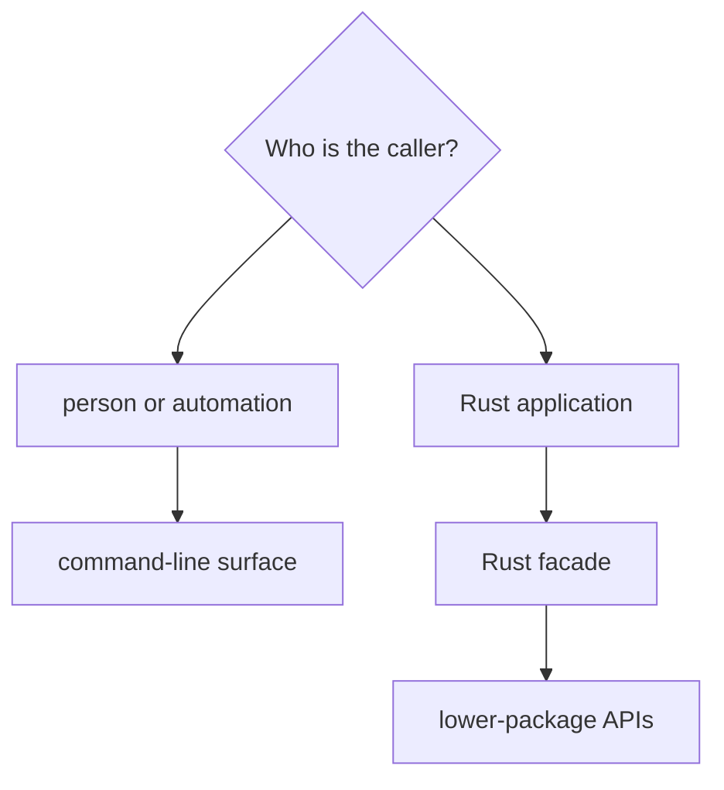
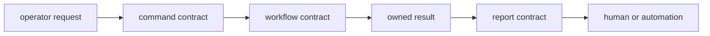

# Command Interface Guide

`bijux-gnss` exposes two public surfaces with different consumers. Operators
and automation use the `bijux gnss` command family. Rust callers use a small
facade that re-exports owned lower-package APIs. A command promise must not be
mistaken for a library contract, and the facade must not become a second
implementation layer.

## Choose The Surface

| caller need | public contract |
| --- | --- |
| Discover commands, options, defaults, and argument relationships | [CLI reference](cli-reference.md) |
| Rely on command names, workflow selection, and exit behavior | [Command contracts](command-contracts.md) |
| Supply receiver configuration, dataset context, sidecars, or overrides | [Configuration contracts](configuration-contracts.md) |
| Understand a multi-stage operator journey | [Workflow contracts](workflow-contracts.md) |
| Parse or display human and machine-readable results | [Reporting contracts](reporting-contracts.md) |
| Distinguish schema, capture, reference, and scientific validation | [Validation contracts](validation-contracts.md) |
| Import GNSS packages through the umbrella library | [Facade contracts](facade-contracts.md) and [public imports](public-imports.md) |

## What Is Stable?

For the binary, treat command and option meaning, required relationships,
defaults, report-format selection, exit behavior, and persisted evidence
references as public. Exact prose may evolve, but automation must not depend on
undocumented text fragments when typed JSON or artifacts exist.

For the Rust facade, only deliberate exports are supported. Private CLI modules
and handler types are not library API.

Each interface layer adds context but must preserve the layer before it. A
report may summarize a receiver refusal; it may not convert that refusal into
success. A workflow may persist an artifact; it may not redefine the artifact
schema.

## Compatibility Questions

Before changing a public surface, ask:

- Will an existing invocation parse with the same meaning?
- Will defaults select the same operation and evidence policy?
- Can automation still distinguish success, degradation, refusal, and failure?
- Does JSON retain field meaning and version expectations?
- Do output references still point to infrastructure-governed evidence?
- Does a facade export still follow the feature gate and lower-package owner?

Use [compatibility commitments](compatibility-commitments.md) for the review
standard and [entrypoints and examples](entrypoints-and-examples.md) for
representative use.

## Sources Of Truth

The [public API guide](https://github.com/bijux/bijux-gnss/blob/main/crates/bijux-gnss/docs/PUBLIC_API.md)
distinguishes binary and Rust callers. The
[command reference](https://github.com/bijux/bijux-gnss/blob/main/crates/bijux-gnss/docs/COMMANDS.md),
[workflow reference](https://github.com/bijux/bijux-gnss/blob/main/crates/bijux-gnss/docs/WORKFLOWS.md), and
[reporting guide](https://github.com/bijux/bijux-gnss/blob/main/crates/bijux-gnss/docs/REPORTING.md) define the
operator-facing contract. Confirm exact parser behavior in the
[command catalog](https://github.com/bijux/bijux-gnss/blob/main/crates/bijux-gnss/src/cli/command_catalog/mod.rs)
and [parser assembly](https://github.com/bijux/bijux-gnss/blob/main/crates/bijux-gnss/src/cli/command_line.rs).
