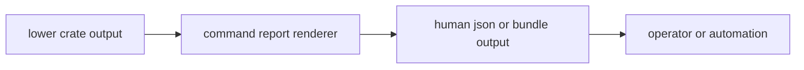

# Reporting Contracts

Reporting contracts define what the command crate may say to operators. Reports
may summarize lower-owner outcomes, but they must preserve the meaning of
receiver diagnostics, infra artifact state, signal assumptions, navigation
science, and core record semantics.

## Reporting Flow

## Owned Reporting Surfaces

| surface | command-owned decision | forbidden drift |
| --- | --- | --- |
| report-format selection | choose human-readable or machine-readable output shape | redefining lower-owner fields |
| success and failure summaries | present status, warnings, and next evidence route | hiding degraded or refused lower-owner states |
| validation publication | package validation results for operators | changing validation thresholds owned elsewhere |
| diagnostic rendering | display stage, severity, and reason clearly | converting typed evidence into ambiguous prose |
| synthetic and raw-IQ summaries | expose operator-relevant metrics | claiming signal, receiver, or infra proof not present in artifacts |

## Reader Standard

A report is strong enough when an operator can answer:

- What command ran?
- What input or artifact was inspected?
- Which lower owner produced the decisive evidence?
- Was the outcome accepted, degraded, refused, or failed?
- Which artifact, diagnostic, or validation result supports the claim?

## First Proof Check

Start with the command [report renderer](https://github.com/bijux/bijux-gnss/blob/main/crates/bijux-gnss/src/cli/report.rs),
[diagnostic report dispatch](https://github.com/bijux/bijux-gnss/blob/main/crates/bijux-gnss/src/cli/commands/diagnostics/report_dispatch.rs),
[diagnostic report publishing](https://github.com/bijux/bijux-gnss/blob/main/crates/bijux-gnss/src/cli/commands/diagnostics/report_publishing.rs),
and [diagnostic report rendering](https://github.com/bijux/bijux-gnss/blob/main/crates/bijux-gnss/src/cli/commands/diagnostics/report_rendering.rs).
Then confirm operator-facing behavior against the [reporting guide](https://github.com/bijux/bijux-gnss/blob/main/crates/bijux-gnss/docs/REPORTING.md)
and the command crate [integration tests](https://github.com/bijux/bijux-gnss/tree/main/crates/bijux-gnss/tests).
