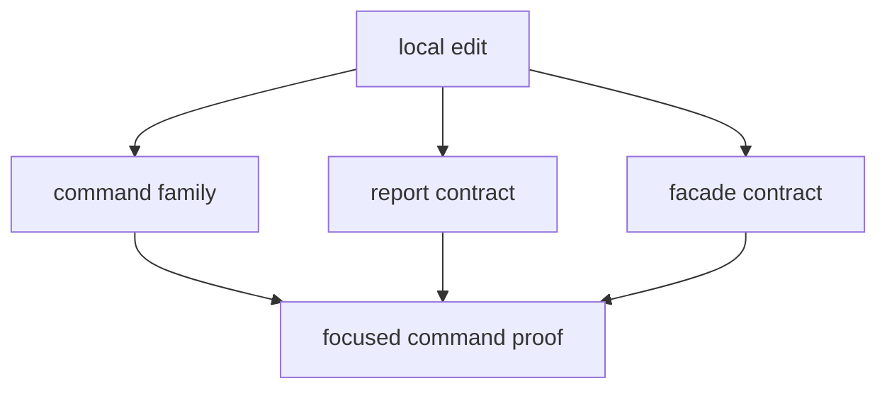

# Local Development

When editing `bijux-gnss`, start from the owning command family, not from the
lower crate that the command eventually invokes.

## Good Local Loop

- find the owning family in `src/cli/command_catalog/`, `src/cli/commands/`,
  `src/cli/command_runtime.rs`, `src/cli/command_runtime/`,
  `src/cli/command_support/`, `src/cli/report.rs`, or the facade
- update the crate-local docs if command meaning moves
- run targeted command tests before touching wider suites
- inspect `src/lib.rs` if the change affects the Rust facade

## What To Avoid

- changing several workflow families at once without naming the shared reason
- using one broad integration test as the only proof for a command-shape change
- widening facade exports to make local development easier

## Local Decision Table

| change | start with | prove with |
| --- | --- | --- |
| command argument or command name | [Command guide](https://github.com/bijux/bijux-gnss/blob/main/crates/bijux-gnss/docs/COMMANDS.md) | command-family integration tests |
| runtime handoff | [Execution guide](https://github.com/bijux/bijux-gnss/blob/main/crates/bijux-gnss/docs/EXECUTION.md) | focused command runtime tests |
| operator output | [Reporting guide](https://github.com/bijux/bijux-gnss/blob/main/crates/bijux-gnss/docs/REPORTING.md) | report and validation-output tests |
| facade import | [Facade guide](https://github.com/bijux/bijux-gnss/blob/main/crates/bijux-gnss/docs/FACADE.md) | public API and guardrail tests |
| workflow contract | [Workflow guide](https://github.com/bijux/bijux-gnss/blob/main/crates/bijux-gnss/docs/WORKFLOWS.md) | workflow-specific integration tests |

## Useful Local Anchors

- [Command crate README](https://github.com/bijux/bijux-gnss/blob/main/crates/bijux-gnss/README.md)
- [Command crate docs](https://github.com/bijux/bijux-gnss/tree/main/crates/bijux-gnss/docs)
- command crate tests
