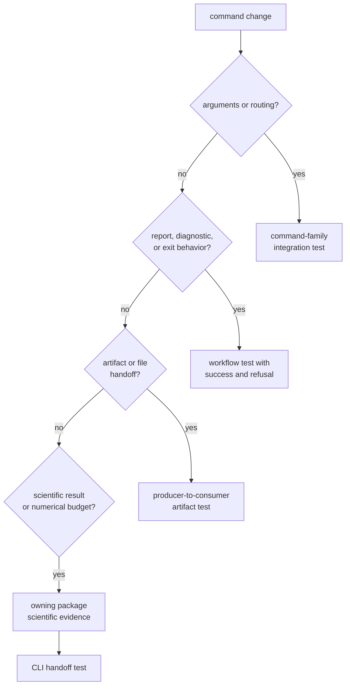
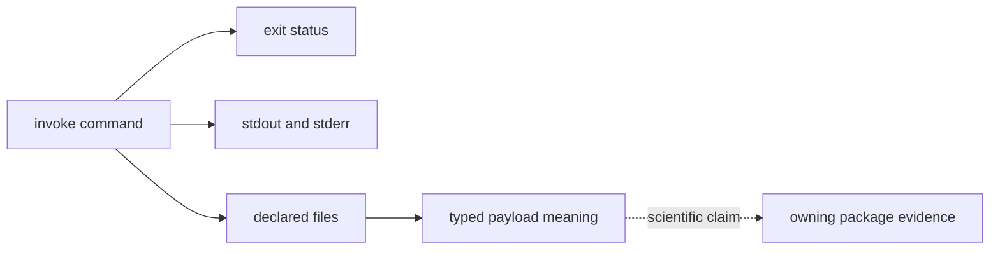

# Verifying Command Workflows

Choose command evidence from the behavior a user can observe. A parser test
does not prove receiver accuracy, and a lower-package scientific test does not
prove that the command reports refusals, paths, or artifacts correctly.

## Route The Claim To Its Evidence



Start with the narrowest command-family target. Add lower-package evidence only
when the command change also moves a domain contract.

## Current Command Evidence

| User-visible behavior | Focused evidence |
| --- | --- |
| C/A code range, wrapping, reference metadata, and correlation summaries | [C/A code workflow tests](https://github.com/bijux/bijux-gnss/blob/main/crates/bijux-gnss/tests/integration_ca_code.rs) |
| acquisition search settings and command overrides | [acquisition configuration tests](https://github.com/bijux/bijux-gnss/blob/main/crates/bijux-gnss/tests/integration_acquisition_doppler_config.rs) |
| configuration acceptance and rejected integration settings | [configuration validation tests](https://github.com/bijux/bijux-gnss/blob/main/crates/bijux-gnss/tests/integration_validate_config.rs) |
| sidecar requirements and registry fallback | [raw-IQ metadata tests](https://github.com/bijux/bijux-gnss/blob/main/crates/bijux-gnss/tests/integration_raw_iq_metadata.rs) |
| front-end metrics, clipping, zero signal, search-range refusal, and sample-rate mismatch | [raw-IQ quality tests](https://github.com/bijux/bijux-gnss/blob/main/crates/bijux-gnss/tests/integration_raw_iq_front_end_metrics.rs) |
| navigation-bit recovery, parity, ephemeris fields, and refusal reporting | [navigation decode tests](https://github.com/bijux/bijux-gnss/blob/main/crates/bijux-gnss/tests/integration_nav_decode.rs) |
| RINEX observation and navigation output headers | [RINEX command tests](https://github.com/bijux/bijux-gnss/blob/main/crates/bijux-gnss/tests/integration_rinex.rs) |
| synthetic capture export, truth bundle, and acquisition reporting | [synthetic export tests](https://github.com/bijux/bijux-gnss/blob/main/crates/bijux-gnss/tests/integration_export_synthetic_iq.rs) |
| synthetic IQ tolerances and rejection behavior | [synthetic IQ validation tests](https://github.com/bijux/bijux-gnss/blob/main/crates/bijux-gnss/tests/integration_validate_synthetic_iq.rs) |
| truth-guided navigation validation and accuracy artifact | [synthetic navigation validation](https://github.com/bijux/bijux-gnss/blob/main/crates/bijux-gnss/tests/integration_validate_synthetic_navigation.rs) |
| quantization comparison artifact and float reference | [quantization measurement test](https://github.com/bijux/bijux-gnss/blob/main/crates/bijux-gnss/tests/integration_measure_synthetic_quantization.rs) |
| public capture acquisition and validation attempts | [live-sky acquisition](https://github.com/bijux/bijux-gnss/blob/main/crates/bijux-gnss/tests/integration_live_sky_acquisition.rs) and [capture validation](https://github.com/bijux/bijux-gnss/blob/main/crates/bijux-gnss/tests/integration_validate_capture.rs) |
| bias-corrected dual-frequency artifact output | [bias validation test](https://github.com/bijux/bijux-gnss/blob/main/crates/bijux-gnss/tests/integration_validate_bias_sinex.rs) |
| package structure policy | [command package guardrail](https://github.com/bijux/bijux-gnss/blob/main/crates/bijux-gnss/tests/integration_guardrails.rs) |

These targets exercise the binary as an operator would invoke it. Source-local
tests under command support and pipeline dispatch cover helper behavior, but
they do not replace process-boundary assertions when flags, output, files, or
exit status change.

## Use A Narrow Invocation

Run from the repository root. Select one target:

```console
cargo test -p bijux-gnss --test integration_validate_config
cargo test -p bijux-gnss --test integration_nav_decode
cargo test -p bijux-gnss --test integration_raw_iq_metadata
```

When one test function isolates the changed claim, filter within that target:

```console
cargo test -p bijux-gnss --test integration_raw_iq_front_end_metrics \
  inspect_reports_quadrature_error_from_synthetic_fixture
```

Do not combine unrelated targets to make the command look more comprehensive.
Broaden only after the focused test identifies a shared contract or workflow
boundary that also moved.

## Assert The Operator Contract



A command integration test should assert the surfaces affected by the change:

- accepted and rejected arguments
- exit status for success, refusal, and malformed input
- stable report fields rather than incidental prose formatting
- paths and artifacts promised to the operator
- machine-readable payload fields when another tool consumes them
- explicit degraded or refused states instead of a successful-looking summary

Use temporary output locations and deterministic inputs. Do not make a command
test depend on an undeclared local dataset, a previous run, or ambient
repository state.

## Know What The Target Does Not Prove

- Configuration tests prove CLI loading and reported validation, not every
  receiver or navigation invariant.
- Raw-IQ command tests prove metadata and reporting handoff, not the complete
  acquisition or tracking operating envelope.
- Navigation decode tests prove command-level wrapping around selected LNAV
  cases, not all navigation formats.
- Synthetic workflows prove their declared fixtures and tolerances, not
  live-sky generalization.
- Guardrails prove repository policy, not command semantics.

The [command test guide](https://github.com/bijux/bijux-gnss/blob/main/crates/bijux-gnss/docs/TESTS.md) defines this
boundary. The [workflow catalog](https://github.com/bijux/bijux-gnss/blob/main/crates/bijux-gnss/docs/WORKFLOWS.md)
locates operator sequences, and the
[validation guide](https://github.com/bijux/bijux-gnss/blob/main/crates/bijux-gnss/docs/VALIDATION.md) identifies
the package that owns each domain check.

## Record Verification Precisely

Report the target and, when used, the test-function filter. State which
operator claim it proves and which lower-package evidence was added. If a
command family has no process-boundary test for the changed behavior, add one
or disclose the gap rather than citing an adjacent target.
