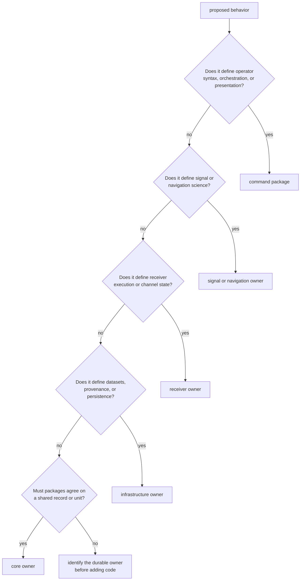
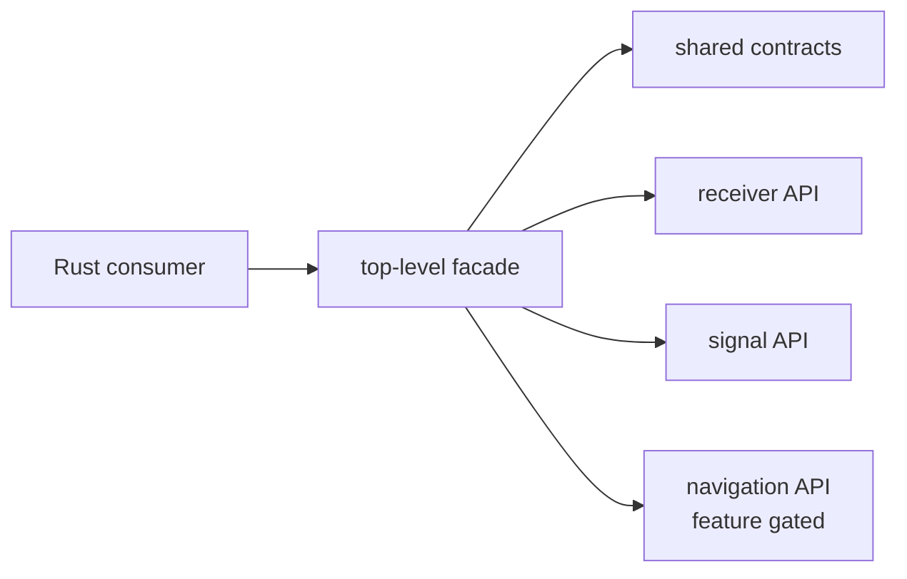

# Command Ownership Boundaries

`bijux-gnss` translates operator intent into calls to the package that owns the
work, then presents the result. It owns the public command vocabulary and the
top-level Rust facade. It does not become the owner of an algorithm, runtime
stage, or persistence rule merely because an operator reaches that behavior
through the CLI.

## Place A Change

The command package is the right owner when a change defines:

- a command, argument, default, help message, or exit status;
- workflow order across already-owned lower-level operations;
- translation from operator input into typed lower-level requests;
- operator-facing rendering, summaries, and report selection;
- a stable top-level re-export that makes the package facade coherent.

## Adapter Or Algorithm?

Command handlers should adapt, sequence, and present. They should not duplicate
the rule that produces a scientific or runtime result.

| proposed change | command responsibility | lower owner |
| --- | --- | --- |
| add an acquisition search-window flag | parse and validate the operator value; construct the request | [receiver execution](../bijux-gnss-receiver/index.md) defines acquisition behavior and admissible runtime state |
| expose a navigation correction choice | select the requested model and render its provenance | [navigation science](../bijux-gnss-nav/index.md) defines the model and scientific validity |
| accept a capture reference | collect operator intent and report resolution failures | [repository infrastructure](../bijux-gnss-infra/index.md) resolves datasets, sidecars, and persisted provenance |
| select a signal identity | parse a supported identity and pass it through | [signal processing](../bijux-gnss-signal/index.md) defines catalog relationships, code behavior, and reusable DSP |
| render a shared observation record | choose the human or machine representation | [shared GNSS contracts](../bijux-gnss-core/index.md) define fields, units, validity, and serialization |

If a command test becomes the only proof of an algorithm, the implementation
is probably in the wrong package or lacks lower-level evidence.

## Facade Boundary

The [public package facade](https://github.com/bijux/bijux-gnss/blob/main/crates/bijux-gnss/src/lib.rs) currently
re-exports:

- shared core contracts;
- receiver pipeline APIs;
- signal processing APIs;
- navigation APIs when the navigation feature is enabled.

Infrastructure is used by command workflows but is not currently re-exported
by the Rust facade. Do not document a transitive dependency as a supported
public API. A new re-export should have a clear downstream use, preserve the
lower package's identity, and avoid turning the facade into an unstructured
collection of internals.

## Effect Boundary

The CLI may open configuration supplied by an operator, invoke lower packages,
choose an output destination, and render reports. Ownership of the underlying
effect remains narrower:

- infrastructure defines dataset discovery, run identity, manifests,
  provenance, and durable layout;
- receiver defines staged execution, channel lifecycle, and in-memory runtime
  evidence;
- navigation defines scientific interpretation and solution acceptance;
- signal defines reusable sample and DSP behavior;
- core defines the records exchanged across those boundaries.

Choosing where an operator wants output is command behavior. Defining what a
valid persisted run means is infrastructure behavior.

## Boundary Failures

Reject a command change that:

- copies a formula, threshold, parser, or state transition from a lower owner;
- invents a second artifact shape for report convenience;
- catches a typed refusal and converts it into plausible success;
- reads an internal module because the owning package lacks a suitable public
  entrypoint;
- adds a facade helper whose only consumer is one command handler;
- embeds filesystem layout assumptions that infrastructure already owns.

The durable repair is to strengthen the lower owner's API or evidence, then
keep the command adapter thin.

## Review Evidence

For command changes, inspect the
[command contract](https://github.com/bijux/bijux-gnss/blob/main/crates/bijux-gnss/docs/COMMANDS.md),
[workflow guide](https://github.com/bijux/bijux-gnss/blob/main/crates/bijux-gnss/docs/WORKFLOWS.md), and affected
[command implementation](https://github.com/bijux/bijux-gnss/tree/main/crates/bijux-gnss/src/cli). Pair command
integration evidence with tests from the package that owns the underlying
behavior.

The boundary changed only if operator syntax, workflow composition,
presentation, or the supported top-level facade changed. Calling a lower
package more often does not transfer ownership.
