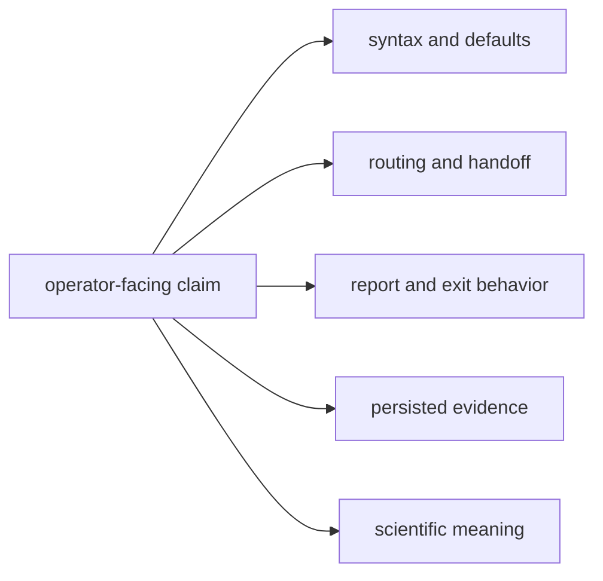
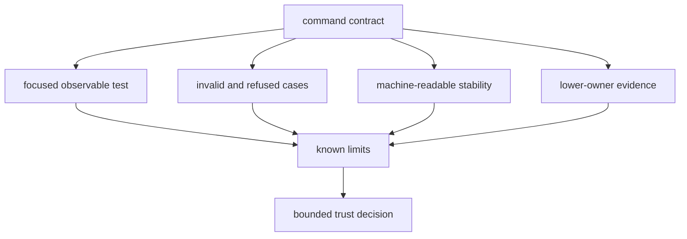

# Command Evidence Guide

Command quality is the ability to prove that an operator request reaches the
intended owner, preserves its evidence, and reports the result honestly. A
green command integration test does not establish every scientific, runtime,
or persistence claim exercised underneath it.

## Match The Claim To Its Proof

| claim | command evidence | additional owner evidence |
| --- | --- | --- |
| An invocation parses with documented defaults | parser or command integration assertion | configuration owner when default meaning moved |
| A workflow calls the intended package with the intended input | focused workflow integration test | lower-package contract test when behavior moved |
| A report preserves accepted, degraded, refused, and failed states | stable field and exit-behavior assertions | producer diagnostics and artifact semantics |
| A command writes attributable evidence | output reference and manifest handoff assertion | infrastructure run-layout and artifact proof |
| A synthetic workflow exercises a declared scenario | command route and produced-evidence assertion | signal and receiver model evidence |
| A navigation or tracking result is accurate | only routing and presentation can be proven here | navigation or receiver scientific tests |

## Build Bounded Confidence

Use [test strategy](test-strategy.md) to select command evidence,
[invariants](invariants.md) to state the promise, and
[change validation](change-validation.md) to choose the minimum proof. Apply
the [review checklist](review-checklist.md) and
[definition of done](definition-of-done.md) only after the claim is narrow
enough to test.

## Current Limits

Command tests are integration-heavy. A pass may show that several packages
cooperate without identifying which boundary protected the behavior. State the
command assertion and lower-owner assertion separately.

Reports intentionally compress lower evidence. Follow strong claims to the
artifact and producing package rather than treating readable output as complete
proof. Synthetic success remains bounded by its scenario and model assumptions.
Facade exports provide routing convenience; they do not transfer ownership.

The [known limitations](known-limitations.md) and
[risk register](risk-register.md) record these boundaries.

## Failure Signals

- A test asserts private helper layout instead of operator-visible behavior.
- Success is asserted without checking degraded or refused results.
- A JSON report changes field meaning without a compatibility decision.
- An integration test is cited as scientific accuracy evidence.
- A fixture is regenerated from the implementation under test.
- A lower-package failure is hidden by weakening a command assertion.

## Evidence Sources

The [package test guide](https://github.com/bijux/bijux-gnss/blob/main/crates/bijux-gnss/docs/TESTS.md) maps command
families to integration evidence. Representative proof includes
[configuration validation](https://github.com/bijux/bijux-gnss/blob/main/crates/bijux-gnss/tests/integration_validate_config.rs),
[navigation decode](https://github.com/bijux/bijux-gnss/blob/main/crates/bijux-gnss/tests/integration_nav_decode.rs),
[synthetic navigation validation](https://github.com/bijux/bijux-gnss/blob/main/crates/bijux-gnss/tests/integration_validate_synthetic_navigation.rs),
and [package guardrails](https://github.com/bijux/bijux-gnss/blob/main/crates/bijux-gnss/tests/integration_guardrails.rs).

Read each test before citing it; its name is not evidence for assertions it
does not make.
