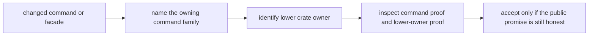

# Review Checklist

Review `bijux-gnss` as the operator boundary, not as the whole receiver. The
crate may name commands, parse operator intent, render reports, and hand work
to lower owners. It should not redefine signal math, receiver runtime behavior,
navigation science, or repository persistence because those details are
convenient to expose from the installed binary.

## Review Gates

| changed surface | reviewer question | inspect before accepting |
| --- | --- | --- |
| CLI name, flag, or output field | Does the public workflow still say exactly what the command can prove? | [command implementation](https://github.com/bijux/bijux-gnss/tree/main/crates/bijux-gnss/src/cli), [command contract](https://github.com/bijux/bijux-gnss/blob/main/crates/bijux-gnss/docs/COMMANDS.md), [CLI reference](../interfaces/cli-reference.md) |
| command orchestration | Is the command only routing work, or did it absorb runtime, signal, navigation, or infrastructure policy? | [Command ownership boundaries](../ownership-boundaries.md), [Workflow contracts](../interfaces/workflow-contracts.md) |
| Rust facade export | Is the facade making a durable user entrypoint, not a shortcut around the owning crate? | [facade guide](https://github.com/bijux/bijux-gnss/blob/main/crates/bijux-gnss/docs/FACADE.md), [public facade](https://github.com/bijux/bijux-gnss/blob/main/crates/bijux-gnss/src/lib.rs), [facade contracts](../interfaces/facade-contracts.md) |
| report or validation output | Can an operator tell which lower-owner proof backs the report field? | [reporting contracts](../interfaces/reporting-contracts.md), [command test guide](https://github.com/bijux/bijux-gnss/blob/main/crates/bijux-gnss/docs/TESTS.md) |
| fixture or workflow example | Does the example prove a real operator path instead of documenting one lucky invocation? | [Operator Journeys](../operations/operator-journeys.md), [Verification Commands](../operations/verification-commands.md) |

## Blocking Signs

- A command test passes while the underlying receiver, signal, navigation, or
  infrastructure contract is untested.
- A new flag exposes lower-crate implementation vocabulary without explaining
  the operator-level decision it controls.
- The [public facade](https://github.com/bijux/bijux-gnss/blob/main/crates/bijux-gnss/src/lib.rs) re-exports an
  internal helper because it is convenient for a caller rather than because
  the command crate owns the public promise.
- Documentation says "run the command" but does not identify the evidence file,
  report field, or lower-owner proof that makes the run trustworthy.

## Evidence To Require

- Use [Verification Commands](../operations/verification-commands.md) for the
  narrow command proof and include the lower-owner validation when the claim
  crosses crate boundaries.
- Inspect the [command test guide](https://github.com/bijux/bijux-gnss/blob/main/crates/bijux-gnss/docs/TESTS.md)
  before accepting a changed test shape.
- Inspect the [facade guide](https://github.com/bijux/bijux-gnss/blob/main/crates/bijux-gnss/docs/FACADE.md) before
  accepting a new public export.
- Update the handbook page that owns the changed promise in the same change set
  as the code or fixture change.
