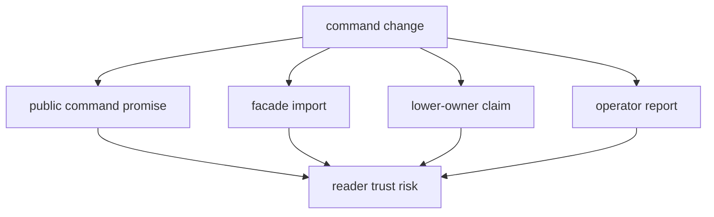

# Risk Register

This page records the main trust risks in the command crate. The risks are not
about implementation tidiness; they are about misleading operators or making
the command crate look like it owns lower-crate behavior.

## Risks

| risk | how it appears | why it matters |
| --- | --- | --- |
| accidental public command | a flag, report field, or exit shape lands without compatibility review | operators and scripts may rely on it immediately |
| false workflow confidence | a broad integration test passes while the changed command family is not directly exercised | command drift can hide behind lower-crate success |
| facade sprawl | convenience exports accumulate in the package facade | downstream users lose the real owner of the behavior |
| report ownership drift | report wording starts deciding lower-crate policy | the command output becomes a second source of truth |

## Mitigations

- review command-shape changes as public contract changes
- choose validation by command family, not by convenience
- keep facade scope narrow and documented
- maintain placement decisions in the
  [command ownership boundaries](../ownership-boundaries.md)
- record operator-visible or facade-visible changes in the package changelog
- link lower-crate claims back to the lower owner instead of restating them here

## Proof Path

Use the [command guide](https://github.com/bijux/bijux-gnss/blob/main/crates/bijux-gnss/docs/COMMANDS.md),
[facade guide](https://github.com/bijux/bijux-gnss/blob/main/crates/bijux-gnss/docs/FACADE.md), and command
guardrail tests as the first proof. If the risk involves a lower crate, stop
here and inspect the lower owner before changing command wording.
