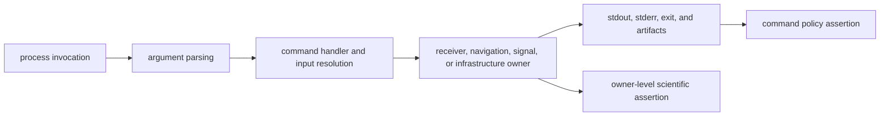
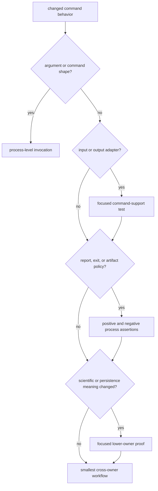

# Test Strategy

Command tests prove an operator route, not the entire scientific stack behind
it. The useful question is therefore not “which test mentions this command?”
but “where can the changed behavior first be observed, and which lower owner
must independently defend its meaning?”

## Evidence Across The Boundary

A process-level command test can observe arguments, working-directory
assumptions, exit success, display output, and files. It can also prove that the
handler reached a lower layer with a fixture. It usually cannot prove that the
lower algorithm is correct for conditions outside that fixture.

## Test Layers

| layer | proves | does not prove | representative evidence |
| --- | --- | --- | --- |
| repository guardrail | crate-level source and policy constraints | CLI syntax or command behavior | [command crate guardrail](https://github.com/bijux/bijux-gnss/blob/main/crates/bijux-gnss/tests/integration_guardrails.rs) |
| binary workflow | real executable accepts an invocation and produces expected process/output behavior | completeness of the lower scientific model | [configuration validation workflow](https://github.com/bijux/bijux-gnss/blob/main/crates/bijux-gnss/tests/integration_validate_config.rs) |
| command adapter | input loading, capture interpretation, or artifact projection owned by command support | public process behavior unless a binary test also covers it | [capture loading support](https://github.com/bijux/bijux-gnss/blob/main/crates/bijux-gnss/src/cli/command_support/tests/capture_loading.rs) |
| cross-owner workflow | command correctly composes lower crates for a bounded fixture | the lower owner’s full support envelope | [synthetic navigation validation](https://github.com/bijux/bijux-gnss/blob/main/crates/bijux-gnss/tests/integration_validate_synthetic_navigation.rs) |
| lower-owner proof | physical, runtime, estimation, or persistence meaning | command argument and report compatibility | [receiver change validation](../../bijux-gnss-receiver/quality/change-validation.md) and [navigation test strategy](../../bijux-gnss-nav/quality/test-strategy.md) |

The guardrail test deliberately relaxes the usual public-re-export rule for the
facade crate. It should be cited only for the policy checks it executes, not as
proof that the command inventory or public facade is complete.

## Choose Tests From The Changed Claim

Examples:

- Configuration changes need one accepted profile and one rejected constraint
  through the binary, plus receiver configuration proof when derived runtime
  meaning changes.
- Navigation decode changes need command publication evidence and independent
  navigation decoder evidence. The
  [decode workflow test](https://github.com/bijux/bijux-gnss/blob/main/crates/bijux-gnss/tests/integration_nav_decode.rs)
  builds and invokes the real executable, but its embedded fixture does not
  replace constellation reference tests.
- Raw-IQ reporting changes need command field assertions and signal or
  infrastructure proof for metadata and numeric interpretation.
- RINEX output changes need the command route plus navigation-owned format
  evidence; file creation alone is not format correctness.

The [verification map](../operations/verification-commands.md) provides focused
routes for the current command families.

## Required Negative Evidence

For behavior that can reject input or refuse a claim, add a negative process
assertion. Check the observable contract that matters: non-success status,
diagnostic or contextual error, absence of a completion manifest, or a typed
refusal in the report. Avoid assertions against incidental full error strings
when a stable structured field exists.

Successful file creation is not enough. The
[command error model](../architecture/error-model.md) explains why partial
output can remain after failure.

## Current Coverage Limits

The current integration inventory has strong workflow coverage for
configuration, capture validation, navigation decode, synthetic IQ and
navigation, quantization, metadata, RINEX, and bias validation. It does not
provide one dedicated snapshot or inventory test for the complete help and
subcommand tree, and the command architecture does not define a stable numeric
exit-code taxonomy.

Do not imply those contracts exist. If a change needs stable help output,
machine-readable errors, or categorized exit codes, introduce and document the
contract before testing it.

## Review Record

Record the invocation, fixture provenance, feature set, observable command
assertion, lower-owner assertion, and any deferred slow evidence. A broad
workspace pass is useful corroboration, but it does not explain which command
contract would fail if the change regressed.
