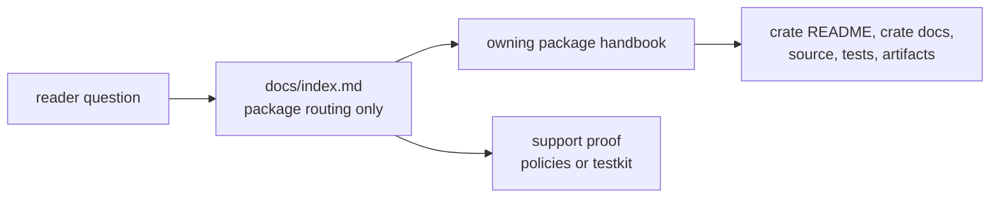

# Repository Handbook

`bijux-telecom` is a Rust GNSS workspace. The root handbook has one job:
route a reader to the crate that owns the next claim they need to trust. It is
not a second API manual and it should not make scientific claims that are only
proven inside one crate.

Start here when the question is still repository-level: which package owns a
behavior, which support crate carries the evidence, and where the first proof
surface lives. Leave this page as soon as the question becomes about one crate
API, one algorithm, one persisted artifact, or one test family.

<!-- bijux-telecom-badges:generated:start -->

<!-- bijux-telecom-badges:generated:end -->

## Fast Route

| reader question | handbook | first proof after the handbook |
| --- | --- | --- |
| How does an operator command map to work? | [01-bijux-gnss](01-bijux-gnss/) | `crates/bijux-gnss/src/cli/`, `crates/bijux-gnss/docs/` |
| Which shared type, unit, time, diagnostic, or artifact meaning is canonical? | [02-bijux-gnss-core](02-bijux-gnss-core/) | `crates/bijux-gnss-core/src/`, `crates/bijux-gnss-core/docs/` |
| How are datasets, run identity, overrides, and persisted evidence interpreted? | [03-bijux-gnss-infra](03-bijux-gnss-infra/) | `crates/bijux-gnss-infra/src/`, `crates/bijux-gnss-infra/docs/` |
| Which navigation format, correction, orbit, or estimator owns the science? | [04-bijux-gnss-nav](04-bijux-gnss-nav/) | `crates/bijux-gnss-nav/src/`, `crates/bijux-gnss-nav/docs/` |
| How does a receiver run stage acquisition, tracking, observations, and runtime validation? | [05-bijux-gnss-receiver](05-bijux-gnss-receiver/) | `crates/bijux-gnss-receiver/src/`, `crates/bijux-gnss-receiver/docs/` |
| Which signal catalog, code family, raw-IQ contract, or DSP primitive is reusable? | [06-bijux-gnss-signal](06-bijux-gnss-signal/) | `crates/bijux-gnss-signal/src/`, `crates/bijux-gnss-signal/docs/` |
| Which maintainer command governs audits, deny policy, benchmarks, or suite selection? | [07-bijux-gnss-dev](07-bijux-gnss-dev/) | `crates/bijux-gnss-dev/src/main.rs`, `crates/bijux-gnss-dev/docs/` |
| What changed at workspace or package level? | [Workspace changelog](../CHANGELOG.md), package changelogs | `crates/<package>/CHANGELOG.md` |

## Package Chain

The installed GNSS command begins in `bijux-gnss`. That command may assemble
repository inputs through `bijux-gnss-infra`, stage execution through
`bijux-gnss-receiver`, consume signal truth from `bijux-gnss-signal`, consume
navigation science from `bijux-gnss-nav`, and exchange shared records through
`bijux-gnss-core`. Maintainer-only validation and benchmark workflows belong
to `bijux-gnss-dev`.

The chain is directional for documentation purposes:

- command questions start in the command owner, not in the crate that performs
  the deepest calculation
- shared records start in core, even when the value was emitted by receiver or
  navigation code
- repository evidence starts in infra, even when the run was launched by the
  command crate
- runtime-stage behavior starts in receiver, even when signal or navigation
  primitives are used inside the stage
- signal math starts in signal, even when the first visible failure is a
  receiver test
- navigation science starts in nav, even when the product is rendered by the
  command crate
- maintainer governance starts in dev, not in whichever workflow failed last

## Support Crates

Two crates are intentionally outside the seven handbook directories but still
carry critical proof:

| support crate | owns | inspect first |
| --- | --- | --- |
| `bijux-gnss-policies` | executable repository-shape and governance guardrails | `crates/bijux-gnss-policies/README.md`, `crates/bijux-gnss-policies/docs/` |
| `bijux-gnss-testkit` | reusable scientific fixtures, truth packets, and reference-model support | `crates/bijux-gnss-testkit/README.md`, `crates/bijux-gnss-testkit/docs/` |

Leave the seven-handbook chain when the strongest proof depends on one of
those support crates. Do not copy their claims into the root handbook as if the
root owns them.

## Root Contract

The root `docs/` tree owns exactly:

- [01-bijux-gnss](01-bijux-gnss/)
- [02-bijux-gnss-core](02-bijux-gnss-core/)
- [03-bijux-gnss-infra](03-bijux-gnss-infra/)
- [04-bijux-gnss-nav](04-bijux-gnss-nav/)
- [05-bijux-gnss-receiver](05-bijux-gnss-receiver/)
- [06-bijux-gnss-signal](06-bijux-gnss-signal/)
- [07-bijux-gnss-dev](07-bijux-gnss-dev/)
- [badges.md](badges.md)
- this index

That structure is a reader contract. Extra root handbook directories should
not appear unless the repository adds another primary owner with the same
status as the seven package handbooks.

## What The Root Does Not Promise

- It does not document every public function. Use crate `docs/`, `src/`, and
  generated Rust documentation for API detail.
- It does not certify scientific truth by itself. Use tests, fixtures, and
  artifact evidence.
- It does not replace crate READMEs. Use the root to pick the owner, then read
  the owner.
- It does not flatten support crates into product owners. Policy and testkit
  claims must stay with their support crates.

## First Proof Check

Before trusting a repository-level claim, inspect these surfaces together:

- `README.md` for the public landing claim
- `CHANGELOG.md` for unreleased workspace-level changes
- `Cargo.toml` for workspace membership and feature shape
- `Makefile` for maintained verification entrypoints
- `docs/` for package routing
- the owning crate README, crate changelog, crate `docs/`, source, and tests for any
  crate-owned claim

If this page and a crate-local proof surface disagree, trust the crate-local
proof first and fix the root route so the next reader does not inherit the
conflict.
